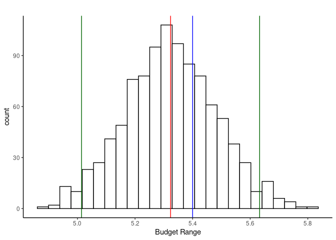

# Objective:  

The Guggenheim Museum is interested in curating a new exhibit. This technical appendix brings support for 3 main proposal of which pieces should be displayed and the total cost of each proposal.  
\  

# General Restrictions:  

+ Must include:
  1. Only one collage  
  1.  
     a. At least one wire mesh sculpture displayed if a computer-generated drawing is displayed __and__  
     b. At least one computer-generated drawing displayed if a wire mesh sculpture is
displayed  
  1. At least one photo-realistic painting 
  1. At least one cubist painting  
  1. At least one expressionist painting  
  1. At least one watercolor painting  
  1. At least one oil painting  
  1. The number of paintings to be no greater than three times the number of other art forms  
  1. All Valentino's paintings   
  1. Both of Hellen's paintings  
  1. Display as many pieces from David as from Enrique  
  1. At least one piece from each of them (David and Enrique)  
  1. Only display one piece from Rick, if any at all.  
  1. At least one piece from a female artist for every three pieces included from a male artist.  
  1. Either one or both of the pieces “Aging Earth” and “Wasted Resources.”  
  1. At least one piece by Stuart  
  1. At least one of the following pieces: “Beyond,” “Who Has Control,” “Where are we now?” and  “Pioneers.”   
\  
\  
+ The museum only has enough space for:  
  18. Four sculptures  
  1. Around 20 paintings, collages, and drawings.  
\  
\  
  20. If “Narcissism” is displayed, “Reflection” should also be displayed  
\  
\  


```r
general_restrictions <- function(model){
  # Add constraints in the order presented in the 'General Restrictions'
  add.constraint(model, c(art_col$Form=="Collage"), "=", 1)
  add.constraint(model, -c((art_col$Form=="Wire")*(1/sum(art_col$Form=="Wire")))+c(art_col$Form=="Computer"), ">=", 0)
  add.constraint(model, -c((art_col$Form=="Computer")*(1/sum(art_col$Form=="Computer")))+c(art_col$Form=="Wire"), ">=", 0)
  add.constraint(model, c(art_col$Form=="Photo"), ">=", 1)
  add.constraint(model, c(art_col$Form=="Cubist"), ">=", 1)
  add.constraint(model, c(art_col$Form=="Expressionist"), "=", 1)
  add.constraint(model, c(art_col$Form=="Watercolor"), ">=", 1)
  add.constraint(model, c(art_col$Form=="Oil"), ">=", 1)
  add.constraint(model, c(art_col$Type=="Painting")-3*c(art_col$Type!="Painting"), "<=", 0)
  add.constraint(model, c(art_col$Artist=="Valentino"), "=", sum(art_col$Artist=="Valentino"))
  add.constraint(model, c(art_col$Artist=="Helen"), "=", sum(art_col$Artist=="Helen"))
  add.constraint(model, c(art_col$Artist=="David")-c(art_col$Artist=="Enrique"), "=", 0)
  add.constraint(model, c(art_col$Artist=="David"), ">=", 1) # I don't need to use Enrique
  add.constraint(model, c(art_col$Artist=="Rick"), "<=", 1)
  add.constraint(model, c(art_col$Gender=="M")-3*c(art_col$Gender=="F"), "<=", 0)
  add.constraint(model, c((art_col$Piece=="Aging Earth" |
                            art_col$Piece=="Wasted Resources")), ">=", 1)
  add.constraint(model, c(art_col$Artist=="Stuart"), ">=", 1)
  add.constraint(model, c((art_col$Piece=="Beyond" |
                              art_col$Piece=="Who Has Control?" |
                              art_col$Piece=="Where are we now?" |
                              art_col$Piece=="Pioneers" )), ">=", 1)
  add.constraint(model, c(art_col$Type=="Sculpture"), "<=", 4)
  add.constraint(model, c(art_col$Type!="Sculpture"), "<=", 20)
  add.constraint(model, c(art_col$Piece=="Narcissism") - c(art_col$Piece=="Reflection"), "<=", 0)
  
  constraints_name <- c("1_coll",
                      "at_l_1_w_if_c_d",
                      "at_l_1_d_if_c_w",
                      "at_l_1_pht",
                      "at_l_1_cub",
                      "at_l_1_expt",
                      "at_l_1_wcol",
                      "at_l_1_oil",
                      "paint<=3non",
                      "valentino",
                      "helen",
                      "David=Enrique",
                      "at_l_1_Darcy",
                      "Rick<=1",
                      "3Fem=Male",
                      "AErth_a_o_WR",
                      "at_l_1_Stuart",
                      "at_l_1_4_pieces",
                      "max_4_scul",
                      "max_20_n_scul",
                      "Narc_with_Refl")
  return(constraints_name)
}
```


# Proposal 1: Limited Budget  

+ Objective: Maximize the number of pieces displayed in the exhibit without exceeding the budget($4 million)  


```r
# Import Art Collection
art_col <- read_csv(here("Final_Project", "Data", "Data.csv"))

# Include Sex

art_col %<>% 
  rename(Desc = `Description of Piece`) %>% 
  mutate(Form = case_when(str_detect(Desc, 'wire mesh') ~ 'Wire',
                          str_detect(Desc, 'computer') ~ 'Computer',
                          str_detect(Desc, 'pen-and-ink') ~ 'Ink',
                          str_detect(Desc, 'sculpture') ~ 'Sculpture',
                          str_detect(Desc, 'collage') ~ 'Collage',
                          str_detect(Desc, 'watercolor') ~ 'Watercolor',
                          str_detect(Desc, 'oil') ~ 'Oil',
                          str_detect(Desc, 'photo') ~ 'Photo',
                          str_detect(Desc, 'cubist') ~ 'Cubist',
                          str_detect(Desc, 'expressionist') ~ 'Expressionist'),
         Type  = case_when(str_detect(Desc, 'sculpture') ~ 'Sculpture',
                           str_detect(Desc, 'painting') ~ 'Painting',
                           str_detect(Desc, 'collage') ~ 'Collage',
                           str_detect(Desc, 'drawing') ~ 'Drawing'),
         Name = str_c(Artist,
                      str_sub(Piece, start = 1L, end = 3L), 
                      str_sub(Form, start = 1L, end = 3L),
                      Gender,
                      str_sub(Type, start = 1L, end = 3L),
                      sep="_")
         )
```


```r
n_var <- nrow(art_col)

# Set up the number of pieces maximization
prop_1 <- make.lp(0, n_var)
```


```r
# Run as maximum
lp.control(prop_1, sense = "max")
```


```r
# Build objective function
obj_fn <- c(rep(1,n_var))

set.objfn(prop_1, obj_fn)

# Force binary variables on the solution 
set.type(prop_1, 1:n_var, "binary")

# add general Restrictions
constraints_name <- general_restrictions(prop_1)

# 
add.constraint(prop_1, c(art_col$Price), "<=", 4000000)

# # Add row and column names
constraints_name <- c(constraints_name,
                      "Max_Budget")

var_interest_name <- c(art_col$Name)

dimnames(prop_1) <- list(constraints_name, var_interest_name)

# Write to see named algebraic formulation
write.lp(prop_1, "Proposal_1.lp",type = 'lp')

# Solve the model, if this return 0 an optimal solution is found
solve(prop_1)
```

```
## [1] 0
```


```r
result_table(prop_1)
```

<table class="table table-striped table-bordered" style="margin-left: auto; margin-right: auto;">
 <thead>
  <tr>
   <th style="text-align:left;">   </th>
   <th style="text-align:right;"> 1_coll </th>
   <th style="text-align:right;"> at_l_1_w_if_c_d </th>
   <th style="text-align:right;"> at_l_1_d_if_c_w </th>
   <th style="text-align:right;"> at_l_1_pht </th>
   <th style="text-align:right;"> at_l_1_cub </th>
   <th style="text-align:right;"> at_l_1_expt </th>
   <th style="text-align:right;"> at_l_1_wcol </th>
   <th style="text-align:right;"> at_l_1_oil </th>
   <th style="text-align:right;"> paint&lt;=3non </th>
   <th style="text-align:right;"> valentino </th>
   <th style="text-align:right;"> helen </th>
   <th style="text-align:right;"> David=Enrique </th>
   <th style="text-align:right;"> at_l_1_Darcy </th>
   <th style="text-align:right;"> Rick&lt;=1 </th>
   <th style="text-align:right;"> 3Fem=Male </th>
   <th style="text-align:right;"> AErth_a_o_WR </th>
   <th style="text-align:right;"> at_l_1_Stuart </th>
   <th style="text-align:right;"> at_l_1_4_pieces </th>
   <th style="text-align:right;"> max_4_scul </th>
   <th style="text-align:right;"> max_20_n_scul </th>
   <th style="text-align:right;"> Narc_with_Refl </th>
   <th style="text-align:right;"> Max_Budget </th>
   <th style="text-align:right;"> Nicholas_Per_Wir_M_Scu </th>
   <th style="text-align:right;"> Nicholas_Bur_Wir_M_Scu </th>
   <th style="text-align:right;"> Nicholas_Eme_Wir_M_Scu </th>
   <th style="text-align:right;"> Rita_Bey_Com_F_Dra </th>
   <th style="text-align:right;"> Rita_Who_Com_F_Dra </th>
   <th style="text-align:right;"> Rita_Dom_Ink_F_Dra </th>
   <th style="text-align:right;"> Rita_Inn_Ink_F_Dra </th>
   <th style="text-align:right;"> Norm_Agi_Scu_M_Scu </th>
   <th style="text-align:right;"> Norm_Was_Col_M_Col </th>
   <th style="text-align:right;"> Helen_Ser_Wat_F_Pai </th>
   <th style="text-align:right;"> Helen_Cal_Wat_F_Pai </th>
   <th style="text-align:right;"> Robert_Voi_Oil_M_Pai </th>
   <th style="text-align:right;"> Robert_Sun_Oil_M_Pai </th>
   <th style="text-align:right;"> Enrique_Sto_Pho_M_Pai </th>
   <th style="text-align:right;"> Enrique_Har_Pho_M_Pai </th>
   <th style="text-align:right;"> Angie_Con_Col_F_Col </th>
   <th style="text-align:right;"> Angie_Ref_Scu_F_Scu </th>
   <th style="text-align:right;"> Angie_Tro_Scu_F_Scu </th>
   <th style="text-align:right;"> David_Zig_Pho_M_Pai </th>
   <th style="text-align:right;"> David_Zig_Cub_M_Pai </th>
   <th style="text-align:right;"> David_Zig_Exp_M_Pai </th>
   <th style="text-align:right;"> Bill_Whe_Oil_M_Pai </th>
   <th style="text-align:right;"> Bill_Pio_Oil_M_Pai </th>
   <th style="text-align:right;"> Stuart_Wis_Ink_M_Dra </th>
   <th style="text-align:right;"> Stuart_Sup_Ink_M_Dra </th>
   <th style="text-align:right;"> Stuart_Liv_Oil_M_Pai </th>
   <th style="text-align:right;"> Candy_Stu_Cub_F_Pai </th>
   <th style="text-align:right;"> C28 </th>
   <th style="text-align:right;"> Rick_My _Col_M_Col </th>
   <th style="text-align:right;"> Rick_Nar_Col_M_Col </th>
   <th style="text-align:right;"> Valentino_All_Wat_M_Pai </th>
   <th style="text-align:right;"> Valentino_The_Wat_M_Pai </th>
   <th style="text-align:right;"> Valentino_Win_Wat_M_Pai </th>
   <th style="text-align:right;"> Valentino_107_Wat_M_Pai </th>
  </tr>
 </thead>
<tbody>
  <tr>
   <td style="text-align:left;"> solution </td>
   <td style="text-align:right;"> 1 </td>
   <td style="text-align:right;"> 0.67 </td>
   <td style="text-align:right;"> 0.5 </td>
   <td style="text-align:right;"> 1 </td>
   <td style="text-align:right;"> 1 </td>
   <td style="text-align:right;"> 1 </td>
   <td style="text-align:right;"> 6 </td>
   <td style="text-align:right;"> 1 </td>
   <td style="text-align:right;"> -5 </td>
   <td style="text-align:right;"> 4 </td>
   <td style="text-align:right;"> 2 </td>
   <td style="text-align:right;"> 0 </td>
   <td style="text-align:right;"> 1 </td>
   <td style="text-align:right;"> 0 </td>
   <td style="text-align:right;"> -5 </td>
   <td style="text-align:right;"> 1 </td>
   <td style="text-align:right;"> 1 </td>
   <td style="text-align:right;"> 1 </td>
   <td style="text-align:right;"> 2 </td>
   <td style="text-align:right;"> 13 </td>
   <td style="text-align:right;"> -1 </td>
   <td style="text-align:right;"> 3,950,000 </td>
   <td style="text-align:right;"> 0 </td>
   <td style="text-align:right;"> 0 </td>
   <td style="text-align:right;"> 1 </td>
   <td style="text-align:right;"> 1 </td>
   <td style="text-align:right;"> 0 </td>
   <td style="text-align:right;"> 0 </td>
   <td style="text-align:right;"> 0 </td>
   <td style="text-align:right;"> 0 </td>
   <td style="text-align:right;"> 1 </td>
   <td style="text-align:right;"> 1 </td>
   <td style="text-align:right;"> 1 </td>
   <td style="text-align:right;"> 1 </td>
   <td style="text-align:right;"> 0 </td>
   <td style="text-align:right;"> 0 </td>
   <td style="text-align:right;"> 1 </td>
   <td style="text-align:right;"> 0 </td>
   <td style="text-align:right;"> 1 </td>
   <td style="text-align:right;"> 0 </td>
   <td style="text-align:right;"> 0 </td>
   <td style="text-align:right;"> 0 </td>
   <td style="text-align:right;"> 1 </td>
   <td style="text-align:right;"> 0 </td>
   <td style="text-align:right;"> 0 </td>
   <td style="text-align:right;"> 1 </td>
   <td style="text-align:right;"> 0 </td>
   <td style="text-align:right;"> 0 </td>
   <td style="text-align:right;"> 0 </td>
   <td style="text-align:right;"> 1 </td>
   <td style="text-align:right;"> 0 </td>
   <td style="text-align:right;"> 0 </td>
   <td style="text-align:right;"> 1 </td>
   <td style="text-align:right;"> 1 </td>
   <td style="text-align:right;"> 1 </td>
   <td style="text-align:right;"> 1 </td>
  </tr>
</tbody>
<tfoot>
<tr>
<td style = 'padding: 0; border:0;' colspan='100%'><sup></sup> Objective Value = 15.00</td>
</tr>
</tfoot>
</table>


With the proposal above we would be able to display  15 art pieces. The selected pieces are:


```r
art_col %>% 
  filter(get.variables(prop_1)==TRUE) %>%  
  select(!(Form:Name)) %>% 
  kable(format.args = list(big.mark = ",")) %>%
  kable_styling(bootstrap_options = c("striped", "bordered")) %>% 
  cat(., file = "../Final_Project/Tables/prop_1.html")

htmltools::includeHTML("../Final_Project/Tables/prop_1.html")
```

<!--html_preserve--><table class="table table-striped table-bordered" style="margin-left: auto; margin-right: auto;">
 <thead>
  <tr>
   <th style="text-align:left;"> Artist </th>
   <th style="text-align:left;"> Piece </th>
   <th style="text-align:left;"> Desc </th>
   <th style="text-align:left;"> Gender </th>
   <th style="text-align:right;"> Price </th>
   <th style="text-align:left;"> Painting </th>
   <th style="text-align:left;"> Medium/Style </th>
  </tr>
 </thead>
<tbody>
  <tr>
   <td style="text-align:left;"> Nicholas </td>
   <td style="text-align:left;"> Emergence </td>
   <td style="text-align:left;"> A wire mesh sculpture of a man </td>
   <td style="text-align:left;"> M </td>
   <td style="text-align:right;"> 125,000 </td>
   <td style="text-align:left;"> N </td>
   <td style="text-align:left;"> Wire Mesh </td>
  </tr>
  <tr>
   <td style="text-align:left;"> Rita </td>
   <td style="text-align:left;"> Beyond </td>
   <td style="text-align:left;"> A series of computer-generated drawings </td>
   <td style="text-align:left;"> F </td>
   <td style="text-align:right;"> 400,000 </td>
   <td style="text-align:left;"> N </td>
   <td style="text-align:left;"> Computer-generated </td>
  </tr>
  <tr>
   <td style="text-align:left;"> Norm </td>
   <td style="text-align:left;"> Wasted Resources </td>
   <td style="text-align:left;"> A collage of various packaging materials </td>
   <td style="text-align:left;"> M </td>
   <td style="text-align:right;"> 575,000 </td>
   <td style="text-align:left;"> N </td>
   <td style="text-align:left;"> Collage </td>
  </tr>
  <tr>
   <td style="text-align:left;"> Helen </td>
   <td style="text-align:left;"> Serenity </td>
   <td style="text-align:left;"> A painting with an all blue watercolor background and a black watercolor center </td>
   <td style="text-align:left;"> F </td>
   <td style="text-align:right;"> 125,000 </td>
   <td style="text-align:left;"> Y </td>
   <td style="text-align:left;"> Watercolor </td>
  </tr>
  <tr>
   <td style="text-align:left;"> Helen </td>
   <td style="text-align:left;"> Calm Before the Storm </td>
   <td style="text-align:left;"> An all blue watercolor painting </td>
   <td style="text-align:left;"> F </td>
   <td style="text-align:right;"> 300,000 </td>
   <td style="text-align:left;"> Y </td>
   <td style="text-align:left;"> Watercolor </td>
  </tr>
  <tr>
   <td style="text-align:left;"> Robert </td>
   <td style="text-align:left;"> Void </td>
   <td style="text-align:left;"> An all black oil painting </td>
   <td style="text-align:left;"> M </td>
   <td style="text-align:right;"> 150,000 </td>
   <td style="text-align:left;"> Y </td>
   <td style="text-align:left;"> Oil </td>
  </tr>
  <tr>
   <td style="text-align:left;"> Enrique </td>
   <td style="text-align:left;"> Harley </td>
   <td style="text-align:left;"> A photo-realistic painting of a Harley-Davidson motorcycle </td>
   <td style="text-align:left;"> M </td>
   <td style="text-align:right;"> 750,000 </td>
   <td style="text-align:left;"> Y </td>
   <td style="text-align:left;"> Photo-Realist </td>
  </tr>
  <tr>
   <td style="text-align:left;"> Angie </td>
   <td style="text-align:left;"> Reflection </td>
   <td style="text-align:left;"> A mirror (considered a sculpture) </td>
   <td style="text-align:left;"> F </td>
   <td style="text-align:right;"> 175,000 </td>
   <td style="text-align:left;"> N </td>
   <td style="text-align:left;"> Sculpture </td>
  </tr>
  <tr>
   <td style="text-align:left;"> David </td>
   <td style="text-align:left;"> Ziggy III </td>
   <td style="text-align:left;"> An expressionist self-portrait (painting) </td>
   <td style="text-align:left;"> M </td>
   <td style="text-align:right;"> 500,000 </td>
   <td style="text-align:left;"> Y </td>
   <td style="text-align:left;"> expressionist </td>
  </tr>
  <tr>
   <td style="text-align:left;"> Stuart </td>
   <td style="text-align:left;"> Wisdom </td>
   <td style="text-align:left;"> A pen-and-ink drawing of an Apache chieftain </td>
   <td style="text-align:left;"> M </td>
   <td style="text-align:right;"> 250,000 </td>
   <td style="text-align:left;"> N </td>
   <td style="text-align:left;"> Drawing </td>
  </tr>
  <tr>
   <td style="text-align:left;"> Candy </td>
   <td style="text-align:left;"> Study of a Fruit Bowl </td>
   <td style="text-align:left;"> A cubist painting of a bowl of fruit </td>
   <td style="text-align:left;"> F </td>
   <td style="text-align:right;"> 400,000 </td>
   <td style="text-align:left;"> Y </td>
   <td style="text-align:left;"> Cubist </td>
  </tr>
  <tr>
   <td style="text-align:left;"> Valentino </td>
   <td style="text-align:left;"> All That Glitters </td>
   <td style="text-align:left;"> A watercolor painting of the Golden Gate Bridge </td>
   <td style="text-align:left;"> M </td>
   <td style="text-align:right;"> 50,000 </td>
   <td style="text-align:left;"> Y </td>
   <td style="text-align:left;"> Watercolor </td>
  </tr>
  <tr>
   <td style="text-align:left;"> Valentino </td>
   <td style="text-align:left;"> The Rock </td>
   <td style="text-align:left;"> A watercolor painting of Alcatraz </td>
   <td style="text-align:left;"> M </td>
   <td style="text-align:right;"> 50,000 </td>
   <td style="text-align:left;"> Y </td>
   <td style="text-align:left;"> Watercolor </td>
  </tr>
  <tr>
   <td style="text-align:left;"> Valentino </td>
   <td style="text-align:left;"> Winding Road </td>
   <td style="text-align:left;"> A watercolor painting of Lombard Street </td>
   <td style="text-align:left;"> M </td>
   <td style="text-align:right;"> 50,000 </td>
   <td style="text-align:left;"> Y </td>
   <td style="text-align:left;"> Watercolor </td>
  </tr>
  <tr>
   <td style="text-align:left;"> Valentino </td>
   <td style="text-align:left;"> 1071 Fifth Ave </td>
   <td style="text-align:left;"> A watercolor painting of  The Guggenheim </td>
   <td style="text-align:left;"> M </td>
   <td style="text-align:right;"> 50,000 </td>
   <td style="text-align:left;"> Y </td>
   <td style="text-align:left;"> Watercolor </td>
  </tr>
</tbody>
</table><!--/html_preserve-->


# Proposal 2: Minimum of 20 Pieces  

+ Objective: Minimize the cost of exibit at least 20 pieces with the same General Restrictions.   


```r
n_var <- nrow(art_col) # we will use One addtional variable for constraint 2 a/b

# Set up the number of pieces
prop_2 <- make.lp(0, n_var)
```


```r
# Run as minimum
lp.control(prop_2, sense = "min")
```


```r
# Build objective function
obj_fn <- c(art_col$Price)

set.objfn(prop_2, obj_fn)

# Force binary variables on the solution 
set.type(prop_2, 1:n_var, "binary")

# add general Restrictions
constraints_name <- general_restrictions(prop_2)

# 
add.constraint(prop_2, rep(1,n_var), ">=", 20)

# # Add row and column names
constraints_name <- c(constraints_name,
                      "At_l_20_Pieces")

var_interest_name <- c(art_col$Name)

dimnames(prop_2) <- list(constraints_name, var_interest_name)

# Write to see named algebraic formulation
write.lp(prop_2, "Proposal_2.lp",type = 'lp')

# Solve the model, if this return 0 an optimal solution is found
solve(prop_2)
```

```
## [1] 0
```


```r
result_table(prop_2)
```

<table class="table table-striped table-bordered" style="margin-left: auto; margin-right: auto;">
 <thead>
  <tr>
   <th style="text-align:left;">   </th>
   <th style="text-align:right;"> 1_coll </th>
   <th style="text-align:right;"> at_l_1_w_if_c_d </th>
   <th style="text-align:right;"> at_l_1_d_if_c_w </th>
   <th style="text-align:right;"> at_l_1_pht </th>
   <th style="text-align:right;"> at_l_1_cub </th>
   <th style="text-align:right;"> at_l_1_expt </th>
   <th style="text-align:right;"> at_l_1_wcol </th>
   <th style="text-align:right;"> at_l_1_oil </th>
   <th style="text-align:right;"> paint&lt;=3non </th>
   <th style="text-align:right;"> valentino </th>
   <th style="text-align:right;"> helen </th>
   <th style="text-align:right;"> David=Enrique </th>
   <th style="text-align:right;"> at_l_1_Darcy </th>
   <th style="text-align:right;"> Rick&lt;=1 </th>
   <th style="text-align:right;"> 3Fem=Male </th>
   <th style="text-align:right;"> AErth_a_o_WR </th>
   <th style="text-align:right;"> at_l_1_Stuart </th>
   <th style="text-align:right;"> at_l_1_4_pieces </th>
   <th style="text-align:right;"> max_4_scul </th>
   <th style="text-align:right;"> max_20_n_scul </th>
   <th style="text-align:right;"> Narc_with_Refl </th>
   <th style="text-align:right;"> At_l_20_Pieces </th>
   <th style="text-align:right;"> Nicholas_Per_Wir_M_Scu </th>
   <th style="text-align:right;"> Nicholas_Bur_Wir_M_Scu </th>
   <th style="text-align:right;"> Nicholas_Eme_Wir_M_Scu </th>
   <th style="text-align:right;"> Rita_Bey_Com_F_Dra </th>
   <th style="text-align:right;"> Rita_Who_Com_F_Dra </th>
   <th style="text-align:right;"> Rita_Dom_Ink_F_Dra </th>
   <th style="text-align:right;"> Rita_Inn_Ink_F_Dra </th>
   <th style="text-align:right;"> Norm_Agi_Scu_M_Scu </th>
   <th style="text-align:right;"> Norm_Was_Col_M_Col </th>
   <th style="text-align:right;"> Helen_Ser_Wat_F_Pai </th>
   <th style="text-align:right;"> Helen_Cal_Wat_F_Pai </th>
   <th style="text-align:right;"> Robert_Voi_Oil_M_Pai </th>
   <th style="text-align:right;"> Robert_Sun_Oil_M_Pai </th>
   <th style="text-align:right;"> Enrique_Sto_Pho_M_Pai </th>
   <th style="text-align:right;"> Enrique_Har_Pho_M_Pai </th>
   <th style="text-align:right;"> Angie_Con_Col_F_Col </th>
   <th style="text-align:right;"> Angie_Ref_Scu_F_Scu </th>
   <th style="text-align:right;"> Angie_Tro_Scu_F_Scu </th>
   <th style="text-align:right;"> David_Zig_Pho_M_Pai </th>
   <th style="text-align:right;"> David_Zig_Cub_M_Pai </th>
   <th style="text-align:right;"> David_Zig_Exp_M_Pai </th>
   <th style="text-align:right;"> Bill_Whe_Oil_M_Pai </th>
   <th style="text-align:right;"> Bill_Pio_Oil_M_Pai </th>
   <th style="text-align:right;"> Stuart_Wis_Ink_M_Dra </th>
   <th style="text-align:right;"> Stuart_Sup_Ink_M_Dra </th>
   <th style="text-align:right;"> Stuart_Liv_Oil_M_Pai </th>
   <th style="text-align:right;"> Candy_Stu_Cub_F_Pai </th>
   <th style="text-align:right;"> C28 </th>
   <th style="text-align:right;"> Rick_My _Col_M_Col </th>
   <th style="text-align:right;"> Rick_Nar_Col_M_Col </th>
   <th style="text-align:right;"> Valentino_All_Wat_M_Pai </th>
   <th style="text-align:right;"> Valentino_The_Wat_M_Pai </th>
   <th style="text-align:right;"> Valentino_Win_Wat_M_Pai </th>
   <th style="text-align:right;"> Valentino_107_Wat_M_Pai </th>
  </tr>
 </thead>
<tbody>
  <tr>
   <td style="text-align:left;"> solution </td>
   <td style="text-align:right;"> 1 </td>
   <td style="text-align:right;"> 0 </td>
   <td style="text-align:right;"> 2.5 </td>
   <td style="text-align:right;"> 1 </td>
   <td style="text-align:right;"> 2 </td>
   <td style="text-align:right;"> 1 </td>
   <td style="text-align:right;"> 6 </td>
   <td style="text-align:right;"> 2 </td>
   <td style="text-align:right;"> -12 </td>
   <td style="text-align:right;"> 4 </td>
   <td style="text-align:right;"> 2 </td>
   <td style="text-align:right;"> 0 </td>
   <td style="text-align:right;"> 1 </td>
   <td style="text-align:right;"> 0 </td>
   <td style="text-align:right;"> -4 </td>
   <td style="text-align:right;"> 1 </td>
   <td style="text-align:right;"> 2 </td>
   <td style="text-align:right;"> 1 </td>
   <td style="text-align:right;"> 4 </td>
   <td style="text-align:right;"> 16 </td>
   <td style="text-align:right;"> -1 </td>
   <td style="text-align:right;"> 20 </td>
   <td style="text-align:right;"> 1 </td>
   <td style="text-align:right;"> 1 </td>
   <td style="text-align:right;"> 1 </td>
   <td style="text-align:right;"> 1 </td>
   <td style="text-align:right;"> 0 </td>
   <td style="text-align:right;"> 0 </td>
   <td style="text-align:right;"> 0 </td>
   <td style="text-align:right;"> 0 </td>
   <td style="text-align:right;"> 1 </td>
   <td style="text-align:right;"> 1 </td>
   <td style="text-align:right;"> 1 </td>
   <td style="text-align:right;"> 1 </td>
   <td style="text-align:right;"> 1 </td>
   <td style="text-align:right;"> 0 </td>
   <td style="text-align:right;"> 1 </td>
   <td style="text-align:right;"> 0 </td>
   <td style="text-align:right;"> 1 </td>
   <td style="text-align:right;"> 0 </td>
   <td style="text-align:right;"> 0 </td>
   <td style="text-align:right;"> 0 </td>
   <td style="text-align:right;"> 1 </td>
   <td style="text-align:right;"> 0 </td>
   <td style="text-align:right;"> 0 </td>
   <td style="text-align:right;"> 1 </td>
   <td style="text-align:right;"> 1 </td>
   <td style="text-align:right;"> 0 </td>
   <td style="text-align:right;"> 1 </td>
   <td style="text-align:right;"> 1 </td>
   <td style="text-align:right;"> 0 </td>
   <td style="text-align:right;"> 0 </td>
   <td style="text-align:right;"> 1 </td>
   <td style="text-align:right;"> 1 </td>
   <td style="text-align:right;"> 1 </td>
   <td style="text-align:right;"> 1 </td>
  </tr>
</tbody>
<tfoot>
<tr>
<td style = 'padding: 0; border:0;' colspan='100%'><sup></sup> Objective Value = 5,400,000.00</td>
</tr>
</tfoot>
</table>


With the proposal above we would be able to display  20 art pieces at a cost of $5.40 million. The selected pieces are:


```r
art_col %>% 
  filter(get.variables(prop_2)==TRUE) %>%  
  select(!(Form:Name)) %>% 
  kable(format.args = list(big.mark = ",")) %>%
    kable_styling(bootstrap_options = c("striped", "bordered"))%>% 
  cat(., file = "../Final_Project/Tables/prop_2.html")

htmltools::includeHTML("../Final_Project/Tables/prop_2.html")
```

<!--html_preserve--><table class="table table-striped table-bordered" style="margin-left: auto; margin-right: auto;">
 <thead>
  <tr>
   <th style="text-align:left;"> Artist </th>
   <th style="text-align:left;"> Piece </th>
   <th style="text-align:left;"> Desc </th>
   <th style="text-align:left;"> Gender </th>
   <th style="text-align:right;"> Price </th>
   <th style="text-align:left;"> Painting </th>
   <th style="text-align:left;"> Medium/Style </th>
  </tr>
 </thead>
<tbody>
  <tr>
   <td style="text-align:left;"> Nicholas </td>
   <td style="text-align:left;"> Perfection </td>
   <td style="text-align:left;"> A wire mesh sculpture of the human body </td>
   <td style="text-align:left;"> M </td>
   <td style="text-align:right;"> 300,000 </td>
   <td style="text-align:left;"> N </td>
   <td style="text-align:left;"> Wire Mesh </td>
  </tr>
  <tr>
   <td style="text-align:left;"> Nicholas </td>
   <td style="text-align:left;"> Burden </td>
   <td style="text-align:left;"> A wire mesh sculpture of a mule </td>
   <td style="text-align:left;"> M </td>
   <td style="text-align:right;"> 250,000 </td>
   <td style="text-align:left;"> N </td>
   <td style="text-align:left;"> Wire Mesh </td>
  </tr>
  <tr>
   <td style="text-align:left;"> Nicholas </td>
   <td style="text-align:left;"> Emergence </td>
   <td style="text-align:left;"> A wire mesh sculpture of a man </td>
   <td style="text-align:left;"> M </td>
   <td style="text-align:right;"> 125,000 </td>
   <td style="text-align:left;"> N </td>
   <td style="text-align:left;"> Wire Mesh </td>
  </tr>
  <tr>
   <td style="text-align:left;"> Rita </td>
   <td style="text-align:left;"> Beyond </td>
   <td style="text-align:left;"> A series of computer-generated drawings </td>
   <td style="text-align:left;"> F </td>
   <td style="text-align:right;"> 400,000 </td>
   <td style="text-align:left;"> N </td>
   <td style="text-align:left;"> Computer-generated </td>
  </tr>
  <tr>
   <td style="text-align:left;"> Norm </td>
   <td style="text-align:left;"> Wasted Resources </td>
   <td style="text-align:left;"> A collage of various packaging materials </td>
   <td style="text-align:left;"> M </td>
   <td style="text-align:right;"> 575,000 </td>
   <td style="text-align:left;"> N </td>
   <td style="text-align:left;"> Collage </td>
  </tr>
  <tr>
   <td style="text-align:left;"> Helen </td>
   <td style="text-align:left;"> Serenity </td>
   <td style="text-align:left;"> A painting with an all blue watercolor background and a black watercolor center </td>
   <td style="text-align:left;"> F </td>
   <td style="text-align:right;"> 125,000 </td>
   <td style="text-align:left;"> Y </td>
   <td style="text-align:left;"> Watercolor </td>
  </tr>
  <tr>
   <td style="text-align:left;"> Helen </td>
   <td style="text-align:left;"> Calm Before the Storm </td>
   <td style="text-align:left;"> An all blue watercolor painting </td>
   <td style="text-align:left;"> F </td>
   <td style="text-align:right;"> 300,000 </td>
   <td style="text-align:left;"> Y </td>
   <td style="text-align:left;"> Watercolor </td>
  </tr>
  <tr>
   <td style="text-align:left;"> Robert </td>
   <td style="text-align:left;"> Void </td>
   <td style="text-align:left;"> An all black oil painting </td>
   <td style="text-align:left;"> M </td>
   <td style="text-align:right;"> 150,000 </td>
   <td style="text-align:left;"> Y </td>
   <td style="text-align:left;"> Oil </td>
  </tr>
  <tr>
   <td style="text-align:left;"> Robert </td>
   <td style="text-align:left;"> Sun </td>
   <td style="text-align:left;"> An all yellow oil painting </td>
   <td style="text-align:left;"> M </td>
   <td style="text-align:right;"> 150,000 </td>
   <td style="text-align:left;"> Y </td>
   <td style="text-align:left;"> Oil </td>
  </tr>
  <tr>
   <td style="text-align:left;"> Enrique </td>
   <td style="text-align:left;"> Harley </td>
   <td style="text-align:left;"> A photo-realistic painting of a Harley-Davidson motorcycle </td>
   <td style="text-align:left;"> M </td>
   <td style="text-align:right;"> 750,000 </td>
   <td style="text-align:left;"> Y </td>
   <td style="text-align:left;"> Photo-Realist </td>
  </tr>
  <tr>
   <td style="text-align:left;"> Angie </td>
   <td style="text-align:left;"> Reflection </td>
   <td style="text-align:left;"> A mirror (considered a sculpture) </td>
   <td style="text-align:left;"> F </td>
   <td style="text-align:right;"> 175,000 </td>
   <td style="text-align:left;"> N </td>
   <td style="text-align:left;"> Sculpture </td>
  </tr>
  <tr>
   <td style="text-align:left;"> David </td>
   <td style="text-align:left;"> Ziggy III </td>
   <td style="text-align:left;"> An expressionist self-portrait (painting) </td>
   <td style="text-align:left;"> M </td>
   <td style="text-align:right;"> 500,000 </td>
   <td style="text-align:left;"> Y </td>
   <td style="text-align:left;"> expressionist </td>
  </tr>
  <tr>
   <td style="text-align:left;"> Stuart </td>
   <td style="text-align:left;"> Wisdom </td>
   <td style="text-align:left;"> A pen-and-ink drawing of an Apache chieftain </td>
   <td style="text-align:left;"> M </td>
   <td style="text-align:right;"> 250,000 </td>
   <td style="text-align:left;"> N </td>
   <td style="text-align:left;"> Drawing </td>
  </tr>
  <tr>
   <td style="text-align:left;"> Stuart </td>
   <td style="text-align:left;"> Superior Powers </td>
   <td style="text-align:left;"> A pen-and-ink drawing of a traditional Native American rain dance </td>
   <td style="text-align:left;"> M </td>
   <td style="text-align:right;"> 350,000 </td>
   <td style="text-align:left;"> N </td>
   <td style="text-align:left;"> Drawing </td>
  </tr>
  <tr>
   <td style="text-align:left;"> Candy </td>
   <td style="text-align:left;"> Study of a Violin </td>
   <td style="text-align:left;"> A cubist painting of a violin </td>
   <td style="text-align:left;"> F </td>
   <td style="text-align:right;"> 400,000 </td>
   <td style="text-align:left;"> Y </td>
   <td style="text-align:left;"> Cubist </td>
  </tr>
  <tr>
   <td style="text-align:left;"> Candy </td>
   <td style="text-align:left;"> Study of a Fruit Bowl </td>
   <td style="text-align:left;"> A cubist painting of a bowl of fruit </td>
   <td style="text-align:left;"> F </td>
   <td style="text-align:right;"> 400,000 </td>
   <td style="text-align:left;"> Y </td>
   <td style="text-align:left;"> Cubist </td>
  </tr>
  <tr>
   <td style="text-align:left;"> Valentino </td>
   <td style="text-align:left;"> All That Glitters </td>
   <td style="text-align:left;"> A watercolor painting of the Golden Gate Bridge </td>
   <td style="text-align:left;"> M </td>
   <td style="text-align:right;"> 50,000 </td>
   <td style="text-align:left;"> Y </td>
   <td style="text-align:left;"> Watercolor </td>
  </tr>
  <tr>
   <td style="text-align:left;"> Valentino </td>
   <td style="text-align:left;"> The Rock </td>
   <td style="text-align:left;"> A watercolor painting of Alcatraz </td>
   <td style="text-align:left;"> M </td>
   <td style="text-align:right;"> 50,000 </td>
   <td style="text-align:left;"> Y </td>
   <td style="text-align:left;"> Watercolor </td>
  </tr>
  <tr>
   <td style="text-align:left;"> Valentino </td>
   <td style="text-align:left;"> Winding Road </td>
   <td style="text-align:left;"> A watercolor painting of Lombard Street </td>
   <td style="text-align:left;"> M </td>
   <td style="text-align:right;"> 50,000 </td>
   <td style="text-align:left;"> Y </td>
   <td style="text-align:left;"> Watercolor </td>
  </tr>
  <tr>
   <td style="text-align:left;"> Valentino </td>
   <td style="text-align:left;"> 1071 Fifth Ave </td>
   <td style="text-align:left;"> A watercolor painting of  The Guggenheim </td>
   <td style="text-align:left;"> M </td>
   <td style="text-align:right;"> 50,000 </td>
   <td style="text-align:left;"> Y </td>
   <td style="text-align:left;"> Watercolor </td>
  </tr>
</tbody>
</table><!--/html_preserve-->


# Proposal 3: Adjusting Pieces Cost  

+ Objective: Considering the possible price's adjustments, what is the impact on the cost of Proposal 2?  


```r
# number of simulations
n <- seq(1:1000)

# Generate random variable with uniform distribution
set.seed(1234)

# Make the function
simulation <- function(n_simulation){
  price_factor <- runif(n_var, 0.8, 1.2)
  
  # Define parameters of the lp
  prop_3 <- make.lp(0, n_var)
  set.type(prop_3, 1:n_var, "binary")
  set.objfn(prop_3, c(price_factor*art_col$Price))
  
  # add general Restrictions
  general_restrictions(prop_3)
  # 
  add.constraint(prop_3, rep(1,n_var), ">=", 20)

  # Solve model
  solve(prop_3)

  # Output
  return(get.objective(prop_3))
}

res_simu_prop_3 <- (sapply(n, simulation)) # t() to traspose for correct dimmensions

mean_simu <- mean(res_simu_prop_3)/1000000
sd_simu <- sd(res_simu_prop_3)/1000000

# Make table
out_prop_3 <- round(
  rbind(
    c(mean_simu, (mean_simu*1000000/get.objective(prop_2)-1)*100),
    c(sd_simu, 0), 
    c(mean_simu-qnorm(0.975)*sd_simu, ((mean_simu-qnorm(0.975)*sd_simu)*1000000/get.objective(prop_2)-1)*100),
    c(mean_simu+qnorm(0.975)*sd_simu, ((mean_simu+qnorm(0.975)*sd_simu)*1000000/get.objective(prop_2)-1)*100),
    c(max(res_simu_prop_3)/1000000, (max(res_simu_prop_3)/get.objective(prop_2)-1)*100),
    c(min(res_simu_prop_3)/1000000, (min(res_simu_prop_3)/get.objective(prop_2)-1)*100)
    ), 2)
rownames(out_prop_3) <- c("mean", "sd", "Conf Interval 2.5%","Conf Interval 97.5%","max", "min")
colnames(out_prop_3) <- c("Simulated Budget ", "Impact on the original budget(%)")

# Print output
kable(out_prop_3, caption = "Loop results") %>%
  kable_styling(bootstrap_options = c("striped", "bordered"))
```

<table class="table table-striped table-bordered" style="margin-left: auto; margin-right: auto;">
<caption>Loop results</caption>
 <thead>
  <tr>
   <th style="text-align:left;">   </th>
   <th style="text-align:right;"> Simulated Budget  </th>
   <th style="text-align:right;"> Impact on the original budget(%) </th>
  </tr>
 </thead>
<tbody>
  <tr>
   <td style="text-align:left;"> mean </td>
   <td style="text-align:right;"> 5.32 </td>
   <td style="text-align:right;"> -1.42 </td>
  </tr>
  <tr>
   <td style="text-align:left;"> sd </td>
   <td style="text-align:right;"> 0.16 </td>
   <td style="text-align:right;"> 0.00 </td>
  </tr>
  <tr>
   <td style="text-align:left;"> Conf Interval 2.5% </td>
   <td style="text-align:right;"> 5.01 </td>
   <td style="text-align:right;"> -7.15 </td>
  </tr>
  <tr>
   <td style="text-align:left;"> Conf Interval 97.5% </td>
   <td style="text-align:right;"> 5.63 </td>
   <td style="text-align:right;"> 4.31 </td>
  </tr>
  <tr>
   <td style="text-align:left;"> max </td>
   <td style="text-align:right;"> 5.81 </td>
   <td style="text-align:right;"> 7.55 </td>
  </tr>
  <tr>
   <td style="text-align:left;"> min </td>
   <td style="text-align:right;"> 4.87 </td>
   <td style="text-align:right;"> -9.80 </td>
  </tr>
</tbody>
</table>

```r
as.data.frame(res_simu_prop_3) %>% 
  ggplot(aes(x=res_simu_prop_3/1000000)) +
  geom_histogram(bins = 25, fill = "white", color = "black")+
  geom_vline(xintercept = mean_simu, color = "red")+
  geom_vline(xintercept = get.objective(prop_2)/1000000, color = "blue")+
  geom_vline(xintercept = mean_simu-qnorm(0.975)*sd_simu, color = "darkgreen")+
  geom_vline(xintercept = mean_simu+qnorm(0.975)*sd_simu, color = "darkgreen")+
  labs(title = "", x = "Budget Range") + theme_classic()
```

<!-- -->


## Save Budget Values

```r
results <- as.data.frame(cbind(get.objective(prop_2)/1000000,
                               mean_simu-qnorm(0.975)*sd_simu,
                               mean_simu+qnorm(0.975)*sd_simu,
                               mean_simu
                               ))
colnames(results) <- c("prop_2", 
                       "prop_3_low_ci",
                       "prop_3_high_ci",
                       "prop_3_mean")
write.csv(results, file = "../Final_Project/Data/results.csv", row.names = FALSE)
```


  
