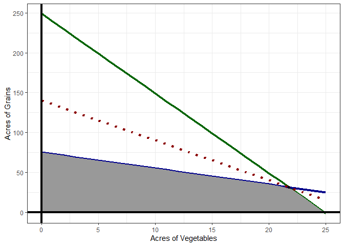
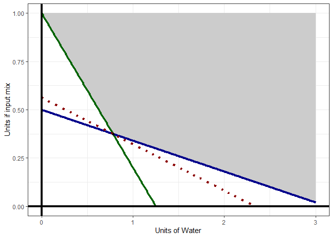
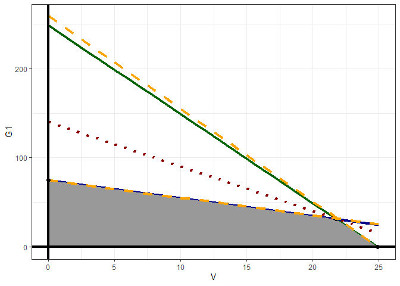
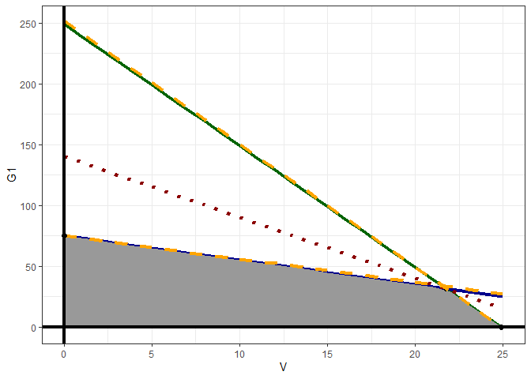

```r
knitr::opts_chunk$set(echo = TRUE)
# Clear environment of variables and functions
rm(list = ls(all = TRUE)) 

# Clear environmet of packages
if(is.null(sessionInfo()$otherPkgs) == FALSE)lapply(paste("package:", names(sessionInfo()$otherPkgs), sep=""), 
                                                    detach, character.only = TRUE, unload = TRUE)
# Load lpSolve package to demonstrate simple LP
library(lpSolveAPI)
```


```r
# Course: 5260 Math models for decision making
# Title: Homework #1 
# Date: April 9th, 2020
# Author: Renato Albolea
```


# Problem 01  Dwight and Hattie Farm

Dwight and Hattie have run the family farm for over thirty years. They are currently planning the mix of crops to plant on their **120-acre farm** for the upcoming season. The table below gives the labor hours and fertilizer required per acre, as well as the total expected profit per acre for each of the potential crops under consideration. Dwight, Hattie, and their children can **work at most 6,500 total hours** during the upcoming season. **They have 200 tons of fertilizer** available. What mix of crops should be planted to **maximize the family’s total profit**? 

Crop          | Labor Required <br> (hours per acre)  | Fertilizer Required <br> (tons per acre)  | Expected Profit <br> (per acre)
------------- | -------------                         |  -------------                            | -------------  
Oats          | 50                                    |     1.5                                   |  $500
Wheat         | 60                                    |     2                                     |  $600
Corn          | 105                                   |     4                                     |  $950

#### a. Formulate a linear programming model algebraically  

  $Using:$  
      $\ \ \ T = Oats  /  W = Wheat  /  C = Corn$ 
        
  $Objective: Maximize Profit$  
      $\ \ \ max(500T + 600W + 950C)$    
        
        
        
  $Subject \ to:$   
      $\ \ \ T + W + C \le 120$
      $\ \ \ 50T + 60W + 105C \le 6,500$  
      $\ \ \ 1.5T + 2W + 4C \le 200$  
      $\ \ \ T \ge 0$  
      $\ \ \ W \ge 0$  
      $\ \ \ C \ge 0$  
      
  
  
  
####   b. Set up and solve in R.  


```r
# Defining the model:
farm <- make.lp(0, 3)

# Force Real numbers on the solution (I can have half acre of one crop)
set.type(farm, 1:3, "real")
```


```r
# objective function
set.objfn(farm, c(500, 600, 950))

# Setting Constraints
add.constraint(farm, c(1, 1, 1), "<=", 120)
add.constraint(farm, c(50, 60, 105), "<=", 6500)
add.constraint(farm, c(1.5, 2, 4), "<=", 200)

# The Model:
farm
```

```
## Model name: 
##             C1    C2    C3          
## Maximize   500   600   950          
## R1           1     1     1  <=   120
## R2          50    60   105  <=  6500
## R3         1.5     2     4  <=   200
## Kind       Std   Std   Std          
## Type      Real  Real  Real          
## Upper      Inf   Inf   Inf          
## Lower        0     0     0
```

```r
# Solving the model
solve(farm)
```

```
## [1] 0
```

```r
# Objective function Value:
get.objective(farm)
```

```
## [1] 64000
```

```r
# THe optimal variables:
get.variables(farm)
```

```
## [1] 80 40  0
```

```r
# How much of the constraints we use?
get.constraints(farm)
```

```
## [1]  120 6400  200
```


# Problem 02  Seattle Academy high school Kitchen

The kitchen manager for Seattle Academy high school is trying to decide what to feed students. He would like to offer some combination of **milk, beans, and oranges**, YUM! **The goal is to minimize cost**, **subject to meeting the minimum nutritional requirements** imposed by law. The cost and nutritional content of each food, along with the minimum nutritional requirements, are shown below. What diet should be fed to each student? Think carefully how a cost minimum is different than a profit maximum and how the constraints are set up.   

Product          | Niacin (mg)   | Thiamin (mg)  | Vitamin C (mg) | Cost ($)
-------------    | ------------- |  -----------  | -------------  | -------------
Milk (gallons)   | 3.2           |     1.12      |  32.0          | 2.00
Navy Beans (cups)| 4.9           |     1.3       |  0.0           | 0.20
Oranges          | 0.8           |     0.19      |  93.0          | 0.25
Minimum Daily Req| 13.0          |    1.5        |  45.0          | ---

#### a. Formulate a linear programming model algebraically  


  $Using:$  
      $\ \ \ M = Milk  /  B = Navy Beans  /  R = Oranges$  
        
  $Objective: Minimize \ Cost$  
      $\ \ \ min(2M + 0.2B + 0.25R)$  
        
        
        
  $Subject \ to:$   
      $\ \ \ 3.2M + 4.9B + 0.8R \ge 13.0$  
      $\ \ \ 1.12M + 1.3B + 0.19R \ge 1.5$  
      $\ \ \ 32.0M + 0.0B + 93R \ge 45$ 
      $\ \ \ M \ge 0$  
      $\ \ \ B \ge 0$  
      $\ \ \ R \ge 0$  
      
  
  
  
####   b. Set up and solve in R.  


```r
# Defining the model:
kitchen <- make.lp(0, 3)

# Force Real numbers on the solution (I can have half of a product)
set.type(kitchen, 1:3, "real")
```


```r
# objective function
set.objfn(kitchen, c(2, 0.2, 0.25))

# Setting Constraints
add.constraint(kitchen, c(3.2, 4.9, 0.8), ">=", 13)
add.constraint(kitchen, c(1.12, 1.3, 0.19), ">=", 1.5)
add.constraint(kitchen, c(32, 0, 93), ">=", 45)

# The Model:
kitchen
```

```
## Model name: 
##             C1    C2    C3         
## Minimize     2   0.2  0.25         
## R1         3.2   4.9   0.8  >=   13
## R2        1.12   1.3  0.19  >=  1.5
## R3          32     0    93  >=   45
## Kind       Std   Std   Std         
## Type      Real  Real  Real         
## Upper      Inf   Inf   Inf         
## Lower        0     0     0
```

```r
# Solving the model
solve(kitchen)
```

```
## [1] 0
```

```r
# Objective function Value:
get.objective(kitchen)
```

```
## [1] 0.6357801
```

```r
# THe optimal variables:
get.variables(kitchen)
```

```
## [1] 0.000000 2.574062 0.483871
```

```r
# How much of the constraints we use?
get.constraints(kitchen)
```

```
## [1] 13.000000  3.438216 45.000000
```

# Problem 03  Web Mercantile warehouse space

Web Mercantile sells many household products through an online catalog. The company needs substantial warehouse space for storing its goods. Plans now are being made for leasing warehouse storage space over the next 5 months. Just how much space will be required in each of these months is known. However, since these space requirements are quite different, it may be most economical to lease only the amount needed each month on a month-by-month basis. On the other hand, the additional cost for leasing space for additional months is much less than for the first month, so it may be less expensive to lease the maximum amount needed for the entire 5 months. Another option is the intermediate approach of changing the total amount of space leased (by adding a new lease and/or having an old lease expire) at least once but not every month.  

The space requirement and the leasing costs for the various leasing periods are as follows:  

Month         | Required Space (Sq. Ft.)   
------------- | ------------- 
1             | 30,000          
2             | 20,000
3             | 40,000
4             | 10,000
5             | 50,000

Leasing Period <br> (Months)        | Cost per Sq. Ft. Leased 
-------------                       | ------------- 
1                                   | $  65          
2                                   | $ 100
3                                   | $ 135
4                                   | $ 160
5                                   | $ 190

The objective is to minimize the total leasing cost for meeting the space requirements.

#### a. Formulate a linear programming model algebraically

  Let us use $x_{i,j}$ to represent the area rented at month i (from 1 to 5) for j months (also 1 to 5)  
    
    
  $Objective: Minimize \ Cost$  
      $\ \ \ min(x_{1,1}*65 + x_{1,2}*100 + x_{1,3}*135 + x_{1,4}*160 + x_{1,5}*190 + x_{2,1}*65 + x_{2,2}*100 + x_{2,3}*135 + x_{2,4}*160 + x_{3,1}*65 + x_{3,2}*100 + x_{3,3}*135 + x_{4,1}*65 + x_{4,2}*100 + x_{5,1}*65)$  
          
          
  $Subject \ to:$   
      $\ \ \ \sum_{j=1}^{5} x_{1,j} \ge 30,000$  
      $\ \ \ \sum_{j=2}^{5} x_{1,j} + \sum_{j=1}^{4} x_{2,j} \ge 20,000$  
      $\ \ \ \sum_{j=3}^{5} x_{1,j} + \sum_{j=2}^{4} x_{2,j} + \sum_{j=1}^{3} x_{3,j} \ge 40,000$
      $\ \ \ \sum_{j=4}^{5} x_{1,j} + \sum_{j=3}^{4} x_{2,j} + \sum_{j=2}^{3} x_{3,j}  + \sum_{j=1}^{2} x_{4,j} \ge 10,000$  
      $\ \ \ x_{1,5} + x_{2,4} + x_{3,3} + x_{4,2} + x_{5,1} \ge 50,000$
      $\ \ \ x_{i,j} \ge 0$  

      
      

####   b. Set up and solve in R.  


```r
# Defining the model:
rent <- make.lp(0, 15)

# Force Real numbers on the solution 
set.type(rent, 1:15, "real")
```


```r
# objective function
set.objfn(rent, c(65, 100, 135, 160, 190, 65, 100, 135, 160, 65, 100, 135, 65, 100, 65))

# Setting Constraints
add.constraint(rent, c(1, 1, 1, 1, 1, 0, 0, 0, 0, 0, 0, 0, 0, 0, 0), ">=", 30000)
add.constraint(rent, c(0, 1, 1, 1, 1, 1, 1, 1, 1, 0, 0, 0, 0, 0, 0), ">=", 20000)
add.constraint(rent, c(0, 0, 1, 1, 1, 0, 1, 1, 1, 1, 1, 1, 0, 0, 0), ">=", 40000)
add.constraint(rent, c(0, 0, 0, 1, 1, 0, 0, 1, 1, 0, 1, 1, 1, 1, 0), ">=", 10000)
add.constraint(rent, c(0, 0, 0, 0, 1, 0, 0, 0, 1, 0, 0, 1, 0, 1, 1), ">=", 50000)

# The Model:
rent
```

```
## Model name: 
##   a linear program with 15 decision variables and 5 constraints
```

```r
# Solving the model
solve(rent)
```

```
## [1] 0
```

```r
# Objective function Value:
get.objective(rent)
```

```
## [1] 7650000
```

```r
# THe optimal variables:
get.variables(rent)
```

```
##  [1]     0     0     0     0 30000     0     0     0     0 10000     0     0
## [13]     0     0 20000
```

```r
# How much of the constraints we use?
get.constraints(rent)
```

```
## [1] 30000 30000 40000 30000 50000
```


# Problem 04  Metalco's new alloy

The Metalco Company desires to blend a new alloy of **40 percent tin, 35 percent zinc, and 25 percent lead** from several available alloys having the following properties:

Property           | Alloy 1       | Alloy 2       | Alloy 3       | Alloy 4       | Alloy 5  
-----------------  | ------------- | ------------- | ------------- | ------------- | ------------- 
Percentage of tin  | 60            |  25           |  45           |  20           |  50        
Percentage of zinc | 10            |  15           |  45           |  50           |  40
Percentage of lead | 30            |  60           |  10           |  30           |  10
Cost ($/lb)        | 22            |  20           |  25           |  24           |  27


The objective is to determine the proportions of these alloys that should be blended to produce the new alloy at a **minimum cost**.

#### a. Formulate a linear programming model algebraically

  Let us use $A_{i}$ to represent each alloy (where i is between 1 and 5)   
    
    
  $Objective: Minimize \ Cost$  
      $\ \ \ min(22A_{1} + 20A_{2} + 25A_{3} + 24A_{4} + 27A_{5})$  
        
        
        
  $Subject \ to:$   
      $\ \ \ 60A_{1} + 25A_{2} + 45A_{3} + 20A_{4} + 50A_{5} = 40$  
      $\ \ \ 10A_{1} + 15A_{2} + 45A_{3} + 50A_{4} + 40A_{5} = 35$ 
      $\ \ \ 30A_{1} + 60A_{2} + 10A_{3} + 30A_{4} + 10A_{5} = 25$ 
      $\ \ \ A_{1} + A_{2} + A_{3} + A_{4} + A_{5} = 1$
      $\ \ \ A_{i} \ge 0$  
      

      

####   b. Set up and solve in R.  


```r
# Defining the model:
alloy <- make.lp(0, 5)

# Force Real numbers on the solution 
set.type(alloy, 1:5, "real")
```


```r
# objective function
set.objfn(alloy, c(22, 20, 25, 24, 27))

# Setting Constraints
add.constraint(alloy, c(60, 25, 45, 20, 50), "=", 40)
add.constraint(alloy, c(10, 15, 45, 50, 40), "=", 35)
add.constraint(alloy, c(30, 60, 10, 30, 10), "=", 25)
add.constraint(alloy, c(1, 1, 1, 1, 1), "=", 1)

# The Model:
alloy
```

```
## Model name: 
##             C1    C2    C3    C4    C5       
## Minimize    22    20    25    24    27       
## R1          60    25    45    20    50  =  40
## R2          10    15    45    50    40  =  35
## R3          30    60    10    30    10  =  25
## R4           1     1     1     1     1  =   1
## Kind       Std   Std   Std   Std   Std       
## Type      Real  Real  Real  Real  Real       
## Upper      Inf   Inf   Inf   Inf   Inf       
## Lower        0     0     0     0     0
```

```r
# Solving the model
solve(alloy)
```

```
## [1] 0
```

```r
# Objective function Value:
get.objective(alloy)
```

```
## [1] 23.45652
```

```r
# THe optimal variables:
get.variables(alloy)
```

```
## [1] 0.04347826 0.28260870 0.67391304 0.00000000 0.00000000
```

```r
# How much of the constraints we use?
get.constraints(alloy)
```

```
## [1] 40 35 25  1
```

# Problem 05  Grains and Vegetables

A farmer is producing Grains and Vegetables with a given set of input mix and water. The input mix includes fertilizer and labor in fixed ratios so they can be treated as one variable, with **grains needing 5 units of input and and vegetables needing 50 units of input per acre**. Water is also used, **grains need 4 units of water and vegetables need 8 units of water per acre**. **The farmer only has 1,245 units of the input mix and 300 units of water**. **The profit per acre is \$5 for grains and \$25 for vegetables**. The farmer wants to **maximize profits and there is no acreage constraint**.

#### a. Formulate a linear programming model algebraically

  Let us use G for grains and V for vegetables   
    
    
  $Objective: Maximimize \ profits$  
      $\ \ \ max(5G +25V)$  
         
         
  $Subject \ to:$   
      $\ \ \ 5G + 50V \le 1,245$  
      $\ \ \ 4G + 8V \le 300$
      $\ \ \ G \ and \ V \ge 0$  
      
      
      
####  b. Use the graphical method to solve this model (an approximation is fine, you can type the answer in your R Notebook if you’re not comfortable graphing) 


```r
library(ggplot2)
library(ggthemes)

fun_input_units <- function(V) (1245-50*V)/5
fun_water <- function(V) (300-8*V)/4
fun_obj <- function(V) (701.25-25*V)/5
V = seq(0, 25)

df <-  data.frame(V, G1=fun_input_units(V), G2=fun_water(V), G3=fun_obj(V))
df <- transform(df, z = pmin(G1,G2))

ggplot(df, aes(x=V))+
  geom_line(aes(y = G1), color = 'dark green', size=1.5) +
  geom_line(aes(y = G2), color = 'dark blue', size=1.5) +
  geom_ribbon(aes(ymin=0, ymax=z), fill = 'gray60')+
  geom_point(aes(x=21.75, y=31.50)) + 
  geom_line(aes(y = G3), color = 'dark red',linetype="dotted", size=1.5)+
  xlab("Acres of Vegetables") +
  ylab("Acres of Grains") +
  theme_bw() + 
  geom_vline(xintercept = 0, size=1.5)+
  geom_hline(yintercept = 0, size=1.5)
```

<!-- -->

The optimal point is at the intersection between the blue and green line: V=23 (approximated) and G=30(approximated)  

####  c.Formulate the dual model algebraically

 Let us use I for input mix and W for water  
 
   
  $Objective: Minimize \ resources$  
      $\ \ \ min(1,245I + 300W)$    
    
          
  $Subject \ to:$   
      $\ \ \ 5I + 4W \ge 5$  
      $\ \ \ 50I + 8W \ge 25$
      $\ \ \ I \ and \ W \ge 0$  
      

  
  
####  d. Use the graphical method to solve the dual model (an approximation is fine, you can type the answer in your R Notebook if you’re not comfortable graphing)


```r
fun_input_units <- function(W) (5-4*W)/5
fun_water <- function(W) (25-8*W)/50
fun_obj <- function(W) (701.25-300*W)/1245
W = seq(0, 3,0.01)

df <-  data.frame(W, I1=fun_input_units(W), I2=fun_water(W), I3=fun_obj(W))
df <- transform(df, z = pmax(I1,I2,0))

ggplot(df, aes(x=W))+
  geom_ribbon(aes(ymin=z, ymax=1), fill = 'gray80') +
  geom_line(aes(y = I1), color = 'dark green', size=1.5) +
  geom_line(aes(y = I2), color = 'dark blue', size=1.5) +
  theme_minimal() + 
  geom_point(aes(x=0.78125 , y=0.37500 )) + 
  geom_line(aes(y = I3), color = 'dark red',linetype="dotted", size=1.5 ) +
  xlim(0,3) + ylim(0,1)+
  xlab("Units of Water") +
  ylab("Units if input mix") +
  theme_bw() + 
  geom_vline(xintercept = 0, size=1.5)+
  geom_hline(yintercept = 0, size=1.5)
```

```
## Warning: Removed 175 row(s) containing missing values (geom_path).
```

```
## Warning: Removed 67 row(s) containing missing values (geom_path).
```

<!-- -->

The optimal point is at the intersection between the blue and green line: W=0.8 (approximated) and I=0.38(approximated)  

####  e. Interpret the dual results


 Adding one unit of water would increase the farm's profit in \$0.8 per acre and adding one unit of the mix input of labor/fertilizer would increase the farm's profit in \$0.38 per acre.   


  **It is common for the parameters of the model to be uncertain. As such, it is good to be aware of “tipping” points in the model, where small changes in parameters can lead to dramatic changes in the model solution. Using your graph of the primal problem in part (b) above, perform the following sensitivity analysis:**  


####  f. What changes in the objective function parameters would change the solution in (b)  

We would had a change in b if grains' profit were bellow \$2.5/acre (Will make the objective function have a slop lower than -10 -the limit of Input constraint) or above \$12.5/acre (Will make the objective function have a slop higher than -2 -the limit of Water constraint), or if Vegetables' profit were below \$10/acre (Will make the objective function have a slop higher than -2 -the limit of Water constraint) or above \$50/acre (Will make the objective function have a slop lower than -10 -the limit of Input constraint). 
The graphs bellow presents the altered objective functions in orange and the new optimal solutions.  


```r
fun_input_units <- function(V) (1245-50*V)/5
fun_water <- function(V) (300-8*V)/4
fun_obj <- function(V) (701.25-25*V)/5
fun_obj_G_Min <- function(V) (622.5-25*V)/2.4
fun_obj_G_Max <- function(V) (945-25*V)/12.6

V = seq(0, 25)

df <-  data.frame(V, G1=fun_input_units(V), G2=fun_water(V), G3=fun_obj(V), G4=fun_obj_G_Min(V),
                  G5=fun_obj_G_Max(V))
df <- transform(df, z = pmin(G1,G2))

ggplot(df, aes(x=V))+
  geom_line(aes(y = G1), color = 'dark green', size=1.5) +
  geom_line(aes(y = G2), color = 'dark blue', size=1.5) +
  geom_ribbon(aes(ymin=0, ymax=z), fill = 'gray60')+
  theme_minimal() + 
  geom_point(aes(x=21.75, y=31.50), size=2) + 
  geom_line(aes(y = G3), color = 'dark red',linetype="dotted", size=1.5 ) +
  geom_line(aes(y = G4), color = 'orange',linetype="dashed", size=1.5  ) +
  geom_point(aes(x=24.9, y=0), color = 'black', size=2) +
  geom_line(aes(y = G5), color = 'orange',linetype="dashed", size=1.5 ) +
  geom_point(aes(x=0, y=75), color = 'black', size=2) +
  theme_bw() + 
  geom_vline(xintercept = 0, size=1.5)+
  geom_hline(yintercept = 0, size=1.5)
```

<!-- -->


```r
fun_input_units <- function(V) (1245-50*V)/5
fun_water <- function(V) (300-8*V)/4
fun_obj <- function(V) (701.25-25*V)/5
fun_obj_V_Min <- function(V) (375-9.5*V)/5
fun_obj_V_Max <- function(V) (1257.45-50.5*V)/5

V = seq(0, 25)

df <-  data.frame(V, G1=fun_input_units(V), G2=fun_water(V), G3=fun_obj(V), G4=fun_obj_V_Min(V),
                  G5=fun_obj_V_Max(V))
df <- transform(df, z = pmin(G1,G2))

ggplot(df, aes(x=V))+
  geom_line(aes(y = G1), color = 'dark green', size=1.5) +
  geom_line(aes(y = G2), color = 'dark blue', size=1.5) +
  geom_ribbon(aes(ymin=0, ymax=z), fill = 'gray60')+
  theme_minimal() + 
  geom_point(aes(x=21.75, y=31.50), size=2) + 
  geom_line(aes(y = G3), color = 'dark red',linetype="dotted", size=1.5 ) +
  geom_line(aes(y = G4), color = 'orange',linetype="dashed", size=1.5  ) +
  geom_point(aes(x=0, y=75), color = 'black', size=2) +
  geom_line(aes(y = G5), color = 'orange',linetype="dashed", size=1.5 ) +
  geom_point(aes(x=24.9, y=0), color = 'black', size=2) +
  theme_bw() + 
  geom_vline(xintercept = 0, size=1.5)+
  geom_hline(yintercept = 0, size=1.5)
```

<!-- -->

####  g. What changes in the right hand side constraints would change the solution in (b)

 
 The slop of the objective function in the dual solution (considering I as the Y axis) is -0.24 (-300/1245).
 The slop of the constraints are: -0.8 (Grain's Profit) and -0.16(Vegetable's profit).
 
 Changing the amount of resource for a non-binding constraint does not change the solution however changing the amount of resource of a binding constraint always changes the solution. Here, both constraints are binding so any change in them changes the solution in (b). However, the optimal solution will lay at the intersection of the two constrains as long as one constrain has a slope higher than -0.16 and the other has a slope lower than -0.8. Thus we would had a change in b if the farm had less than 375 (slope lower than -0.8) or more than 1,875 (slope higher than -0.16) of mix input or if water were below 199.2(slope higher than -0.16) or above 996 (slope lower than -0.8). 


####  h. What changes in the constraint parameters would change the solution in (b)

 The slop of the objective function (considering G as the Y axis) is -5 (-25/5).
 The slop of the constraints are: -10 (inputs) and -2(water)
 As was said above, since both constraints are binding, the solution will always change, however, the optimal solution will lay at the intersection of the two constrains as long as one constrain has a slope higher than -5 and the other has a slope lower than -5. 


####  i. Program the problem from above and find the solution

```r
# Defining the model:
farm <- make.lp(0, 2)

# Force Real numbers on the solution 
set.type(farm, 1:2, "real")
```


```r
# objective function
set.objfn(farm, c(5, 25))

# Setting Constraints
add.constraint(farm, c(5, 50), "<=", 1245)
add.constraint(farm, c(4, 8), "<=", 300)

dimnames(farm) <- list( c("Input_Mix", "Water"),
                        c("Grains", "Vegetables"))
# The Model:
farm
```

```
## Model name: 
##                Grains  Vegetables          
## Maximize            5          25          
## Input_Mix           5          50  <=  1245
## Water               4           8  <=   300
## Kind              Std         Std          
## Type             Real        Real          
## Upper             Inf         Inf          
## Lower               0           0
```

```r
# Solving the model
solve(farm)
```

```
## [1] 0
```

```r
# Objective function Value:
get.objective(farm)
```

```
## [1] 701.25
```

```r
# THe optimal variables:
get.variables(farm)
```

```
## [1] 31.50 21.75
```

```r
# How much of the constraints we use?
get.constraints(farm)
```

```
## [1] 1245  300
```
####  j. Find the dual values and interpret them


```r
get.dual.solution(farm)
```

```
## [1] 1.00000 0.37500 0.78125 0.00000 0.00000
```

 Adding one unit of water would increase the farm's profit in \$0.78 per acre and adding one unit of the mix input of labor/fertilizer would increase the farm's profit in \$0.375 per acre.
 

####  k. Find the sensitivity range and compare to what you found in parts (f) and (g)


<table class="table table-striped table-bordered" style="margin-left: auto; margin-right: auto;">
 <thead>
  <tr>
   <th style="text-align:left;">   </th>
   <th style="text-align:right;"> Input_Mix </th>
   <th style="text-align:right;"> Water </th>
   <th style="text-align:right;"> Grains </th>
   <th style="text-align:right;"> Vegetables </th>
  </tr>
 </thead>
<tbody>
  <tr>
   <td style="text-align:left;"> Solution </td>
   <td style="text-align:right;"> 1,245.00 </td>
   <td style="text-align:right;"> 300.00 </td>
   <td style="text-align:right;"> 31.5 </td>
   <td style="text-align:right;"> 21.75 </td>
  </tr>
  <tr>
   <td style="text-align:left;"> Duals/Coef </td>
   <td style="text-align:right;"> 0.37 </td>
   <td style="text-align:right;"> 0.78 </td>
   <td style="text-align:right;"> 5.0 </td>
   <td style="text-align:right;"> 25.00 </td>
  </tr>
  <tr>
   <td style="text-align:left;"> Sens From </td>
   <td style="text-align:right;"> 375.00 </td>
   <td style="text-align:right;"> 199.20 </td>
   <td style="text-align:right;"> 2.5 </td>
   <td style="text-align:right;"> 10.00 </td>
  </tr>
  <tr>
   <td style="text-align:left;"> Sens Till </td>
   <td style="text-align:right;"> 1,875.00 </td>
   <td style="text-align:right;"> 996.00 </td>
   <td style="text-align:right;"> 12.5 </td>
   <td style="text-align:right;"> 50.00 </td>
  </tr>
</tbody>
<tfoot>
<tr>
<td style = 'padding: 0; border:0;' colspan='100%'><sup></sup> Objective function value = 701.25</td>
</tr>
</tfoot>
</table>

 We have the same values.  
