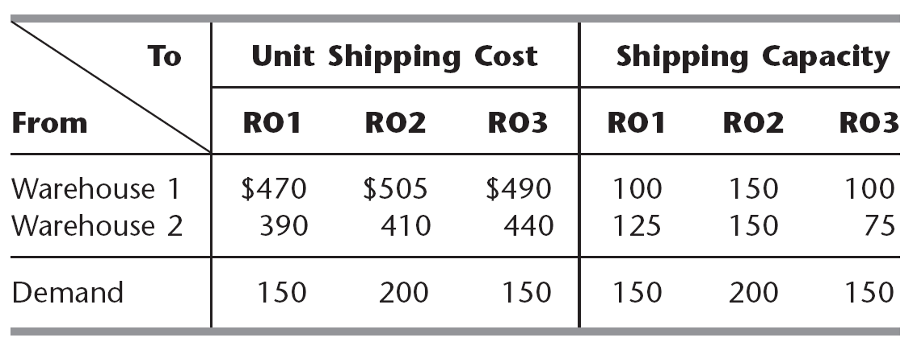
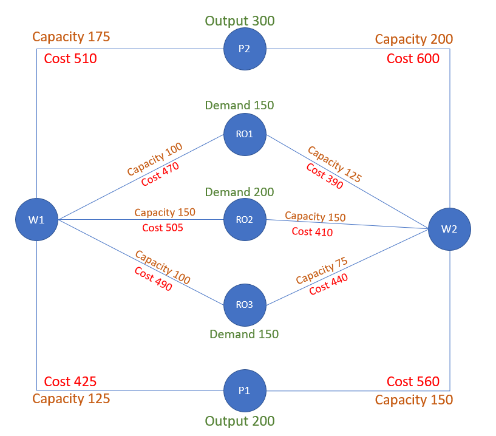
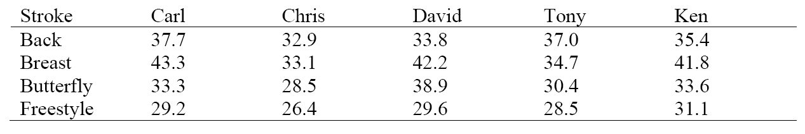
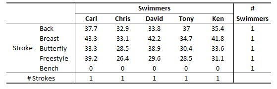

```r
knitr::opts_chunk$set(echo = TRUE)
# Clear environment of variables and functions
rm(list = ls(all = TRUE)) 

# Clear environmet of packages
if(is.null(sessionInfo()$otherPkgs) == FALSE)lapply(paste("package:", names(sessionInfo()$otherPkgs), sep=""), 
                                                    detach, character.only = TRUE, unload = TRUE)
# Load lpSolve package to demonstrate simple LP
library(lpSolveAPI)
`%>%` <- magrittr::`%>%`
library(knitr)
library(kableExtra)
library(formattable)
```


```r
# Course: 5260 Math models for decision making
# Title: Homework #2 
# Date: April 28th, 2020
# Author: Renato Albolea
```


# Problem 01 Heart Start

Heart Start produces automated external defibrillators (AEDs) in each of two different plants (A and B). The unit production costs and monthly production capacity of the two plants are indicated in the table below. The AEDs are sold through three wholesalers. The shipping cost from each plant to the warehouse of each wholesaler along with the monthly demand from each wholesaler are also indicated in the table. How many AEDs should be produced in each plant, and how should they be distributed to each of the three wholesaler warehouses so as to minimize the combined cost of production and shipping?  


#### a. Draw a diagram of the problem. 
{width=60%}
  
  
####   b. Formulate this problem as a transportation problem by constructing the appropriate parameter table. Note the form above isn’t quite right as not all costs are combined and there is less demand than supply.  

{width=100%}


####   c. Code and solve a linear programming model using lpSolveAPI. What is the shipping cost and allocation from each plant to each warehouse? 


```r
# Set up the cost minimization
trans_1 <- make.lp(0, 8)

# Build objective function and constraints
obj_fn <- c(622, 614, 630, 0,
            641, 645, 649, 0)

matrix(obj_fn, nrow = 2, byrow=TRUE)
```

```
##      [,1] [,2] [,3] [,4]
## [1,]  622  614  630    0
## [2,]  641  645  649    0
```

```r
set.objfn(trans_1, obj_fn)

# Force integer numbers on the solution 
#set.type(trans_1, 1:8, "int")

# Plant Constraint
add.constraint(trans_1, c(rep(1, 4), rep(0, 4)), "=", 100) # A
add.constraint(trans_1, c(rep(0, 4),rep(1, 4)), "=", 120) # B

# Distribution Constraint
add.constraint(trans_1, c(rep(c(1, 0, 0, 0),2)), "=", 80) # W1
add.constraint(trans_1, c(rep(c(0, 1, 0, 0),2)), "=", 60) # W2
add.constraint(trans_1, c(rep(c(0, 0, 1, 0),2)), "=", 70) # W3
add.constraint(trans_1, c(rep(c(0, 0, 0, 1),2)), "=", 10) # W4D


# Add row and column names
dimnames(trans_1) <- list(c("PA", "PB", "W1", "W2", "W3", "W4D"),
                            c("PA_W1", "PA_W2", "PA_W3", "PA_W4D", 
                              "PB_W1", "PB_W2", "PB_W3", "PB_W4D"))

# Write to see named algebraic formulation
write.lp(trans_1, "Problem_1.lp",type = 'lp')

# Solve the model, if this return 0 an optimal solution is found
solve(trans_1)
```

```
## [1] 0
```


### d. Would it be more cost effective to increase capacity at Plant A or B?
 Since the products produced by Plant A have a total cost (production + shipment) lower than the products from Plant B, it is better to increase capacity on Plant A. The same answer can be seen in the sensitivity table below.
 
 

```r
sensitivity_table(trans_1)
```

<table class="table table-striped table-bordered" style="margin-left: auto; margin-right: auto;">
 <thead>
  <tr>
   <th style="text-align:left;">   </th>
   <th style="text-align:left;"> PA </th>
   <th style="text-align:left;"> PB </th>
   <th style="text-align:left;"> W1 </th>
   <th style="text-align:left;"> W2 </th>
   <th style="text-align:left;"> W3 </th>
   <th style="text-align:left;"> W4D </th>
   <th style="text-align:left;"> PA_W1 </th>
   <th style="text-align:left;"> PA_W2 </th>
   <th style="text-align:left;"> PA_W3 </th>
   <th style="text-align:left;"> PA_W4D </th>
   <th style="text-align:left;"> PB_W1 </th>
   <th style="text-align:left;"> PB_W2 </th>
   <th style="text-align:left;"> PB_W3 </th>
   <th style="text-align:left;"> PB_W4D </th>
  </tr>
 </thead>
<tbody>
  <tr>
   <td style="text-align:left;"> solution </td>
   <td style="text-align:left;"> 100 </td>
   <td style="text-align:left;"> 120 </td>
   <td style="text-align:left;"> 80 </td>
   <td style="text-align:left;"> 60 </td>
   <td style="text-align:left;"> 70 </td>
   <td style="text-align:left;"> 10 </td>
   <td style="text-align:left;"> 0 </td>
   <td style="text-align:left;"> 60 </td>
   <td style="text-align:left;"> 40 </td>
   <td style="text-align:left;"> 0 </td>
   <td style="text-align:left;"> 80 </td>
   <td style="text-align:left;"> 0 </td>
   <td style="text-align:left;"> 30 </td>
   <td style="text-align:left;"> 10 </td>
  </tr>
  <tr>
   <td style="text-align:left;"> duals/coef </td>
   <td style="text-align:left;"> 614 </td>
   <td style="text-align:left;"> 633 </td>
   <td style="text-align:left;"> 8 </td>
   <td style="text-align:left;"> 0 </td>
   <td style="text-align:left;"> 16 </td>
   <td style="text-align:left;"> -633 </td>
   <td style="text-align:left;"> 622 </td>
   <td style="text-align:left;"> 614 </td>
   <td style="text-align:left;"> 630 </td>
   <td style="text-align:left;"> 0 </td>
   <td style="text-align:left;"> 641 </td>
   <td style="text-align:left;"> 645 </td>
   <td style="text-align:left;"> 649 </td>
   <td style="text-align:left;"> 0 </td>
  </tr>
  <tr>
   <td style="text-align:left;"> Sens From </td>
   <td style="text-align:left;"> 100 </td>
   <td style="text-align:left;"> 120 </td>
   <td style="text-align:left;"> 80 </td>
   <td style="text-align:left;"> -inf </td>
   <td style="text-align:left;"> 70 </td>
   <td style="text-align:left;"> 10 </td>
   <td style="text-align:left;"> 622 </td>
   <td style="text-align:left;"> -inf </td>
   <td style="text-align:left;"> 618 </td>
   <td style="text-align:left;"> -19 </td>
   <td style="text-align:left;"> -inf </td>
   <td style="text-align:left;"> 633 </td>
   <td style="text-align:left;"> 649 </td>
   <td style="text-align:left;"> -inf </td>
  </tr>
  <tr>
   <td style="text-align:left;"> Sens Till </td>
   <td style="text-align:left;"> 100 </td>
   <td style="text-align:left;"> 120 </td>
   <td style="text-align:left;"> 80 </td>
   <td style="text-align:left;"> inf </td>
   <td style="text-align:left;"> 70 </td>
   <td style="text-align:left;"> 10 </td>
   <td style="text-align:left;"> inf </td>
   <td style="text-align:left;"> 626 </td>
   <td style="text-align:left;"> 630 </td>
   <td style="text-align:left;"> inf </td>
   <td style="text-align:left;"> 641 </td>
   <td style="text-align:left;"> inf </td>
   <td style="text-align:left;"> 661 </td>
   <td style="text-align:left;"> 19 </td>
  </tr>
</tbody>
<tfoot>
<tr>
<td style = 'padding: 0; border:0;' colspan='100%'><sup></sup> Objective Value = 132,790.00</td>
</tr>
</tfoot>
</table>


# Problem 02 10.6-5 altered 

The Makonsel Company is a fully integrated company that both produces goods and sells them at its retail outlets.
After production, the goods are stored in the company’s two warehouses until needed by the retail outlets. Trucks are used to
transport the goods from the two plants to the warehouses, and then from the warehouses to the three retail outlets.
Using units of full truckloads, the following table shows each plant’s monthly output, its shipping cost per truckload sent to each warehouse, and the maximum amount that it can ship per month to each warehouse.   


{width=100%}   

For each retail outlet (RO), the next table shows its monthly demand, its shipping cost per truckload from each warehouse, and the maximum amount that can be shipped per month from each warehouse.

{width=60%} 

#### a. Draw a diagram of the network in a Plant—Warehouse—Retail Outlets diagram where the nodes of each group are lined up Add all cost and capacity information to each route 
{width=60%}
  
  
####  b. Code the problem in R as a Minimum Cost Flow problem 


```r
# Set up the cost minimization
trans_2 <- make.lp(0, 10)

# Build objective function and constraints
obj_fn <- c(425, 560, # Plant 1 
            510, 600, # Plant 2 
            470, 505, 490, # Warehouse 1 
            390, 410, 440) # Warehouse 2
 

set.objfn(trans_2, obj_fn)

# Force Integer numbers on the solution 
set.type(trans_2, 1:10, "int")

# Plant Constraint
add.constraint(trans_2, c(1, 1, rep(0, 8)), "=", 200) # Plant 1
add.constraint(trans_2, c(0, 0 , 1, 1, rep(0, 6)), "=", 300) # Plant 2

# Distribution Constraint From Plants to Warehouses
add.constraint(trans_2, c(1, rep(0, 9)), "<=", 125) # Plant 1 to W 1
add.constraint(trans_2, c(0, 1, rep(0, 8)), "<=", 150) # Plant 1 to W 2
add.constraint(trans_2, c(0, 0, 1, rep(0, 7)), "<=", 175) # Plant 2 to W 1
add.constraint(trans_2, c(rep(0, 3), 1, rep(0, 6)), "<=", 200) # Plant 2 to W 2

# Warehouse Constraint
add.constraint(trans_2, c(1, 0, 1, 0, rep(0, 6)), "<=", 350) # W 1
add.constraint(trans_2, c(0, 1, 0, 1, rep(0, 6)), "<=", 350) # W 2
add.constraint(trans_2, c(1, 0, 1, 0, rep(-1,3), rep(0, 3)), "=", 0) # W 1
add.constraint(trans_2, c(1, 0, 1, 0, rep(0,3), rep(-1, 3)), "=", 0) # W 2


# # Distribution Constraint From Warehouse to Retail
add.constraint(trans_2, c(rep(0, 4), 1, rep(0, 5)), "<=", 100) # W 1 to RO1
add.constraint(trans_2, c(rep(0, 5), 1, rep(0, 4)), "<=", 150) # W 1 to RO2
add.constraint(trans_2, c(rep(0, 6), 1, rep(0, 3)), "<=", 100) # W 1 to RO3
add.constraint(trans_2, c(rep(0, 7), 1, rep(0, 2)), "<=", 125) # W 2 to RO1
add.constraint(trans_2, c(rep(0, 8), 1, 0), "<=", 150) # W 2 to RO2
add.constraint(trans_2, c(rep(0, 9), 1 ), "<=",  75) # W 2 to RO3


# # Store Constraint
add.constraint(trans_2, c(rep(0, 4), 1, rep(0, 2), 1, rep(0, 2)), "=", 150) # RO1
add.constraint(trans_2, c(rep(0, 5), 1, rep(0, 2), 1, rep(0, 1)), "=", 200) # RO2
add.constraint(trans_2, c(rep(0, 6), 1, rep(0, 2), 1, rep(0, 0)), "=", 150) # RO3


# # Add row and column names
dimnames(trans_2) <- list(c("P1", "P2", "P1_W1", "P1_W2", "P2_W1", "P2_W2", 
                            "W1", "W2", "W1_in_out", "W2_in_out", "W1_RO1", "W1_RO2", "W1_RO3",
                              "W2_RO1", "W2_RO2", "W2_RO3", "RO1", "RO2", "RO3"),
                          
                          c("P1_W1", "P1_W2", "P2_W1", "P2_W2",
                              "W1_RO1", "W1_RO2", "W1_RO3", "W2_RO1", "W2_RO2", "W2_RO3"))

# Write to see named algebraic formulation
write.lp(trans_2, "Problem_2.lp",type = 'lp')

# Solve the model, if this return 0 an optimal solution is found
solve(trans_2)
```

```
## [1] 0
```


### c. What is the total cost of shipping?
 
 The total shipping cost is $488,125.00  
 
 

### d. Which Plant/Warehouse route would you recommend expanding? Why? 

 Plant 1 has a lower cost to ship its products so it should be prioritized in a expansion.  
 The route from Plant 1 to the Warehouse 1 also should be prioritized because is the cheapest line to the warehouse.
 The route from Warehouse 1 to Retail Outlet 3 should also be prioritized since each additional unit that we can ship additionally in this rout will reduce our cost in $30 per unit all else holding constant.  
 


```r
sensitivity_table(trans_2)
```

<table class="table table-striped table-bordered" style="margin-left: auto; margin-right: auto;">
 <thead>
  <tr>
   <th style="text-align:left;">   </th>
   <th style="text-align:left;"> P1 </th>
   <th style="text-align:left;"> P2 </th>
   <th style="text-align:left;"> P1_W1 </th>
   <th style="text-align:left;"> P1_W2 </th>
   <th style="text-align:left;"> P2_W1 </th>
   <th style="text-align:left;"> P2_W2 </th>
   <th style="text-align:left;"> W1 </th>
   <th style="text-align:left;"> W2 </th>
   <th style="text-align:left;"> W1_in_out </th>
   <th style="text-align:left;"> W2_in_out </th>
   <th style="text-align:left;"> W1_RO1 </th>
   <th style="text-align:left;"> W1_RO2 </th>
   <th style="text-align:left;"> W1_RO3 </th>
   <th style="text-align:left;"> W2_RO1 </th>
   <th style="text-align:left;"> W2_RO2 </th>
   <th style="text-align:left;"> W2_RO3 </th>
   <th style="text-align:left;"> RO1 </th>
   <th style="text-align:left;"> RO2 </th>
   <th style="text-align:left;"> RO3 </th>
   <th style="text-align:left;"> P1_W1 </th>
   <th style="text-align:left;"> P1_W2 </th>
   <th style="text-align:left;"> P2_W1 </th>
   <th style="text-align:left;"> P2_W2 </th>
   <th style="text-align:left;"> W1_RO1 </th>
   <th style="text-align:left;"> W1_RO2 </th>
   <th style="text-align:left;"> W1_RO3 </th>
   <th style="text-align:left;"> W2_RO1 </th>
   <th style="text-align:left;"> W2_RO2 </th>
   <th style="text-align:left;"> W2_RO3 </th>
  </tr>
 </thead>
<tbody>
  <tr>
   <td style="text-align:left;"> solution </td>
   <td style="text-align:left;"> 200 </td>
   <td style="text-align:left;"> 300 </td>
   <td style="text-align:left;"> 125 </td>
   <td style="text-align:left;"> 75 </td>
   <td style="text-align:left;"> 125 </td>
   <td style="text-align:left;"> 175 </td>
   <td style="text-align:left;"> 250 </td>
   <td style="text-align:left;"> 250 </td>
   <td style="text-align:left;"> 0 </td>
   <td style="text-align:left;"> 0 </td>
   <td style="text-align:left;"> 100 </td>
   <td style="text-align:left;"> 50 </td>
   <td style="text-align:left;"> 100 </td>
   <td style="text-align:left;"> 50 </td>
   <td style="text-align:left;"> 150 </td>
   <td style="text-align:left;"> 50 </td>
   <td style="text-align:left;"> 150 </td>
   <td style="text-align:left;"> 200 </td>
   <td style="text-align:left;"> 150 </td>
   <td style="text-align:left;"> 125 </td>
   <td style="text-align:left;"> 75 </td>
   <td style="text-align:left;"> 125 </td>
   <td style="text-align:left;"> 175 </td>
   <td style="text-align:left;"> 100 </td>
   <td style="text-align:left;"> 50 </td>
   <td style="text-align:left;"> 100 </td>
   <td style="text-align:left;"> 50 </td>
   <td style="text-align:left;"> 150 </td>
   <td style="text-align:left;"> 50 </td>
  </tr>
  <tr>
   <td style="text-align:left;"> duals/coef </td>
   <td style="text-align:left;"> 560 </td>
   <td style="text-align:left;"> 600 </td>
   <td style="text-align:left;"> -45 </td>
   <td style="text-align:left;"> 0 </td>
   <td style="text-align:left;"> 0 </td>
   <td style="text-align:left;"> 0 </td>
   <td style="text-align:left;"> 0 </td>
   <td style="text-align:left;"> 0 </td>
   <td style="text-align:left;"> -85 </td>
   <td style="text-align:left;"> -5 </td>
   <td style="text-align:left;"> 0 </td>
   <td style="text-align:left;"> 0 </td>
   <td style="text-align:left;"> -30 </td>
   <td style="text-align:left;"> 0 </td>
   <td style="text-align:left;"> -15 </td>
   <td style="text-align:left;"> 0 </td>
   <td style="text-align:left;"> 385 </td>
   <td style="text-align:left;"> 420 </td>
   <td style="text-align:left;"> 435 </td>
   <td style="text-align:left;"> 425 </td>
   <td style="text-align:left;"> 560 </td>
   <td style="text-align:left;"> 510 </td>
   <td style="text-align:left;"> 600 </td>
   <td style="text-align:left;"> 470 </td>
   <td style="text-align:left;"> 505 </td>
   <td style="text-align:left;"> 490 </td>
   <td style="text-align:left;"> 390 </td>
   <td style="text-align:left;"> 410 </td>
   <td style="text-align:left;"> 440 </td>
  </tr>
  <tr>
   <td style="text-align:left;"> Sens From </td>
   <td style="text-align:left;"> 125 </td>
   <td style="text-align:left;"> 125 </td>
   <td style="text-align:left;"> 75 </td>
   <td style="text-align:left;"> -inf </td>
   <td style="text-align:left;"> -inf </td>
   <td style="text-align:left;"> -inf </td>
   <td style="text-align:left;"> -inf </td>
   <td style="text-align:left;"> -inf </td>
   <td style="text-align:left;"> 0 </td>
   <td style="text-align:left;"> -50 </td>
   <td style="text-align:left;"> -inf </td>
   <td style="text-align:left;"> -inf </td>
   <td style="text-align:left;"> 100 </td>
   <td style="text-align:left;"> -inf </td>
   <td style="text-align:left;"> 75 </td>
   <td style="text-align:left;"> -inf </td>
   <td style="text-align:left;"> 100 </td>
   <td style="text-align:left;"> 200 </td>
   <td style="text-align:left;"> 100 </td>
   <td style="text-align:left;"> -inf </td>
   <td style="text-align:left;"> 515 </td>
   <td style="text-align:left;"> 465 </td>
   <td style="text-align:left;"> -158205824564529280 </td>
   <td style="text-align:left;"> 440 </td>
   <td style="text-align:left;"> 490 </td>
   <td style="text-align:left;"> -inf </td>
   <td style="text-align:left;"> 375 </td>
   <td style="text-align:left;"> -inf </td>
   <td style="text-align:left;"> 410 </td>
  </tr>
  <tr>
   <td style="text-align:left;"> Sens Till </td>
   <td style="text-align:left;"> 275 </td>
   <td style="text-align:left;"> 325 </td>
   <td style="text-align:left;"> 150 </td>
   <td style="text-align:left;"> inf </td>
   <td style="text-align:left;"> inf </td>
   <td style="text-align:left;"> inf </td>
   <td style="text-align:left;"> inf </td>
   <td style="text-align:left;"> inf </td>
   <td style="text-align:left;"> 100 </td>
   <td style="text-align:left;"> 0 </td>
   <td style="text-align:left;"> inf </td>
   <td style="text-align:left;"> inf </td>
   <td style="text-align:left;"> 150 </td>
   <td style="text-align:left;"> inf </td>
   <td style="text-align:left;"> 150 </td>
   <td style="text-align:left;"> inf </td>
   <td style="text-align:left;"> 150 </td>
   <td style="text-align:left;"> 300 </td>
   <td style="text-align:left;"> 150 </td>
   <td style="text-align:left;"> 470 </td>
   <td style="text-align:left;"> inf </td>
   <td style="text-align:left;"> 137086331427226560 </td>
   <td style="text-align:left;"> 645 </td>
   <td style="text-align:left;"> 485 </td>
   <td style="text-align:left;"> inf </td>
   <td style="text-align:left;"> 520 </td>
   <td style="text-align:left;"> 420 </td>
   <td style="text-align:left;"> 425 </td>
   <td style="text-align:left;"> inf </td>
  </tr>
</tbody>
<tfoot>
<tr>
<td style = 'padding: 0; border:0;' colspan='100%'><sup></sup> Objective Value = 488,125.00</td>
</tr>
</tfoot>
</table>


### e. Capacity from Warehouse 2 to Retail Outlet 3 is lower than all other capacities. The manager has been complaining that it needs to be expanded to meet demand. What would you recommend based on this analysis?  

The route that links Warehouse 2 to Retail Outlet 3 is not being used in its fully capacity because the route from Warehouse 1 to Retail Outlet 3 is a cheaper option and both routes are supplying all the demand already. In case of a demand increase the route from Warehouse 1 to Retail Outlet 3 should be increased instead of the other one.


# Problem 03 College swim team

The coach of a men’s college swim team needs to assign swimmers to a 200-yard medley relay team. Since most of the best swimmers are very fast in more than one stroke, it is not clear which swimmer should be assigned to each of the four strokes. The five fastest swimmers and the best times for 50-yards of each stroke are below. The coach wishes to determine how to assign four swimmers to get the fastest overall time in the four event medley.

{width=80%}


#### a. Though this is an assignment problem, formulate this problem as a transportation problem by constructing the appropriate parameter table. Note the form above isn’t quite right so you will need to make some adjustments. 

{width=80%}
  


####  b.How many decision variables are there in your final table? What makes the problem complicated from the coach’s perspective?   

The table ends up with 25 variables. The hard part of the problem is that each Swimmer can go to the pool just once, so the coach can not just pick the fast swimmer for each style. For example, Chris is the fastest swimmer for all styles but you can only use him once.  

####  c. Code and solve a linear programming model using lpSolveAPI. What is the expected finishing time and who swims which stroke of the race?  


```r
# Set up the cost minimization
trans_3 <- make.lp(0, 25)

# Build objective function and constraints
obj_fn <- c(37.7, 32.9, 33.8, 37.0, 35.4, 
            43.3, 33.1, 42.2, 34.7, 41.8, 
            33.3, 28.5, 38.9, 30.4, 33.6, 
            29.2, 26.4, 29.6, 28.5, 31.1, 
            0, 0, 0, 0, 0 )

matrix(obj_fn, nrow = 5, byrow=TRUE)
```

```
##      [,1] [,2] [,3] [,4] [,5]
## [1,] 37.7 32.9 33.8 37.0 35.4
## [2,] 43.3 33.1 42.2 34.7 41.8
## [3,] 33.3 28.5 38.9 30.4 33.6
## [4,] 29.2 26.4 29.6 28.5 31.1
## [5,]  0.0  0.0  0.0  0.0  0.0
```

```r
set.objfn(trans_3, obj_fn)

# Force integer numbers on the solution 
set.type(trans_3, 1:25, "int")

# Stroke Constraint
add.constraint(trans_3, c(rep(1, 5), rep(0, 20)), "=", 1) # Back
add.constraint(trans_3, c(rep(0, 5), rep(1, 5), rep(0, 15)), "=", 1) # Breast
add.constraint(trans_3, c(rep(0, 10), rep(1, 5), rep(0, 10)), "=", 1) # Butterfly
add.constraint(trans_3, c(rep(0, 15), rep(1, 5), rep(0, 5)), "=", 1) # Freestyle
add.constraint(trans_3, c(rep(0, 20), rep(1, 5)), "=", 1) # Bench

# Swimmer Constraint
add.constraint(trans_3, c(rep(c(1, 0, 0, 0, 0),5)), "=", 1) # Carl
add.constraint(trans_3, c(rep(c(0, 1, 0, 0, 0),5)), "=", 1) # Chris
add.constraint(trans_3, c(rep(c(0, 0, 1, 0, 0),5)), "=", 1) # David
add.constraint(trans_3, c(rep(c(0, 0, 0, 1, 0),5)), "=", 1) # Tony
add.constraint(trans_3, c(rep(c(0, 0, 0, 0, 1),5)), "=", 1) # Ken


# Add row and column names
dimnames(trans_3) <- list(c("Back", "Breast", "Butterfly", "Freestyle", "Bench",
                              "Carl", "Chris", "David", "Tony", "Ken"),
                          
                            c("Back_Carl", "Back_Chris", "Back_David", "Back_Tony", "Back_Ken",
                              "Breast_Carl", "Breast_Chris", "Breast_David", "Breast_Tony", "Breast_Ken",
                              "Butterfly_Carl", "Butterfly_Chris", "Butterfly_David", "Butterfly_Tony", "Butterfly_Ken",
                              "Freestyle_Carl", "Freestyle_Chris", "Freestyle_David", "Freestyle_Tony", "Freestyle_Ken",
                              "Bench_Carl", "Bench_Chris", "Bench_David", "Bench_Tony", "Bench_Ken"))


# Write to see named algebraic formulation
write.lp(trans_3, "Problem_3.lp",type = 'lp')

# Solve the model, if this return 0 an optimal solution is found
solve(trans_3)
```

```
## [1] 0
```


The total time is expected to be: 126.20 seconds
 
