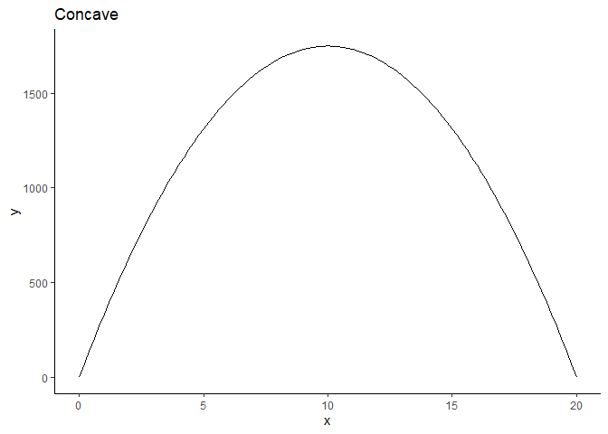
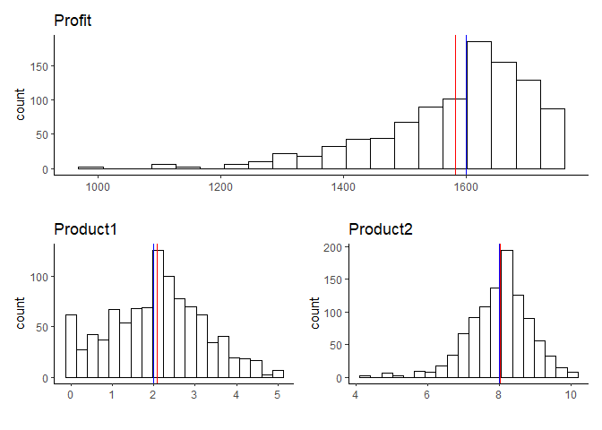
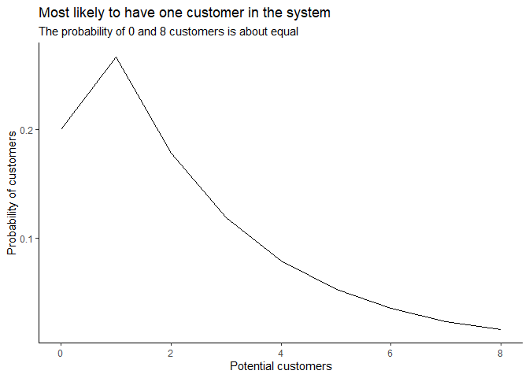
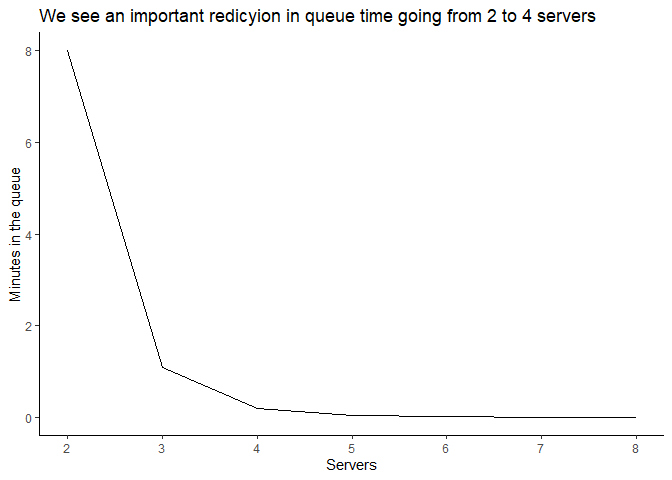
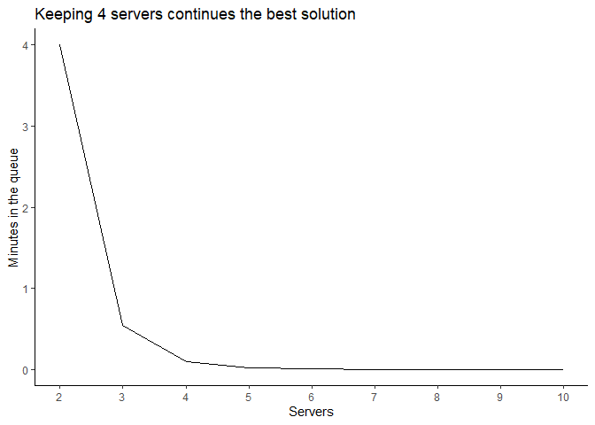
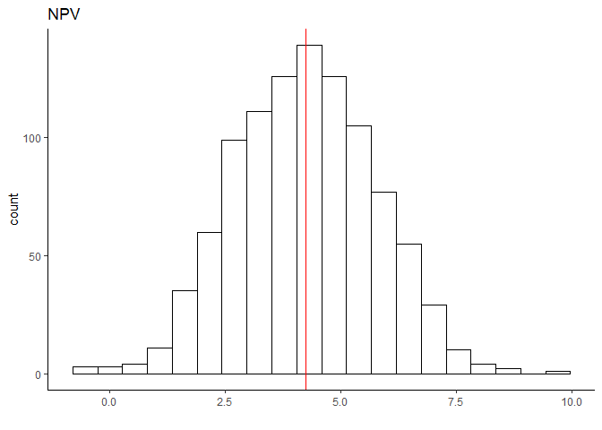

# Problem 01 Albert Hanson Company

The management of the Albert Hanson Company is trying to determine the best product mix for two new products to **maximize profits**. Because these products would share the same production facilities, the total number of units produced of the two products combined cannot exceed ten per hour. Also, they have to be produced in at least a two-to-one ratio, with there being at least twice as many of product 2. In particular, with a production rate of $x_1$ units per hour, it is estimated that product 1 would provide a profit per hour of $ \$100x_1 - \$10x_1^2$ and the production rate of product 2 is $x_2$ units per hour, its estimated profit per hour would be $ \$300x_2 - \$15x_2^2$   

### a. Formulate an NLP model for this problem.   

**Objective: Maximize Profit**  
    $max_{x_i}  \; \pi = \; \$100x_1 - \$10x_1^2 + \$300x_2 - \$15x_2^2$  
    _Subject to:_  
       $x_1 + x_2\le10$  
       $x_2 = 2x_1$  
       

### b. Is the profit function concave? What does the shape of the profit function indicate about how profits change as production increases?  

+ In this problem, profit is a Concave function, which means that profit has a global maximum. Given the second restriction we can write profit as a function of only $x_2$. As the production increases the profit increases until $x_2$= 10 units.Above that, profit diminishes as production increases.  


```r
# Plotting function
ggplot(data = data.frame(x = 0), mapping = aes(x = x)) + 
  stat_function(fun = (function (x) 100*0.5*x - 10*((0.5*x)^2) + 300*x - 15*(x^2))) + 
  xlim(0, 20) +
  labs(title = "Concave") +
  theme_classic()
```

<!-- -->

+ Also, when we calculate the first and second partial derivatives from profit we have:

  - First w.r.t. $x_1$: $\partial \pi / \partial x_1 = 200 - 20x_1 \ge 0$ and
  - Second w.r.t. $x_1$: $\partial^2 \pi / \partial x_1^2 = -20  \le 0$
  - First w.r.t. $x_2$: $\partial \pi / \partial x_2 = 600 - 30x_2 \ge 0$ and
  - Second w.r.t. $x_2$: $\partial^2 \pi / \partial x_2^2 = -30  \le 0$  
  
  - Since both second derivarives are negative we can say that profit is concave over the whole range of each variable. 

+ Now since we have verified that the objective function is concave and the constraints are quasi-convex (linear in this case), so the function meets the conditions for maximization  

### c. Program the model in R. What is the solution? 

+ It is a maximum problem so we need to multiply by −1
  
  

```r
# The objective function
eval_f <- function(x, a, b, c){
  return( -(100*x[1] - 10*x[1]^2 + 300*x[2] - 15*x[2]^2 )) # This indicates x will be a vector with two elements
  }

# Constraint functions 
# This one function creates all constraints
eval_g <- function(x, a, b, c) { 
  return( a*x[1] + b*x[2] - c )    # This will create as many constraints as there are elements
  }                                # But a, b and c must all be the same length   

# Define parameters of constraints, only one constraint so only 1 entry for each
a <- c( 1, 2) # Coefficients for column 1
b <- c( 1,-1) # Coefficients for column 2
c <- c(10, 0) # Coefficients for rhs constaints


# Set up model calling nloptr function and set values 
nlp <- nloptr( x0 = c(0, 0),       # Set the inital values of x
                                    # Should try range of initial values to check global solution
                eval_f = eval_f,   # Call the obj fn
                lb = c(  0,  0),    # Set lower and upper bounds on the decision variables
                ub = c(Inf, Inf), 
                eval_g_ineq = eval_g, # Call the inequality constraints, diff call for equality cons
                opts = list("algorithm"="NLOPT_LN_COBYLA", # Set the search algorithm, use NLOPT_LN_COBYLA
                            "xtol_rel" = 0.001), # Set search tolerance
                a = a,  # Call constraint parmeter values
                b = b, 
                c = c) 

original_result <- as.matrix(cbind(nlp$objective, t(cbind(nlp$solution)))) 
rownames(original_result) <- "solution"
colnames(original_result) <- c("Profit", "Product1", "Product2")
original_result[,1] <- -1 * original_result[,1]

print(nlp)
```

```
## 
## Call:
## nloptr(x0 = c(0, 0), eval_f = eval_f, lb = c(0, 0), ub = c(Inf, 
##     Inf), eval_g_ineq = eval_g, opts = list(algorithm = "NLOPT_LN_COBYLA", 
##     xtol_rel = 0.001), a = a, b = b, c = c)
## 
## 
## Minimization using NLopt version 2.4.2 
## 
## NLopt solver status: 4 ( NLOPT_XTOL_REACHED: Optimization stopped because 
## xtol_rel or xtol_abs (above) was reached. )
## 
## Number of Iterations....: 46 
## Termination conditions:  xtol_rel: 0.001 
## Number of inequality constraints:  2 
## Number of equality constraints:    0 
## Optimal value of objective function:  -1599.99999516765 
## Optimal value of controls: 1.99956 8.00044
```

+ The maximum profit is obtained by: $x_1$ = 2, $x_2$ = 8, and $\pi$ = \$1600


### d. Determine the shadow price of each constraint. Which constraint has the largest impact on profits?   

+ To find out the impact of first constraint on the solution:


```r
# Set up model calling nloptr function and set values 
nlp_d <- nloptr( x0 = c(0, 0),       # Set the inital values of x
                                    # Should try range of initial values to check global solution
                eval_f = eval_f,   # Call the obj fn
                lb = c(  0,  0),    # Set lower and upper bounds on the decision variables
                ub = c(Inf, Inf), 
                eval_g_ineq = eval_g, # Call the inequality constraints, diff call for equality cons
                opts = list("algorithm"="NLOPT_LN_COBYLA", # Set the search algorithm, use NLOPT_LN_COBYLA
                            "xtol_rel" = 0.001), # Set search tolerance
                a = a,  # Call constraint parmeter values
                b = b, 
                c = c + c(1,0)) 
```

+ The original solution was $x_1$ = 2, $x_2$ = 8, and $\pi$ = \$1600

+ The new solution is $x_1$ = 2.6, $x_2$ = 8.4, and $\pi$ = \$1654

+ So the dual value is $54

+ To find out the impact of second constraint on the solution:


```r
# Set up model calling nloptr function and set values 
nlp_d <- nloptr( x0 = c(0, 0),       # Set the inital values of x
                                    # Should try range of initial values to check global solution
                eval_f = eval_f,   # Call the obj fn
                lb = c(  0,  0),    # Set lower and upper bounds on the decision variables
                ub = c(Inf, Inf), 
                eval_g_ineq = eval_g, # Call the inequality constraints, diff call for equality cons
                opts = list("algorithm"="NLOPT_LN_COBYLA", # Set the search algorithm, use NLOPT_LN_COBYLA
                            "xtol_rel" = 0.001), # Set search tolerance
                a = a,  # Call constraint parmeter values
                b = b, 
                c = c + c(0,1)) 
```

+ The original solution was $x_1$ = 2, $x_2$ = 8, and $\pi$ = \$1600

+ The new solution is $x_1$ = 2, $x_2$ = 8, and $\pi$ = \$1600

+ So the dual value is $0

+ **We can conclude that the first constraint has a larger impact on profits**

  
  
  
  
# Problem 02: Albert Hanson Company continuation. 

Reconsider the Albert Hanson Company problem above. The production facility constraint indicated that the total number of units produced of the two products combined cannot exceed ten per hour. The constraint was derived from an on-site storage constraint that it is not possible to produce more of either good unless there are less than 10 units in the production facility. The general procedure is that the finished products is moved to an off-site storage facility, but the shipping method is not reliable. As such it is possible for the production constraint to be more or less than 10 units ddepending on how much $x_1$ and $x_2$ have been moved to storage. Also note that partial units are possible.  

### e. Complete a Monte Carlo simulation of production if the production facility constraint is distributed C ~ N(10, 2). What is the impact on profitability and the production levels of x1 and x2?  

**Objective: Maximize Profit**  
    $max_{x_i}  \; \pi = \; \$100x_1 - \$10x_1^2 + \$300x_2 - \$15x_2^2$  
    _Subject to:_  
       $x_1 + x_2 \le \bar{C}$  
       $x_2 = 2x_1$  
       $x_1, \ x_2 \ge 0$
       
       

```r
# number of simulations
n <- 1000

# Generate random variable with mean 10 and sd 2
set.seed(03032002)
w <- rnorm(n, mean = 10, sd = 2)

# Vector to hold simulation results
res_w <- vector()
res_w_dual <- vector()

 eval_f <- function(x, a, b, c){
      return( -(100*x[1] - 10*x[1]^2 + 300*x[2] - 15*x[2]^2 )) # This indicates x will be a vector with two elements
}

# Constraint functions 
# This one function creates all constraints
eval_g <- function(x, a, b, c) { 
  return( a*x[1] + b*x[2] - c )    # This will create as many constraints as there are elements
}                                # But a, b and c must all be the same length   

# Define parameters of constraints, only one constraint so only 1 entry for each
a <- c( 1, 2 ) # Coefficients for column 1
b <- c( 1, -1 ) # Coefficients for column 2

#check simulation time
system.time(
  #simulation step
  for(i in seq(n)){
    c <- c(sample(w, 1, replace = TRUE), 0) # Coefficients for rhs constaints
    # Set up model calling nloptr function and set values 
    nlp <- nloptr( x0 = c(0, 0),       # Set the inital values of x
                                    # Should try range of initial values to check global solution
                eval_f = eval_f,   # Call the obj fn
                lb = c(  0,  0),    # Set lower and upper bounds on the decision variables
                ub = c(Inf, Inf), 
                eval_g_ineq = eval_g, # Call the inequality constraints, diff call for equality cons
                opts = list("algorithm"="NLOPT_LN_COBYLA", # Set the search algorithm, use NLOPT_LN_COBYLA
                            "xtol_rel" = 0.001), # Set search tolerance
                a = a,  # Call constraint parmeter values
                b = b, 
                c = c)
    
    res_w <- rbind(res_w, cbind(nlp$objective, t(cbind(nlp$solution))))
    
        # For dual calculation  
    nlp_dual <- nloptr( x0 = c(0, 0),       # Set the inital values of x
                                    # Should try range of initial values to check global solution
                eval_f = eval_f,   # Call the obj fn
                lb = c(  0,  0),    # Set lower and upper bounds on the decision variables
                ub = c(Inf, Inf), 
                eval_g_ineq = eval_g, # Call the inequality constraints, diff call for equality cons
                opts = list("algorithm"="NLOPT_LN_COBYLA", # Set the search algorithm, use NLOPT_LN_COBYLA
                            "xtol_rel" = 0.001), # Set search tolerance
                a = a,  # Call constraint parmeter values
                b = b, 
                c = c+ c(1,0))
    res_w_dual <- rbind(res_w_dual, nlp_dual$objective)
  }

  
)
```

```
##    user  system elapsed 
##    2.14    0.00    2.18
```


```r
# Convert obj fn to positive for max
res_w[,1] <- -1 * res_w[,1]
res_w_dual[,1] <- -1 * res_w_dual[,1]

# Make table
sim <- round(rbind(apply(res_w, 2, mean),
                   apply(res_w, 2, sd),
                   apply(res_w, 2, max), 
                   apply(res_w, 2, min)), 2)

rownames(sim) <- c("mean", "sd", "max", "min")
colnames(sim) <- c("Profit", "Product_01", "Product_02")

#Compare results across models
kable(original_result, caption = "Results from original") %>%
  kable_styling(bootstrap_options = c("striped", "bordered"))
```

<table class="table table-striped table-bordered" style="margin-left: auto; margin-right: auto;">
<caption>Results from original</caption>
 <thead>
  <tr>
   <th style="text-align:left;">   </th>
   <th style="text-align:right;"> Profit </th>
   <th style="text-align:right;"> Product1 </th>
   <th style="text-align:right;"> Product2 </th>
  </tr>
 </thead>
<tbody>
  <tr>
   <td style="text-align:left;"> solution </td>
   <td style="text-align:right;"> 1600 </td>
   <td style="text-align:right;"> 1.99956 </td>
   <td style="text-align:right;"> 8.00044 </td>
  </tr>
</tbody>
</table>


```r
kable(sim, caption = "Results from simulation") %>%
  kable_styling(bootstrap_options = c("striped", "bordered"))
```

<table class="table table-striped table-bordered" style="margin-left: auto; margin-right: auto;">
<caption>Results from simulation</caption>
 <thead>
  <tr>
   <th style="text-align:left;">   </th>
   <th style="text-align:right;"> Profit </th>
   <th style="text-align:right;"> Product_01 </th>
   <th style="text-align:right;"> Product_02 </th>
  </tr>
 </thead>
<tbody>
  <tr>
   <td style="text-align:left;"> mean </td>
   <td style="text-align:right;"> 1582.03 </td>
   <td style="text-align:right;"> 2.08 </td>
   <td style="text-align:right;"> 8.01 </td>
  </tr>
  <tr>
   <td style="text-align:left;"> sd </td>
   <td style="text-align:right;"> 124.62 </td>
   <td style="text-align:right;"> 1.13 </td>
   <td style="text-align:right;"> 0.85 </td>
  </tr>
  <tr>
   <td style="text-align:left;"> max </td>
   <td style="text-align:right;"> 1750.00 </td>
   <td style="text-align:right;"> 5.00 </td>
   <td style="text-align:right;"> 10.00 </td>
  </tr>
  <tr>
   <td style="text-align:left;"> min </td>
   <td style="text-align:right;"> 998.82 </td>
   <td style="text-align:right;"> 0.00 </td>
   <td style="text-align:right;"> 4.22 </td>
  </tr>
</tbody>
</table>


```r
# Visualizing the Monte Carlo simulation results  

profit <- as.data.frame(res_w) %>% 
  ggplot(aes(x = res_w[,1])) + geom_histogram(bins = 20, fill = "white", color = "black") + 
  geom_vline(xintercept = mean(res_w[,1]), color = "red") +
  geom_vline(xintercept = mean(original_result[,1]), color = "blue") + 
    labs(title = "Profit", x = "") + theme_classic()

product_1 <- as.data.frame(res_w) %>% 
  ggplot(aes(x = res_w[,2])) + geom_histogram(bins = 20, fill = "white", color = "black") + 
  geom_vline(xintercept = mean(res_w[,2]), color = "red") +
  geom_vline(xintercept = mean(original_result[,2]), color = "blue") + 
  labs(title = "Product1", x = "") + theme_classic()

product_2 <- as.data.frame(res_w) %>% 
  ggplot(aes(x = res_w[,3])) + geom_histogram(bins = 20, fill = "white", color = "black") + 
  geom_vline(xintercept = mean(res_w[,3]), color = "red") +
  geom_vline(xintercept = mean(original_result[,3]), color = "blue") + 
  labs(title = "Product2", x = "") + theme_classic()

profit / (product_1 | product_2)
```

<!-- -->

+ **The simulation presented a lower profit**  
+ **On average, the production of both products was increased by little**  

### f. What is the mean and standard deviation of the dual value on the production facility constraint?  

+ Mean = 53.28  
+ Standard deviation =24.42  


# Problem 03: Softie.com 

Softie.com is setting up a customer service center to assist customers in selecting the software solutions for their business needs. Softie is a startup so has been running their business at a bare bones level, but they recently received funding so now can expand. They currently are using a phone center with 2 servers to answer customer questions, and the phone servers will answer email when they are not on the phone. During an 8 hour business day they receive about 8 calls per hour and each call takes and average of 10 minutes to complete. The manager wants you to review the expected performance of the call system, you determine it approximately follows an M/M/C birth-to-death queueing system. 

### a. What are the current performance parameters in terms of people and wait times? 

+ The average arrival rate per hour is $ \lambda = 8$  
+ The number of servers is $s=2$  
+ The number of services per hour is $\mu = 60/10 = 6$


```r
# Parameters
lambda <- 8
mu <- 6
s <- 2

rho <- lambda/(s*mu)

# Probability of 0 people
p0 <- 1 - rho 
```

+ A server is expected to be busy 66.67% of times  


```r
# Set up problem with criteria and 8 customers
n <- 8

# Build a table of results
tab_q3 <- as.data.frame(matrix(0, n+1, 7))

# Loop to build table of results
for (i in 0:n){
  # Using "queueing" package
  q_mod2 <- NewInput.MMC(lambda = lambda, 
                        mu = mu, 
                        c = s, 
                        n = n)
  m2 <- QueueingModel.i_MMC(q_mod2)
  
  # Place results as a row in a table
  # Multiply wait by 60 minutes in an hour to convert time from hours to minutes
  tab_q3[i+1,] <- round(c(i, m2$Pn[i + 1], m2$Inputs$c, m2$L, m2$Lq, m2$W*60, m2$Wq*60), 3) 
  
}

c_name <- c("Customers", "Pn", "s", "L", "Lq", "W (minutes)", "Wq (minutes)")

# Add column names
colnames(tab_q3) <- c_name
```

<table class="table table-striped table-bordered" style="margin-left: auto; margin-right: auto;">
 <thead>
  <tr>
   <th style="text-align:right;"> Customers </th>
   <th style="text-align:right;"> Pn </th>
   <th style="text-align:right;"> s </th>
   <th style="text-align:right;"> L </th>
   <th style="text-align:right;"> Lq </th>
   <th style="text-align:right;"> W (minutes) </th>
   <th style="text-align:right;"> Wq (minutes) </th>
  </tr>
 </thead>
<tbody>
  <tr>
   <td style="text-align:right;"> 0 </td>
   <td style="text-align:right;"> 0.200 </td>
   <td style="text-align:right;"> 2 </td>
   <td style="text-align:right;"> 2.4 </td>
   <td style="text-align:right;"> 1.067 </td>
   <td style="text-align:right;"> 18 </td>
   <td style="text-align:right;"> 8 </td>
  </tr>
  <tr>
   <td style="text-align:right;"> 1 </td>
   <td style="text-align:right;"> 0.267 </td>
   <td style="text-align:right;"> 2 </td>
   <td style="text-align:right;"> 2.4 </td>
   <td style="text-align:right;"> 1.067 </td>
   <td style="text-align:right;"> 18 </td>
   <td style="text-align:right;"> 8 </td>
  </tr>
  <tr>
   <td style="text-align:right;"> 2 </td>
   <td style="text-align:right;"> 0.178 </td>
   <td style="text-align:right;"> 2 </td>
   <td style="text-align:right;"> 2.4 </td>
   <td style="text-align:right;"> 1.067 </td>
   <td style="text-align:right;"> 18 </td>
   <td style="text-align:right;"> 8 </td>
  </tr>
  <tr>
   <td style="text-align:right;"> 3 </td>
   <td style="text-align:right;"> 0.119 </td>
   <td style="text-align:right;"> 2 </td>
   <td style="text-align:right;"> 2.4 </td>
   <td style="text-align:right;"> 1.067 </td>
   <td style="text-align:right;"> 18 </td>
   <td style="text-align:right;"> 8 </td>
  </tr>
  <tr>
   <td style="text-align:right;"> 4 </td>
   <td style="text-align:right;"> 0.079 </td>
   <td style="text-align:right;"> 2 </td>
   <td style="text-align:right;"> 2.4 </td>
   <td style="text-align:right;"> 1.067 </td>
   <td style="text-align:right;"> 18 </td>
   <td style="text-align:right;"> 8 </td>
  </tr>
  <tr>
   <td style="text-align:right;"> 5 </td>
   <td style="text-align:right;"> 0.053 </td>
   <td style="text-align:right;"> 2 </td>
   <td style="text-align:right;"> 2.4 </td>
   <td style="text-align:right;"> 1.067 </td>
   <td style="text-align:right;"> 18 </td>
   <td style="text-align:right;"> 8 </td>
  </tr>
  <tr>
   <td style="text-align:right;"> 6 </td>
   <td style="text-align:right;"> 0.035 </td>
   <td style="text-align:right;"> 2 </td>
   <td style="text-align:right;"> 2.4 </td>
   <td style="text-align:right;"> 1.067 </td>
   <td style="text-align:right;"> 18 </td>
   <td style="text-align:right;"> 8 </td>
  </tr>
  <tr>
   <td style="text-align:right;"> 7 </td>
   <td style="text-align:right;"> 0.023 </td>
   <td style="text-align:right;"> 2 </td>
   <td style="text-align:right;"> 2.4 </td>
   <td style="text-align:right;"> 1.067 </td>
   <td style="text-align:right;"> 18 </td>
   <td style="text-align:right;"> 8 </td>
  </tr>
  <tr>
   <td style="text-align:right;"> 8 </td>
   <td style="text-align:right;"> 0.016 </td>
   <td style="text-align:right;"> 2 </td>
   <td style="text-align:right;"> 2.4 </td>
   <td style="text-align:right;"> 1.067 </td>
   <td style="text-align:right;"> 18 </td>
   <td style="text-align:right;"> 8 </td>
  </tr>
</tbody>
<tfoot>
<tr>
<td style = 'padding: 0; border:0;' colspan='100%'><sup>*</sup> Probability customers will wait in the queue 53.3%</td>
</tr>
</tfoot>
<tfoot>
<tr>
<td style = 'padding: 0; border:0;' colspan='100%'><sup>*</sup> Probability all servers are busy is 27.6%</td>
</tr>
</tfoot>
</table>
  
   
    
     
     
<!-- -->


+ For customers ranging from 0 to 8 in the system, we have the steady calculatations as below:  
  - Pn = Probability of i (1:8) people in the queue system  
  - s = Number of servers 
  - L = Mean number of customers in the queue system  
  - Lq = Mean number of customers in the queue  
  - W (minutes) = Mean wait time in queue system  
  - Wq (minutes) = Mean wait time in queue waiting for service 
  
+ On an average, there are 2.4 people in the system and 1.067 person in the queue  
+ On an average, a person would spend 18 minutes in the system and 8 minutes in the queue  
+ 8 minutes is a long time to wait for a 10 minutes service  


### c. What is the probability that at least one of the call servers will be able to work on email inquiries?  
+ The probability that at least one of the call servers will be able to work on email inquiries in when there are none or one customer in the system which is:  
$\sum_{i=0}^{1}P_i = P_0 + P_1 =$ 46.7%  

### d. How many more call servers should Softie.com hire if they want to reduce the time in the queue (waiting for customer service) to less than half-a-minute?   

    
  

```r
# Number of cutomers, Initial servers
n <- 8; int <- 2

# Build a table of results
tab_q3 <- as.data.frame(matrix(0, n+1-int, 7))

# Loop to build table of results
for (s in int:n){

  # Using "queueing" package
  q_mod3 <- NewInput.MMC(lambda = lambda, mu = mu, c = s, n = n)
  m3 <- QueueingModel.i_MMC(q_mod3)
  
  # Place results as a row in a table
    # Multiply wait by 60 minutes in an hour to convert time from hours to minutes
  tab_q3[s+1-int,] <- round(c(s, m3$L, m3$Lq, m3$W*60, m3$Wq*60, B_erlang(s, lambda/mu), C_erlang(s, lambda/mu)), 3) 
}

# Add column names
colnames(tab_q3) <- c("Servers", "L", "Lq", "W (minutes)", "Wq (minutes)", "B_erlang", "C_erlang")

line_4_servers <- tab_q3$`Wq (minutes)`[3]
```
  


<table class="table table-striped table-bordered" style="margin-left: auto; margin-right: auto;">
 <thead>
  <tr>
   <th style="text-align:right;"> Servers </th>
   <th style="text-align:right;"> L </th>
   <th style="text-align:right;"> Lq </th>
   <th style="text-align:right;"> W (minutes) </th>
   <th style="text-align:right;"> Wq (minutes) </th>
   <th style="text-align:right;"> B_erlang </th>
   <th style="text-align:right;"> C_erlang </th>
  </tr>
 </thead>
<tbody>
  <tr>
   <td style="text-align:right;"> 2 </td>
   <td style="text-align:right;"> 2.400 </td>
   <td style="text-align:right;"> 1.067 </td>
   <td style="text-align:right;"> 18.000 </td>
   <td style="text-align:right;"> 8.000 </td>
   <td style="text-align:right;"> 0.276 </td>
   <td style="text-align:right;"> 0.533 </td>
  </tr>
  <tr>
   <td style="text-align:right;"> 3 </td>
   <td style="text-align:right;"> 1.478 </td>
   <td style="text-align:right;"> 0.145 </td>
   <td style="text-align:right;"> 11.085 </td>
   <td style="text-align:right;"> 1.085 </td>
   <td style="text-align:right;"> 0.109 </td>
   <td style="text-align:right;"> 0.181 </td>
  </tr>
  <tr>
   <td style="text-align:right;"> 4 </td>
   <td style="text-align:right;"> 1.359 </td>
   <td style="text-align:right;"> 0.026 </td>
   <td style="text-align:right;"> 10.194 </td>
   <td style="text-align:right;"> 0.194 </td>
   <td style="text-align:right;"> 0.035 </td>
   <td style="text-align:right;"> 0.052 </td>
  </tr>
  <tr>
   <td style="text-align:right;"> 5 </td>
   <td style="text-align:right;"> 1.338 </td>
   <td style="text-align:right;"> 0.005 </td>
   <td style="text-align:right;"> 10.034 </td>
   <td style="text-align:right;"> 0.034 </td>
   <td style="text-align:right;"> 0.009 </td>
   <td style="text-align:right;"> 0.013 </td>
  </tr>
  <tr>
   <td style="text-align:right;"> 6 </td>
   <td style="text-align:right;"> 1.334 </td>
   <td style="text-align:right;"> 0.001 </td>
   <td style="text-align:right;"> 10.006 </td>
   <td style="text-align:right;"> 0.006 </td>
   <td style="text-align:right;"> 0.002 </td>
   <td style="text-align:right;"> 0.003 </td>
  </tr>
  <tr>
   <td style="text-align:right;"> 7 </td>
   <td style="text-align:right;"> 1.333 </td>
   <td style="text-align:right;"> 0.000 </td>
   <td style="text-align:right;"> 10.001 </td>
   <td style="text-align:right;"> 0.001 </td>
   <td style="text-align:right;"> 0.000 </td>
   <td style="text-align:right;"> 0.000 </td>
  </tr>
  <tr>
   <td style="text-align:right;"> 8 </td>
   <td style="text-align:right;"> 1.333 </td>
   <td style="text-align:right;"> 0.000 </td>
   <td style="text-align:right;"> 10.000 </td>
   <td style="text-align:right;"> 0.000 </td>
   <td style="text-align:right;"> 0.000 </td>
   <td style="text-align:right;"> 0.000 </td>
  </tr>
</tbody>
</table>
  
   
    
     
     
<!-- -->


+ Adding two more servers can reduce the wait time in the queue to 0.19 minutes  

### d. What is the probability that at least one of the call servers will be able to work on email if they hire the recommended number of servers in part c?  


  
  

```r
# Set up problem with criteria and 8 customers
n <- 8; lam = 8; mu = 6; s = 4 

# Build a table of results
tab_q3 <- as.data.frame(matrix(0, n+1, 7))

# Loop to build table of results
for (i in 0:n){
  
  # Using "queueing" package
  q_mod2 <- NewInput.MMC(lambda = lam, mu = mu, c = s, n = n)
  m2 <- QueueingModel.i_MMC(q_mod2)
  
  # Place results as a row in a table
    # Multiply wait by 60 minutes in an hour to convert time from hours to minutes
  tab_q3[i+1,] <- round(c(i, m2$Pn[i + 1], m2$Inputs$c, m2$L, m2$Lq, m2$W*60, m2$Wq*60), 3) 
}

c_name <- c("Customers", "Pn", "s", "L", "Lq", "W (minutes)", "Wq (minutes)")

# Add column names
colnames(tab_q3) <- c_name
```
  

<table class="table table-striped table-bordered" style="margin-left: auto; margin-right: auto;">
 <thead>
  <tr>
   <th style="text-align:right;"> Customers </th>
   <th style="text-align:right;"> Pn </th>
   <th style="text-align:right;"> s </th>
   <th style="text-align:right;"> L </th>
   <th style="text-align:right;"> Lq </th>
   <th style="text-align:right;"> W (minutes) </th>
   <th style="text-align:right;"> Wq (minutes) </th>
  </tr>
 </thead>
<tbody>
  <tr>
   <td style="text-align:right;"> 0 </td>
   <td style="text-align:right;"> 0.262 </td>
   <td style="text-align:right;"> 4 </td>
   <td style="text-align:right;"> 1.359 </td>
   <td style="text-align:right;"> 0.026 </td>
   <td style="text-align:right;"> 10.194 </td>
   <td style="text-align:right;"> 0.194 </td>
  </tr>
  <tr>
   <td style="text-align:right;"> 1 </td>
   <td style="text-align:right;"> 0.350 </td>
   <td style="text-align:right;"> 4 </td>
   <td style="text-align:right;"> 1.359 </td>
   <td style="text-align:right;"> 0.026 </td>
   <td style="text-align:right;"> 10.194 </td>
   <td style="text-align:right;"> 0.194 </td>
  </tr>
  <tr>
   <td style="text-align:right;"> 2 </td>
   <td style="text-align:right;"> 0.233 </td>
   <td style="text-align:right;"> 4 </td>
   <td style="text-align:right;"> 1.359 </td>
   <td style="text-align:right;"> 0.026 </td>
   <td style="text-align:right;"> 10.194 </td>
   <td style="text-align:right;"> 0.194 </td>
  </tr>
  <tr>
   <td style="text-align:right;"> 3 </td>
   <td style="text-align:right;"> 0.104 </td>
   <td style="text-align:right;"> 4 </td>
   <td style="text-align:right;"> 1.359 </td>
   <td style="text-align:right;"> 0.026 </td>
   <td style="text-align:right;"> 10.194 </td>
   <td style="text-align:right;"> 0.194 </td>
  </tr>
  <tr>
   <td style="text-align:right;"> 4 </td>
   <td style="text-align:right;"> 0.035 </td>
   <td style="text-align:right;"> 4 </td>
   <td style="text-align:right;"> 1.359 </td>
   <td style="text-align:right;"> 0.026 </td>
   <td style="text-align:right;"> 10.194 </td>
   <td style="text-align:right;"> 0.194 </td>
  </tr>
  <tr>
   <td style="text-align:right;"> 5 </td>
   <td style="text-align:right;"> 0.012 </td>
   <td style="text-align:right;"> 4 </td>
   <td style="text-align:right;"> 1.359 </td>
   <td style="text-align:right;"> 0.026 </td>
   <td style="text-align:right;"> 10.194 </td>
   <td style="text-align:right;"> 0.194 </td>
  </tr>
  <tr>
   <td style="text-align:right;"> 6 </td>
   <td style="text-align:right;"> 0.004 </td>
   <td style="text-align:right;"> 4 </td>
   <td style="text-align:right;"> 1.359 </td>
   <td style="text-align:right;"> 0.026 </td>
   <td style="text-align:right;"> 10.194 </td>
   <td style="text-align:right;"> 0.194 </td>
  </tr>
  <tr>
   <td style="text-align:right;"> 7 </td>
   <td style="text-align:right;"> 0.001 </td>
   <td style="text-align:right;"> 4 </td>
   <td style="text-align:right;"> 1.359 </td>
   <td style="text-align:right;"> 0.026 </td>
   <td style="text-align:right;"> 10.194 </td>
   <td style="text-align:right;"> 0.194 </td>
  </tr>
  <tr>
   <td style="text-align:right;"> 8 </td>
   <td style="text-align:right;"> 0.000 </td>
   <td style="text-align:right;"> 4 </td>
   <td style="text-align:right;"> 1.359 </td>
   <td style="text-align:right;"> 0.026 </td>
   <td style="text-align:right;"> 10.194 </td>
   <td style="text-align:right;"> 0.194 </td>
  </tr>
</tbody>
<tfoot>
<tr>
<td style = 'padding: 0; border:0;' colspan='100%'><sup>*</sup> Probability customers will wait in the queue 5.2%</td>
</tr>
</tfoot>
<tfoot>
<tr>
<td style = 'padding: 0; border:0;' colspan='100%'><sup>*</sup> Probability all servers are busy is 3.5%</td>
</tr>
</tfoot>
</table>

+ The probability that at least one of the call servers will be able to work on email inquiries in when there are none or one customer in the system which is:  
$\sum_{i=0}^{2}P_i = P_0 + P_1 =$ 84.5%  


### Suppose their incoming business doubles and Softie.com buys a management package that allows them to cut their call service time in half. Will they need more or fewer service callers to maintain a less-than half-a-minute queue time?   

  
  
+ The average arrival rate per hour is $ \lambda = 8*2 = 16$  
+ The number of servers is $s=4$  
+ The number of services per hour is $\mu = 60/5 = 12$


```r
# Set up problem with initial criteria and 20 customers
lam = 16; mu = 12 ; s = 4; n <- 10; int <- 2

# Build a table of results
tab_q3 <- as.data.frame(matrix(0, n+1-int, 7))

# Loop to build table of results
for (s in int:n){

  # Using "queueing" package
  sm_c <- NewInput.MMC(lambda = lam, mu = mu, c = s, n = n)
  smc <- QueueingModel.i_MMC(sm_c)
  
  # Place results as a row in a table
    # Multiply wait by 60 minutes in an hour to convert time from hours to minutes
  tab_q3[s+1-int,] <- round(c(s, smc$L, smc$Lq, smc$W*60, smc$Wq*60, B_erlang(s, lam/mu), C_erlang(s, lam/mu)), 3) 
}

# Add column names
colnames(tab_q3) <- c("Servers", "L", "Lq", "W (minutes)", "Wq (minutes)", "B_erlang", "C_erlang")
```


<table class="table table-striped table-bordered" style="margin-left: auto; margin-right: auto;">
 <thead>
  <tr>
   <th style="text-align:right;"> Servers </th>
   <th style="text-align:right;"> L </th>
   <th style="text-align:right;"> Lq </th>
   <th style="text-align:right;"> W (minutes) </th>
   <th style="text-align:right;"> Wq (minutes) </th>
   <th style="text-align:right;"> B_erlang </th>
   <th style="text-align:right;"> C_erlang </th>
  </tr>
 </thead>
<tbody>
  <tr>
   <td style="text-align:right;"> 2 </td>
   <td style="text-align:right;"> 2.400 </td>
   <td style="text-align:right;"> 1.067 </td>
   <td style="text-align:right;"> 9.000 </td>
   <td style="text-align:right;"> 4.000 </td>
   <td style="text-align:right;"> 0.276 </td>
   <td style="text-align:right;"> 0.533 </td>
  </tr>
  <tr>
   <td style="text-align:right;"> 3 </td>
   <td style="text-align:right;"> 1.478 </td>
   <td style="text-align:right;"> 0.145 </td>
   <td style="text-align:right;"> 5.542 </td>
   <td style="text-align:right;"> 0.542 </td>
   <td style="text-align:right;"> 0.109 </td>
   <td style="text-align:right;"> 0.181 </td>
  </tr>
  <tr>
   <td style="text-align:right;"> 4 </td>
   <td style="text-align:right;"> 1.359 </td>
   <td style="text-align:right;"> 0.026 </td>
   <td style="text-align:right;"> 5.097 </td>
   <td style="text-align:right;"> 0.097 </td>
   <td style="text-align:right;"> 0.035 </td>
   <td style="text-align:right;"> 0.052 </td>
  </tr>
  <tr>
   <td style="text-align:right;"> 5 </td>
   <td style="text-align:right;"> 1.338 </td>
   <td style="text-align:right;"> 0.005 </td>
   <td style="text-align:right;"> 5.017 </td>
   <td style="text-align:right;"> 0.017 </td>
   <td style="text-align:right;"> 0.009 </td>
   <td style="text-align:right;"> 0.013 </td>
  </tr>
  <tr>
   <td style="text-align:right;"> 6 </td>
   <td style="text-align:right;"> 1.334 </td>
   <td style="text-align:right;"> 0.001 </td>
   <td style="text-align:right;"> 5.003 </td>
   <td style="text-align:right;"> 0.003 </td>
   <td style="text-align:right;"> 0.002 </td>
   <td style="text-align:right;"> 0.003 </td>
  </tr>
  <tr>
   <td style="text-align:right;"> 7 </td>
   <td style="text-align:right;"> 1.333 </td>
   <td style="text-align:right;"> 0.000 </td>
   <td style="text-align:right;"> 5.000 </td>
   <td style="text-align:right;"> 0.000 </td>
   <td style="text-align:right;"> 0.000 </td>
   <td style="text-align:right;"> 0.000 </td>
  </tr>
  <tr>
   <td style="text-align:right;"> 8 </td>
   <td style="text-align:right;"> 1.333 </td>
   <td style="text-align:right;"> 0.000 </td>
   <td style="text-align:right;"> 5.000 </td>
   <td style="text-align:right;"> 0.000 </td>
   <td style="text-align:right;"> 0.000 </td>
   <td style="text-align:right;"> 0.000 </td>
  </tr>
  <tr>
   <td style="text-align:right;"> 9 </td>
   <td style="text-align:right;"> 1.333 </td>
   <td style="text-align:right;"> 0.000 </td>
   <td style="text-align:right;"> 5.000 </td>
   <td style="text-align:right;"> 0.000 </td>
   <td style="text-align:right;"> 0.000 </td>
   <td style="text-align:right;"> 0.000 </td>
  </tr>
  <tr>
   <td style="text-align:right;"> 10 </td>
   <td style="text-align:right;"> 1.333 </td>
   <td style="text-align:right;"> 0.000 </td>
   <td style="text-align:right;"> 5.000 </td>
   <td style="text-align:right;"> 0.000 </td>
   <td style="text-align:right;"> 0.000 </td>
   <td style="text-align:right;"> 0.000 </td>
  </tr>
</tbody>
</table>
  
   
    
     
     
<!-- -->


+ If the business doubles and the service times cut by half, if the company reduces the number of servers to 3, they can maintain the queue time a little over half a minute but by keeping 4 servers maintains a much lower queue times for the customers 

### What is the cost minimizing number of servers when the arrival rate is 32 per hour, each takes a mean of 12 minutes of service time, about 5 per hour, the mean profit per customer is $30 and a server cost $10 per hour?

  
+ The average arrival rate per hour is $ \lambda = 32$  
+ The number of services per hour is $\mu = 60/5 = 12$  
+ Profit per customer $ \pi= \$30$  
+ Server cost per hour = $10  
+ Cusomers will leave if the wait is more than 30 seconds  


```r
# Set up problem with initial criteria and 10 customers
lam = 32; mu = 5 ; n <- 10

# Minimum number of servers so queue not grow to infinity, ceiling rounds up to next integer
int <- ceiling(lam/mu)

# Profit per customer
pi <- 30

# Cost per server per hour
cost <- 10

# Build a table of results
tab_q3 <- as.data.frame(matrix(0, n+1-int, 8))

# Loop to build table of results
for (s in int:n){

  # Using "queueing" package
  sm_c <- NewInput.MMC(lambda = lam, mu = mu, c = s, n = n)
  smc <- QueueingModel.i_MMC(sm_c)

  # Cost of lost customers
  lp <- ifelse(smc$Wq*60 > 0.5, smc$Lq * pi, 0)
  # Cost of servers
  sc <- s*cost  
  # Total cost
  tc <- sc + lp
  
  # Place results as a row in a table
    # Multiply wait by 60 minutes in an hour to convert time from hours to minutes
  tab_q3[s+1-int,] <- round(c(s, smc$L, smc$Lq, smc$W*60, smc$Wq*60, lp, sc, tc), 2) 
}
```

<table class="table table-striped table-bordered" style="margin-left: auto; margin-right: auto;">
 <thead>
  <tr>
   <th style="text-align:right;"> Servers </th>
   <th style="text-align:right;"> L </th>
   <th style="text-align:right;"> Lq </th>
   <th style="text-align:right;"> W (minutes) </th>
   <th style="text-align:right;"> Wq (minutes) </th>
   <th style="text-align:right;"> Lost Profit </th>
   <th style="text-align:right;"> Server Cost </th>
   <th style="text-align:right;"> Total Cost </th>
  </tr>
 </thead>
<tbody>
  <tr>
   <td style="text-align:right;"> 7 </td>
   <td style="text-align:right;"> 14.48 </td>
   <td style="text-align:right;"> 8.08 </td>
   <td style="text-align:right;"> 27.14 </td>
   <td style="text-align:right;"> 15.14 </td>
   <td style="text-align:right;"> 242.31 </td>
   <td style="text-align:right;"> 70 </td>
   <td style="text-align:right;"> 312.31 </td>
  </tr>
  <tr>
   <td style="text-align:right;"> 8 </td>
   <td style="text-align:right;"> 8.23 </td>
   <td style="text-align:right;"> 1.83 </td>
   <td style="text-align:right;"> 15.43 </td>
   <td style="text-align:right;"> 3.43 </td>
   <td style="text-align:right;"> 54.92 </td>
   <td style="text-align:right;"> 80 </td>
   <td style="text-align:right;"> 134.92 </td>
  </tr>
  <tr>
   <td style="text-align:right;"> 9 </td>
   <td style="text-align:right;"> 7.05 </td>
   <td style="text-align:right;"> 0.65 </td>
   <td style="text-align:right;"> 13.21 </td>
   <td style="text-align:right;"> 1.21 </td>
   <td style="text-align:right;"> 19.36 </td>
   <td style="text-align:right;"> 90 </td>
   <td style="text-align:right;"> 109.36 </td>
  </tr>
  <tr>
   <td style="text-align:right;"> 10 </td>
   <td style="text-align:right;"> 6.65 </td>
   <td style="text-align:right;"> 0.25 </td>
   <td style="text-align:right;"> 12.47 </td>
   <td style="text-align:right;"> 0.47 </td>
   <td style="text-align:right;"> 0.00 </td>
   <td style="text-align:right;"> 100 </td>
   <td style="text-align:right;"> 100.00 </td>
  </tr>
</tbody>
</table>


+  10 servers gives the minimum cost of trading off between servers and lost customers and maintaning the queue time to be less than 30 seconds
+ The company saves a lot of money on lost profit by hiring one more server from 7 to 8
  
  
  
# Problem 04: Blaine Development Corporation

The Blaine Development Corporation (BDC) is reconsidering the Lummi Resort Hotel project. It would be located on the picturesque banks of Birch Bay and have its own championship-level golf course. The cost to purchase the land would be \$1 million, payable immediately. Construction costs would be approximately \$2 million, due at the end of year 1. However, the construction costs are uncertain. These costs could be up to 20 percent higher or lower than the estimate of \$2 million with an equal chance (uniform distribution). BDC’s best estimate for the annual operating profit to be generated in years 2, 3, 4, and 5 is \$700,000. Due to the great uncertainty, the estimate of the standard deviation of the annual operating profit in each year also is \$700,000. Assume that the yearly profits are statistically independent and follow the normal distribution. After year 5, BDC plans to sell the hotel. The selling price is likely to be somewhere between \$4 and \$8 million (assume a uniform distribution), and revenue will be received in year 5. Interest has been r = 5% (and you can ignore inflation), so you can simplify your net present value (NPV) calculation to be: $NVP = \sum_{t=0}^{5} \frac{\pi_t-c_t}{(1+r)^t} $ where t is operating profit and ct is cost of land and construction, both in period t. Simulate the NPV 1000 times. What is the mean and standard deviation of the NPV of the project? 


```r
# number of simulations
n <- 1000

# The land cost happens in t=0
land_cost <- c(1e+6, 0, 0, 0, 0, 0)

# interest rate
r <- 0.05

# Generate random variable with Uniform distrib. between 0.8*2 M and 1.2*2 M
set.seed(03032002)
constr_cost <- runif(n, min=2*(1-0.2), max=2*(1+0.2)) 

# Generate random variable with normal distrib. with mean=0.7 M and sd =0.7 M
profit_year <- rnorm(n, mean=0.7, sd=0.7)

# Generate random variable with Uniform distrib. between 4 M and 8 M
selling_value <- runif(n, min=4, max=8) 

# Vector to hold simulation results
res_npv <- vector()

#check simulation time
system.time(
  #simulation step
  for(i in seq(n)){
    npv <- (-1)/(1.05^0) +                                  # Year 0: Cash Flow = Land Cost = ($1Mn)    
   (-1 * sample(constr_cost, 1, replace = TRUE))/(1.05^1) +   # Year 1: Cash Flow = Construction Cost = Sample of c
   sample(profit_year, 1, replace = TRUE)/(1.05^2) +        # Year 2: Cash Flow = Profit = Sample of p
   sample(profit_year, 1, replace = TRUE)/(1.05^3) +        # Year 3: Cash Flow = Profit = Sample of p
   sample(profit_year, 1, replace = TRUE)/(1.05^4) +        # Year 4: Cash Flow = Profit = Sample of p
   (sample(selling_value, 1, replace = TRUE) + 
      sample(profit_year, 1, replace = TRUE))/(1.05^5) # Year 5: Cash Flow = Sample of s + Sample of p
    
    res_npv <- rbind(res_npv, npv)
  }
)
```

```
##    user  system elapsed 
##    0.03    0.00    0.03
```

```r
npv_mean <- dollar(mean(res_npv)*1000000)
npv_sd <-  dollar(sd(res_npv)*1000000)

as.data.frame(res_npv) %>% 
    ggplot(aes(x = res_npv[,1])) + geom_histogram(bins = 20, fill = "white", color = "black") + 
    geom_vline(xintercept = mean(res_npv[,1]), color = "red") +
    labs(title = "NPV", x = "") + theme_classic()
```

<!-- -->

+ The project's mean NPV is:$ $4,231,616
+ The project's mean STD is:$ $1,506,951
