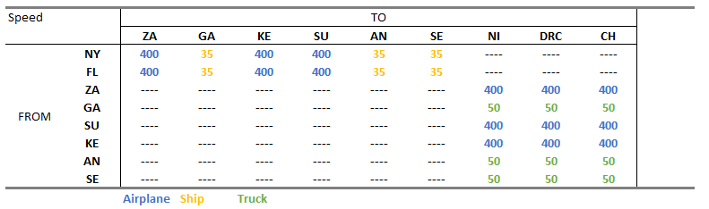
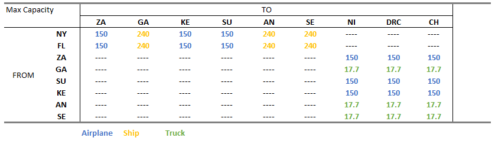

```{r echo = FALSE, message=FALSE}
# Clear environment of variables and functions
rm(list = ls(all = TRUE)) 

# Clear environmet of packages
if(is.null(sessionInfo()$otherPkgs) == FALSE)lapply(paste("package:", names(sessionInfo()$otherPkgs), sep=""), detach, character.only = TRUE, unload = TRUE)


# Load lpSolve package to demonstrate simple LP
library(lpSolveAPI)
library(tidyverse)
library(knitr)
library(kableExtra)
library(formattable)
library(here)
library(igraph)

options(scipen=999)

```


```{r echo = FALSE}
# Function to generate the sensitivity table
sensitivity_table <- function(model){
  # Make solution/sensitivity analysis table
  # Get primal solution
  ps <- get.primal.solution(model)
  
  
  # Get sensitivity analysis
  obj_sa <- get.sensitivity.obj(model)
  rhs_sa <- get.sensitivity.rhs(model)
  
  n <- length(get.variables(model))
  m <- length(get.constr.type(model))
  ov <- paste0("Objective Value = ", comma(ps[1], digits = 2))
  
  sa_tab <- rbind(ps[2:(n + m + 1)], 
                  c(round(rhs_sa$duals[1:m], 2), obj_fn),
                  round(c(rhs_sa$dualsfrom[1:m],obj_sa$objfrom), 2),
                  round(c(rhs_sa$dualstill[1:m],obj_sa$objtill), 2)) 
  colnames(sa_tab) <- c(rownames(model), colnames(model))
  rownames(sa_tab) <- c("solution", "duals/coef", "Sens From", "Sens Till")      
  
  # Substitute "inf" and "-inf" so tables are easier to read (coded by two classmates!)
  sa_tab <- ifelse(sa_tab == -1.000e+30, "-inf", sa_tab)
  sa_tab <- ifelse(sa_tab == 1.000e+30, "inf", sa_tab)
  
  # Print the table
  kable(sa_tab, format.args = list(big.mark = ",")) %>%
    kable_styling(bootstrap_options = c("striped", "bordered")) %>% 
    add_footnote(label = ov, notation = "none")
}
  

```

## Importing data

```{r, message=FALSE}

raw_data <- read_csv(here("MidTerm", "5260_Aiding_Africa_Data.csv"), skip = 1)

transp <- raw_data %>% 
  select(1:3) %>% 
  remove_missing()

dest <- raw_data %>% 
  select(5:6) %>% 
  remove_missing()


dist_cost <- raw_data %>% 
  select(8:12) %>% 
  remove_missing()

dist_cost <- raw_data %>% 
  select(8:12) %>% 
  remove_missing()

aid_req <- raw_data%>% 
  select(14:15) %>% 
  remove_missing()

air_restr <- raw_data %>% 
  select(17:19) %>% 
  remove_missing()

truck_restr <- raw_data %>% 
  select(21:23) %>% 
  remove_missing()
```

## Wrangling Data

```{r}

M <- 1000000

#Create short names for Cities
abv <- tribble(
  ~Long, ~Short,
  "New York, NY",	"NY",
  "Jacksonville, FL",	"FL",
  "Lusaka, Zambia",	"ZA",
  "Libreville, Gabon",	"GA",
  "Nairobi, Kenya",	"KE",
  "Khartoum, Sudan",	"SU",
  "Luanda, Angola",	"AN",
  "Dakar, Senegal",	"SE",
  "Niamey, Niger",	"NI",
  "Kosongo, D.R. Congo",	"DRC",
  "Ndjamena, Chad",	"CH")

#Add Short names to datasets
dist_cost <- dist_cost %>% 
  left_join(abv, by=c("From" = "Long")) %>% 
  rename(From_Short = Short) %>%  
  left_join(abv, by=c("To" = "Long")) %>% 
  rename(To_Short = Short)

aid_req <- aid_req %>% left_join(abv, by=c("City" = "Long")) %>% rename(City_Short = Short)

air_restr <- air_restr %>% 
  left_join(abv, by=c("From_1" = "Long")) %>% rename(From_Short = Short) %>% 
  left_join(abv, by=c("To_1" = "Long")) %>% rename(To_Short = Short) %>% 
  rename(From = From_1,
         To = To_1)

truck_restr <-  truck_restr %>% 
  left_join(abv, by=c("From_2" = "Long")) %>% rename(From_Short = Short) %>% 
  left_join(abv, by=c("To_2" = "Long")) %>% rename(To_Short = Short) %>% 
  rename(From = From_2,
         To = To_2)


# Change order of columns in the dist_cost
dist_cost <- dist_cost %>% select(6:7,1:5)

#Join Transport_Characteristics to City transport pairs, transport modes, distances and costs
dist_cost <- dist_cost %>%  left_join(transp,by=c("Type_1" = "Type"))


# Create a Single point of Origin

dist_cost <- dist_cost %>% 
  add_row(From_Short = "US",
          To_Short = "NY",
          From = "US",
          To = "New York, NY",
          Type_1 = "Airplane",
          Distance = 0,
          Cost = 0,
          Capacity = M,
          Speed = M) %>% 
  add_row(From_Short = "US",
          To_Short = "FL",
          From = "US",
          To = "Jacksonville, FL",
          Type_1 = "Airplane",
          Distance = 0,
          Cost = 0,
          Capacity = M,
          Speed = M)


# Create Trip Time
dist_cost <-  dist_cost %>% mutate(Time = Distance/Speed)


```


## Coding Network Map

```{r}

nodes <-tibble(node = union_all(dist_cost$From_Short, dist_cost$To_Short)) %>% distinct()

net <- graph_from_data_frame(d=dist_cost, vertices=nodes, directed=T ) 


net$layout <- matrix(c(-1000,-1000,   0,    0,    0,    0,    0,    0,-2000,1000,1000,  1000,
                        3000,-3000,5000, 3000, 1000,-1000,-3000,-5000,    0,   0,-3000, 3000 ), nc = 2)

V(net)$size <- 30

# Generate colors based on Transport type:
colrs <- c("darkblue", "goldenrod2", "red4")
edge.col <- colrs[as.factor(E(net)$Type_1)]

# Set Weight
net <- net %>% set_edge_attr("weight", value = dist_cost$Time)


plot(net, edge.arrow.size=.4, edge.color=edge.col, 
     vertex.label.font=1, vertex.label.cex=.7, heigh=800, width=1200)

legend(x=-1.5, y=-1.1, legend = c("Airplane","Ship", "Truck"),
       col =colrs, lwd = 3, text.col = colrs, cex=.8, bty="n", ncol=1)

```

## Minimal Time: “cost is no object” plan

{width=600px} 


{width=600px}

```{r results='asis'}

kable(
    distances(net,v="US", weights = dist_cost$Time, mode="out"), 
    format.args = list(big.mark = ",")
    ) %>%
    kable_styling(bootstrap_options = c("striped", "bordered"))%>%
    save_kable("Short_Path.png")
  
knitr::include_graphics("Short_Path.png")
total_path <- c()

for (j in 1:nrow(aid_req)){ 
  # Set up the cost minimization
  min_time <- make.lp(0, nrow(dist_cost))
  
  # Build objective function and constraints
  obj_fn <- dist_cost$Time
  
  set.objfn(min_time, obj_fn)

  #Shortest Path Matrix
  for (i in 1:nrow(nodes)){ 
      add.constraint(min_time, 
                     (dist_cost$From_Short==pull(nodes[i, 1]))*1 - (dist_cost$To_Short==pull(nodes[i,1]))*1,
                     '=', if_else(pull(nodes[i, 1])=="US",
                                  1,
                                  if_else(pull(nodes[i, 1])==pull(aid_req[j, 3]),
                                          -1,
                                          0)))
      i <- i + 1
    }
  
  
  
  # Add row and column names
  restrictions_name <-  c(nodes$node)
  route_name <- paste(dist_cost$From_Short, dist_cost$To_Short,dist_cost$Type_1 , sep = "_")
  
  dimnames(min_time) <- list(restrictions_name,
                            route_name)
  
  
  # Write to see named algebraic formulation
  write.lp(min_time, "Question_2.lp",type = 'lp')
  
  # Solve the model, if this return 0 an optimal solution is found
  
  cat(paste0("### ", pull(aid_req[j, 1]), "\n"))
  
  print(solve(min_time))
  
  cat("<br>")
  
  print("Shortest Path: ")
  print(all_shortest_paths(net, "US", pull(aid_req[j, 3]))$res[[1]])
  
  cat("<br>")
  
  
  aid.path <- shortest_paths(net, 
                            from = "US", 
                             to  = pull(aid_req[j, 3]),
                             output = "both") # both path nodes and edges
  
  
  total_path <- c(total_path, unlist(aid.path$epath))
  
  # # Generate edge width variable to plot the path:
  ew <- rep(1, ecount(net))
  ew[unlist(aid.path$epath)] <- 5
  
  (plot(net, edge.width=ew, edge.arrow.size=.4, edge.color=edge.col, 
       vertex.label.font=1, vertex.label.cex=.7))
  (legend(x=-1.5, y=-1.1, legend = c("Airplane","Ship", "Truck"),
       col =colrs, lwd = 3, text.col = colrs, cex=.8, bty="n", ncol=1))
  (title(paste0("Fastest path to reach ", pull(aid_req[j, 1]))))
  
  cat(sensitivity_table(min_time))

  j <-j+1
}
```


### Total Path:

```{r}
# # Generate edge width variable to plot the path:
  ew <- rep(1, ecount(net))
  ew[unlist(total_path)] <- 5
  png("Short_Path_Graph.png",
    units="in", 
    width=5, 
    height=4,
    pointsize=12*72/96, 
    res=96)
  
  plot(net, edge.width=ew, edge.arrow.size=.4, edge.color=edge.col, 
       vertex.label.font=1, vertex.label.cex=.7)
  legend(x=-1.5, y=-1.1, legend = c("Airplane","Ship", "Truck"),
       col =colrs, lwd = 3, text.col = colrs, cex=.8, bty="n", ncol=1)
  title("Fastest path to reach all cities")
  
  dev.off()
  
  
  plot(net, edge.width=ew, edge.arrow.size=.4, edge.color=edge.col, 
       vertex.label.font=1, vertex.label.cex=.7)
  legend(x=-1.5, y=-1.1, legend = c("Airplane","Ship", "Truck"),
       col =colrs, lwd = 3, text.col = colrs, cex=.8, bty="n", ncol=1)
  title("Fastest path to reach all cities")
  
```


## Minimal Cost Plan

{width=600px}


```{r}
# Set up the cost minimization
trans_1 <- make.lp(0, nrow(dist_cost))

# Build objective function and constraints
obj_fn <- dist_cost$Cost

set.objfn(trans_1, obj_fn)


# Both in New York and Jacksonville,Florida there are 500,000 tons of the necessary cargo available
add.constraint(trans_1, (dist_cost$From=="New York, NY")*dist_cost$Capacity, "=", 500000) 
add.constraint(trans_1, (dist_cost$From=="Jacksonville, FL")*dist_cost$Capacity, "=", 500000) 

# Supplies to Niamey, Niger can only arrive via air
add.constraint(trans_1, dist_cost$To=="Niamey, Niger" & dist_cost$Type_1!="Airplane", "=", 0) 

#The truck routes into Ndjamena, Chad are restricted so at most 840 trucks can be sent to Ndjamena, Chad from each port
add.constraint(trans_1, dist_cost$From=="Libreville, Gabon" & dist_cost$To=="Ndjamena, Chad", "<=", 840) 
add.constraint(trans_1, dist_cost$From=="Luanda, Angola" & dist_cost$To=="Ndjamena, Chad", "<=", 840) 
add.constraint(trans_1, dist_cost$From=="Dakar, Senegal" & dist_cost$To=="Ndjamena, Chad", "<=", 840) 


#The IFRC is restricted to at most 200 flights from Lusaka, Zambia to Ndjamena, Chad and to at most 200 flights from Khartoum, Sudan to Ndjamena, Chad.
add.constraint(trans_1, dist_cost$From=="Lusaka, Zambia" & dist_cost$To=="Ndjamena, Chad", "<=", 200)
add.constraint(trans_1, dist_cost$From=="Khartoum, Sudan" & dist_cost$To=="Ndjamena, Chad", "<=", 200)


#Necessary Aid
for (i in 1:nrow(aid_req)){ 
    add.constraint(trans_1, 
                   (dist_cost$From==pull(aid_req[i,1]))*dist_cost$Capacity - (dist_cost$To==pull(aid_req[i,1]))*dist_cost$Capacity,
                   '=',-pull(aid_req[i,2]))
    i <- i + 1
  }


# Add row and column names
restrictions_name <-  c("Max_NY", "Max_FL","Only_Air_NI", "Truck_Limit_GA_CH", "Truck_Limit_AN_CH", "Truck_Limit_SE_CH",
                        "Air_Limit_ZA_CH", "Air_Limit_SU_CH",aid_req$City_Short)
route_name <- paste(dist_cost$From_Short, dist_cost$To_Short,dist_cost$Type_1 , sep = "_")
dimnames(trans_1) <- list(restrictions_name,
                          route_name)


# Write to see named algebraic formulation
write.lp(trans_1, "Question_3.lp",type = 'lp')

# Solve the model, if this return 0 an optimal solution is found
solve(trans_1)
```

```{r}

# Objective function Value:
get.objective(trans_1)

# THe optimal variables:
get.variables(trans_1)

# How much of the constraints we use?
get.constraints(trans_1)

sensitivity_table(trans_1)

```


## Maximize the total amount of cargo

{width=600px}


```{r}
# Set up the cost minimization
trans_2 <- make.lp(0, nrow(dist_cost))

```

```{r echo = FALSE, include = FALSE}
# Setting the problem as minimization:
lp.control(trans_2, sense="max")
```

```{r}
# Build objective function and constraints
obj_fn <- dist_cost$Capacity * (dist_cost$From_Short=="NY" | dist_cost$From_Short == "FL")

set.objfn(trans_2, obj_fn)


# Both in New York and Jacksonville,Florida there are 500,000 tons of the necessary cargo available
add.constraint(trans_2, (dist_cost$From=="New York, NY")*dist_cost$Capacity, "<=", 500000) 
add.constraint(trans_2, (dist_cost$From=="Jacksonville, FL")*dist_cost$Capacity, "<=", 500000) 

# Air Transport restricitions
for (i in 1:nrow(air_restr)){ 
    add.constraint(trans_2, 
                   dist_cost$From==pull(air_restr[i,1]) & dist_cost$To==pull(air_restr[i,2]) ,
                   '<=',pull(air_restr[i,3]))
    i <- i + 1
  }

# Truck Transport restricitions
for (i in 1:nrow(truck_restr)){ 
    add.constraint(trans_2, 
                   dist_cost$From==pull(truck_restr[i,1]) & dist_cost$To==pull(truck_restr[i,2]) ,
                   '<=',pull(truck_restr[i,3]))
    i <- i + 1
  }

# Max Necessary Aid
for (i in 1:nrow(aid_req)){ 
    add.constraint(trans_2, 
                   (dist_cost$From==pull(aid_req[i,1]))*dist_cost$Capacity - (dist_cost$To==pull(aid_req[i,1]))*dist_cost$Capacity,
                   '>=',-pull(aid_req[i,2]))
    i <- i + 1
  }

# Add row and column names
restrictions_name <-  c("Max_NY", 
                        "Max_FL",
                        paste("Air", air_restr$From_Short, air_restr$To_Short, sep = "_"), 
                        paste("Truck", truck_restr$From_Short, truck_restr$To_Short, sep = "_"),
                        paste0("Max_Aid_", aid_req$City_Short))

route_name <- paste(dist_cost$From_Short, dist_cost$To_Short,dist_cost$Type_1 , sep = "_")

dimnames(trans_2) <- list(restrictions_name,
                          route_name)


# Write to see named algebraic formulation
write.lp(trans_2, "Question_4.lp",type = 'lp')

# Solve the model, if this return 0 an optimal solution is found
solve(trans_2)
```

```{r}

# Objective function Value:
get.objective(trans_2)

# THe optimal variables:
get.variables(trans_2)

# How much of the constraints we use?
get.constraints(trans_2)

sensitivity_table(trans_2)

```