## Importing data


```r
raw_data <- read_csv(here("MidTerm", "5260_Aiding_Africa_Data.csv"), skip = 1)
```

```
## Warning: Missing column names filled in: 'X4' [4], 'X7' [7], 'X13' [13],
## 'X16' [16], 'X20' [20]
```

```
## Warning: Duplicated column names deduplicated: 'Type' => 'Type_1' [10],
## 'From' => 'From_1' [17], 'To' => 'To_1' [18], 'From' => 'From_2' [21], 'To' =>
## 'To_2' [22]
```

```r
transp <- raw_data %>% 
  select(1:3) %>% 
  remove_missing()
```

```
## Warning: Removed 27 rows containing missing values.
```

```r
dest <- raw_data %>% 
  select(5:6) %>% 
  remove_missing()
```

```
## Warning: Removed 27 rows containing missing values.
```

```r
dist_cost <- raw_data %>% 
  select(8:12) %>% 
  remove_missing()

dist_cost <- raw_data %>% 
  select(8:12) %>% 
  remove_missing()

aid_req <- raw_data%>% 
  select(14:15) %>% 
  remove_missing()
```

```
## Warning: Removed 21 rows containing missing values.
```

```r
air_restr <- raw_data %>% 
  select(17:19) %>% 
  remove_missing()
```

```
## Warning: Removed 15 rows containing missing values.
```

```r
truck_restr <- raw_data %>% 
  select(21:23) %>% 
  remove_missing()
```

```
## Warning: Removed 24 rows containing missing values.
```

## Wrangling Data


```r
M <- 1000000

#Create short names for Cities
abv <- tribble(
  ~Long, ~Short,
  "New York, NY",	"NY",
  "Jacksonville, FL",	"FL",
  "Lusaka, Zambia",	"ZA",
  "Libreville, Gabon",	"GA",
  "Nairobi, Kenya",	"KE",
  "Khartoum, Sudan",	"SU",
  "Luanda, Angola",	"AN",
  "Dakar, Senegal",	"SE",
  "Niamey, Niger",	"NI",
  "Kosongo, D.R. Congo",	"DRC",
  "Ndjamena, Chad",	"CH")

#Add Short names to datasets
dist_cost <- dist_cost %>% 
  left_join(abv, by=c("From" = "Long")) %>% 
  rename(From_Short = Short) %>%  
  left_join(abv, by=c("To" = "Long")) %>% 
  rename(To_Short = Short)

aid_req <- aid_req %>% left_join(abv, by=c("City" = "Long")) %>% rename(City_Short = Short)

air_restr <- air_restr %>% 
  left_join(abv, by=c("From_1" = "Long")) %>% rename(From_Short = Short) %>% 
  left_join(abv, by=c("To_1" = "Long")) %>% rename(To_Short = Short) %>% 
  rename(From = From_1,
         To = To_1)

truck_restr <-  truck_restr %>% 
  left_join(abv, by=c("From_2" = "Long")) %>% rename(From_Short = Short) %>% 
  left_join(abv, by=c("To_2" = "Long")) %>% rename(To_Short = Short) %>% 
  rename(From = From_2,
         To = To_2)


# Change order of columns in the dist_cost
dist_cost <- dist_cost %>% select(6:7,1:5)

#Join Transport_Characteristics to City transport pairs, transport modes, distances and costs
dist_cost <- dist_cost %>%  left_join(transp,by=c("Type_1" = "Type"))


# Create a Single point of Origin

dist_cost <- dist_cost %>% 
  add_row(From_Short = "US",
          To_Short = "NY",
          From = "US",
          To = "New York, NY",
          Type_1 = "Airplane",
          Distance = 0,
          Cost = 0,
          Capacity = M,
          Speed = M) %>% 
  add_row(From_Short = "US",
          To_Short = "FL",
          From = "US",
          To = "Jacksonville, FL",
          Type_1 = "Airplane",
          Distance = 0,
          Cost = 0,
          Capacity = M,
          Speed = M)


# Create Trip Time
dist_cost <-  dist_cost %>% mutate(Time = Distance/Speed)
```


## Coding Network Map


```r
nodes <-tibble(node = union_all(dist_cost$From_Short, dist_cost$To_Short)) %>% distinct()

net <- graph_from_data_frame(d=dist_cost, vertices=nodes, directed=T ) 


net$layout <- matrix(c(-1000,-1000,   0,    0,    0,    0,    0,    0,-2000,1000,1000,  1000,
                        3000,-3000,5000, 3000, 1000,-1000,-3000,-5000,    0,   0,-3000, 3000 ), nc = 2)

V(net)$size <- 30

# Generate colors based on Transport type:
colrs <- c("darkblue", "goldenrod2", "red4")
edge.col <- colrs[as.factor(E(net)$Type_1)]

# Set Weight
net <- net %>% set_edge_attr("weight", value = dist_cost$Time)


plot(net, edge.arrow.size=.4, edge.color=edge.col, 
     vertex.label.font=1, vertex.label.cex=.7, heigh=800, width=1200)

legend(x=-1.5, y=-1.1, legend = c("Airplane","Ship", "Truck"),
       col =colrs, lwd = 3, text.col = colrs, cex=.8, bty="n", ncol=1)
```

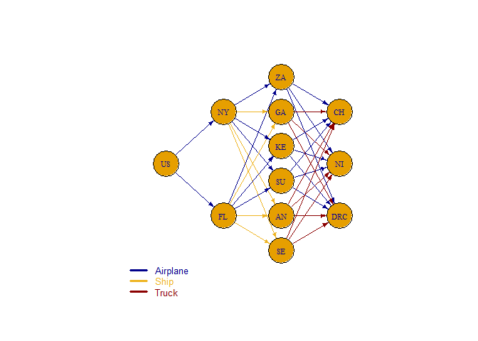<!-- -->

## Minimal Time: “cost is no object” plan

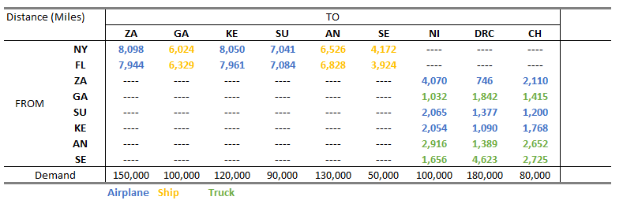{width=600px} 


{width=600px}


```r
kable(
    distances(net,v="US", weights = dist_cost$Time, mode="out"), 
    format.args = list(big.mark = ",")
    ) %>%
    kable_styling(bootstrap_options = c("striped", "bordered"))%>%
    save_kable("Short_Path.png")
  

```


```r
total_path <- c()

for (j in 1:nrow(aid_req)){ 
  # Set up the cost minimization
  min_time <- make.lp(0, nrow(dist_cost))
  
  # Build objective function and constraints
  obj_fn <- dist_cost$Time
  
  set.objfn(min_time, obj_fn)

  #Shortest Path Matrix
  for (i in 1:nrow(nodes)){ 
      add.constraint(min_time, 
                     (dist_cost$From_Short==pull(nodes[i, 1]))*1 - (dist_cost$To_Short==pull(nodes[i,1]))*1,
                     '=', if_else(pull(nodes[i, 1])=="US",
                                  1,
                                  if_else(pull(nodes[i, 1])==pull(aid_req[j, 3]),
                                          -1,
                                          0)))
      i <- i + 1
    }
  
  
  
  # Add row and column names
  restrictions_name <-  c(nodes$node)
  route_name <- paste(dist_cost$From_Short, dist_cost$To_Short,dist_cost$Type_1 , sep = "_")
  
  dimnames(min_time) <- list(restrictions_name,
                            route_name)
  
  
  # Write to see named algebraic formulation
  write.lp(min_time, "Question_2.lp",type = 'lp')
  
  # Solve the model, if this return 0 an optimal solution is found
  
  cat(paste0("### ", pull(aid_req[j, 1]), "\n"))
  
  print(solve(min_time))
  
  cat("<br>")
  
  print("Shortest Path: ")
  print(all_shortest_paths(net, "US", pull(aid_req[j, 3]))$res[[1]])
  
  cat("<br>")
  
  
  aid.path <- shortest_paths(net, 
                            from = "US", 
                             to  = pull(aid_req[j, 3]),
                             output = "both") # both path nodes and edges
  
  
  total_path <- c(total_path, unlist(aid.path$epath))
  
  # # Generate edge width variable to plot the path:
  ew <- rep(1, ecount(net))
  ew[unlist(aid.path$epath)] <- 5
  
  (plot(net, edge.width=ew, edge.arrow.size=.4, edge.color=edge.col, 
       vertex.label.font=1, vertex.label.cex=.7))
  (legend(x=-1.5, y=-1.1, legend = c("Airplane","Ship", "Truck"),
       col =colrs, lwd = 3, text.col = colrs, cex=.8, bty="n", ncol=1))
  (title(paste0("Fastest path to reach ", pull(aid_req[j, 1]))))
  
  cat(sensitivity_table(min_time))

  j <-j+1
}
```

### Dakar, Senegal
[1] 0
<br>[1] "Shortest Path: "
+ 3/12 vertices, named, from 3d59739:
[1] US FL SE
<br>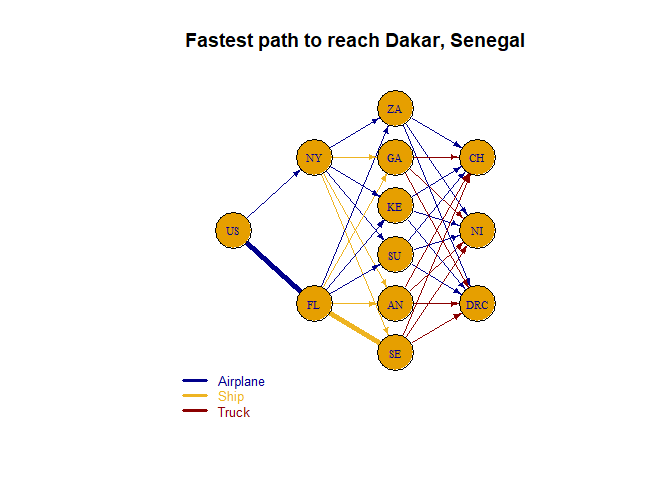<!-- --><table class="table table-striped table-bordered" style="margin-left: auto; margin-right: auto;">
 <thead>
  <tr>
   <th style="text-align:left;">   </th>
   <th style="text-align:left;"> NY </th>
   <th style="text-align:left;"> FL </th>
   <th style="text-align:left;"> ZA </th>
   <th style="text-align:left;"> GA </th>
   <th style="text-align:left;"> KE </th>
   <th style="text-align:left;"> SU </th>
   <th style="text-align:left;"> AN </th>
   <th style="text-align:left;"> SE </th>
   <th style="text-align:left;"> US </th>
   <th style="text-align:left;"> NI </th>
   <th style="text-align:left;"> DRC </th>
   <th style="text-align:left;"> CH </th>
   <th style="text-align:left;"> NY_ZA_Airplane </th>
   <th style="text-align:left;"> NY_GA_Ship </th>
   <th style="text-align:left;"> NY_KE_Airplane </th>
   <th style="text-align:left;"> NY_SU_Airplane </th>
   <th style="text-align:left;"> NY_AN_Ship </th>
   <th style="text-align:left;"> NY_SE_Ship </th>
   <th style="text-align:left;"> FL_ZA_Airplane </th>
   <th style="text-align:left;"> FL_GA_Ship </th>
   <th style="text-align:left;"> FL_KE_Airplane </th>
   <th style="text-align:left;"> FL_SU_Airplane </th>
   <th style="text-align:left;"> FL_AN_Ship </th>
   <th style="text-align:left;"> FL_SE_Ship </th>
   <th style="text-align:left;"> ZA_NI_Airplane </th>
   <th style="text-align:left;"> GA_NI_Truck </th>
   <th style="text-align:left;"> KE_NI_Airplane </th>
   <th style="text-align:left;"> SU_NI_Airplane </th>
   <th style="text-align:left;"> AN_NI_Truck </th>
   <th style="text-align:left;"> SE_NI_Truck </th>
   <th style="text-align:left;"> ZA_DRC_Airplane </th>
   <th style="text-align:left;"> GA_DRC_Truck </th>
   <th style="text-align:left;"> KE_DRC_Airplane </th>
   <th style="text-align:left;"> SU_DRC_Airplane </th>
   <th style="text-align:left;"> AN_DRC_Truck </th>
   <th style="text-align:left;"> SE_DRC_Truck </th>
   <th style="text-align:left;"> ZA_CH_Airplane </th>
   <th style="text-align:left;"> GA_CH_Truck </th>
   <th style="text-align:left;"> KE_CH_Airplane </th>
   <th style="text-align:left;"> SU_CH_Airplane </th>
   <th style="text-align:left;"> AN_CH_Truck </th>
   <th style="text-align:left;"> SE_CH_Truck </th>
   <th style="text-align:left;"> US_NY_Airplane </th>
   <th style="text-align:left;"> US_FL_Airplane </th>
  </tr>
 </thead>
<tbody>
  <tr>
   <td style="text-align:left;"> solution </td>
   <td style="text-align:left;"> 0 </td>
   <td style="text-align:left;"> 0 </td>
   <td style="text-align:left;"> 0 </td>
   <td style="text-align:left;"> 0 </td>
   <td style="text-align:left;"> 0 </td>
   <td style="text-align:left;"> 0 </td>
   <td style="text-align:left;"> 0 </td>
   <td style="text-align:left;"> -1 </td>
   <td style="text-align:left;"> 1 </td>
   <td style="text-align:left;"> 0 </td>
   <td style="text-align:left;"> 0 </td>
   <td style="text-align:left;"> 0 </td>
   <td style="text-align:left;"> 0 </td>
   <td style="text-align:left;"> 0 </td>
   <td style="text-align:left;"> 0 </td>
   <td style="text-align:left;"> 0 </td>
   <td style="text-align:left;"> 0 </td>
   <td style="text-align:left;"> 0 </td>
   <td style="text-align:left;"> 0 </td>
   <td style="text-align:left;"> 0 </td>
   <td style="text-align:left;"> 0 </td>
   <td style="text-align:left;"> 0 </td>
   <td style="text-align:left;"> 0 </td>
   <td style="text-align:left;"> 1 </td>
   <td style="text-align:left;"> 0 </td>
   <td style="text-align:left;"> 0 </td>
   <td style="text-align:left;"> 0 </td>
   <td style="text-align:left;"> 0 </td>
   <td style="text-align:left;"> 0 </td>
   <td style="text-align:left;"> 0 </td>
   <td style="text-align:left;"> 0 </td>
   <td style="text-align:left;"> 0 </td>
   <td style="text-align:left;"> 0 </td>
   <td style="text-align:left;"> 0 </td>
   <td style="text-align:left;"> 0 </td>
   <td style="text-align:left;"> 0 </td>
   <td style="text-align:left;"> 0 </td>
   <td style="text-align:left;"> 0 </td>
   <td style="text-align:left;"> 0 </td>
   <td style="text-align:left;"> 0 </td>
   <td style="text-align:left;"> 0 </td>
   <td style="text-align:left;"> 0 </td>
   <td style="text-align:left;"> 0 </td>
   <td style="text-align:left;"> 1 </td>
  </tr>
  <tr>
   <td style="text-align:left;"> duals/coef </td>
   <td style="text-align:left;"> 0 </td>
   <td style="text-align:left;"> 0 </td>
   <td style="text-align:left;"> 0 </td>
   <td style="text-align:left;"> 0 </td>
   <td style="text-align:left;"> 0 </td>
   <td style="text-align:left;"> 0 </td>
   <td style="text-align:left;"> 0 </td>
   <td style="text-align:left;"> -112.11 </td>
   <td style="text-align:left;"> 0 </td>
   <td style="text-align:left;"> 0 </td>
   <td style="text-align:left;"> 0 </td>
   <td style="text-align:left;"> 0 </td>
   <td style="text-align:left;"> 20.245 </td>
   <td style="text-align:left;"> 172.114285714286 </td>
   <td style="text-align:left;"> 20.125 </td>
   <td style="text-align:left;"> 17.6025 </td>
   <td style="text-align:left;"> 186.457142857143 </td>
   <td style="text-align:left;"> 119.2 </td>
   <td style="text-align:left;"> 19.86 </td>
   <td style="text-align:left;"> 180.828571428571 </td>
   <td style="text-align:left;"> 19.9025 </td>
   <td style="text-align:left;"> 17.71 </td>
   <td style="text-align:left;"> 195.085714285714 </td>
   <td style="text-align:left;"> 112.114285714286 </td>
   <td style="text-align:left;"> 10.175 </td>
   <td style="text-align:left;"> 20.64 </td>
   <td style="text-align:left;"> 6.31 </td>
   <td style="text-align:left;"> 5.1625 </td>
   <td style="text-align:left;"> 58.32 </td>
   <td style="text-align:left;"> 33.12 </td>
   <td style="text-align:left;"> 1.865 </td>
   <td style="text-align:left;"> 36.84 </td>
   <td style="text-align:left;"> 2.725 </td>
   <td style="text-align:left;"> 3.4425 </td>
   <td style="text-align:left;"> 27.78 </td>
   <td style="text-align:left;"> 92.46 </td>
   <td style="text-align:left;"> 5.275 </td>
   <td style="text-align:left;"> 28.3 </td>
   <td style="text-align:left;"> 4.42 </td>
   <td style="text-align:left;"> 3 </td>
   <td style="text-align:left;"> 53.04 </td>
   <td style="text-align:left;"> 54.5 </td>
   <td style="text-align:left;"> 0 </td>
   <td style="text-align:left;"> 0 </td>
  </tr>
  <tr>
   <td style="text-align:left;"> Sens From </td>
   <td style="text-align:left;"> 0 </td>
   <td style="text-align:left;"> -inf </td>
   <td style="text-align:left;"> -inf </td>
   <td style="text-align:left;"> -inf </td>
   <td style="text-align:left;"> -inf </td>
   <td style="text-align:left;"> -inf </td>
   <td style="text-align:left;"> -inf </td>
   <td style="text-align:left;"> -1 </td>
   <td style="text-align:left;"> 1 </td>
   <td style="text-align:left;"> -inf </td>
   <td style="text-align:left;"> -inf </td>
   <td style="text-align:left;"> -inf </td>
   <td style="text-align:left;"> 0 </td>
   <td style="text-align:left;"> 0 </td>
   <td style="text-align:left;"> 0 </td>
   <td style="text-align:left;"> 0 </td>
   <td style="text-align:left;"> 0 </td>
   <td style="text-align:left;"> 112.11 </td>
   <td style="text-align:left;"> 0 </td>
   <td style="text-align:left;"> 0 </td>
   <td style="text-align:left;"> 0 </td>
   <td style="text-align:left;"> 0 </td>
   <td style="text-align:left;"> 0 </td>
   <td style="text-align:left;"> -33.12 </td>
   <td style="text-align:left;"> 0 </td>
   <td style="text-align:left;"> 0 </td>
   <td style="text-align:left;"> 0 </td>
   <td style="text-align:left;"> 0 </td>
   <td style="text-align:left;"> 0 </td>
   <td style="text-align:left;"> -112.11 </td>
   <td style="text-align:left;"> 0 </td>
   <td style="text-align:left;"> 0 </td>
   <td style="text-align:left;"> 0 </td>
   <td style="text-align:left;"> 0 </td>
   <td style="text-align:left;"> 0 </td>
   <td style="text-align:left;"> -112.11 </td>
   <td style="text-align:left;"> 0 </td>
   <td style="text-align:left;"> 0 </td>
   <td style="text-align:left;"> 0 </td>
   <td style="text-align:left;"> 0 </td>
   <td style="text-align:left;"> 0 </td>
   <td style="text-align:left;"> -112.11 </td>
   <td style="text-align:left;"> -7.09 </td>
   <td style="text-align:left;"> -inf </td>
  </tr>
  <tr>
   <td style="text-align:left;"> Sens Till </td>
   <td style="text-align:left;"> 0 </td>
   <td style="text-align:left;"> inf </td>
   <td style="text-align:left;"> inf </td>
   <td style="text-align:left;"> inf </td>
   <td style="text-align:left;"> inf </td>
   <td style="text-align:left;"> inf </td>
   <td style="text-align:left;"> inf </td>
   <td style="text-align:left;"> -1 </td>
   <td style="text-align:left;"> 1 </td>
   <td style="text-align:left;"> inf </td>
   <td style="text-align:left;"> inf </td>
   <td style="text-align:left;"> inf </td>
   <td style="text-align:left;"> inf </td>
   <td style="text-align:left;"> inf </td>
   <td style="text-align:left;"> inf </td>
   <td style="text-align:left;"> inf </td>
   <td style="text-align:left;"> inf </td>
   <td style="text-align:left;"> inf </td>
   <td style="text-align:left;"> inf </td>
   <td style="text-align:left;"> inf </td>
   <td style="text-align:left;"> inf </td>
   <td style="text-align:left;"> inf </td>
   <td style="text-align:left;"> inf </td>
   <td style="text-align:left;"> 119.2 </td>
   <td style="text-align:left;"> inf </td>
   <td style="text-align:left;"> inf </td>
   <td style="text-align:left;"> inf </td>
   <td style="text-align:left;"> inf </td>
   <td style="text-align:left;"> inf </td>
   <td style="text-align:left;"> inf </td>
   <td style="text-align:left;"> inf </td>
   <td style="text-align:left;"> inf </td>
   <td style="text-align:left;"> inf </td>
   <td style="text-align:left;"> inf </td>
   <td style="text-align:left;"> inf </td>
   <td style="text-align:left;"> inf </td>
   <td style="text-align:left;"> inf </td>
   <td style="text-align:left;"> inf </td>
   <td style="text-align:left;"> inf </td>
   <td style="text-align:left;"> inf </td>
   <td style="text-align:left;"> inf </td>
   <td style="text-align:left;"> inf </td>
   <td style="text-align:left;"> inf </td>
   <td style="text-align:left;"> 7.09 </td>
  </tr>
</tbody>
<tfoot>
<tr>
<td style = 'padding: 0; border:0;' colspan='100%'><sup></sup> Objective Value = 112.11</td>
</tr>
</tfoot>
</table>### Libreville, Gabon
[1] 0
<br>[1] "Shortest Path: "
+ 3/12 vertices, named, from 3d59739:
[1] US NY GA
<br>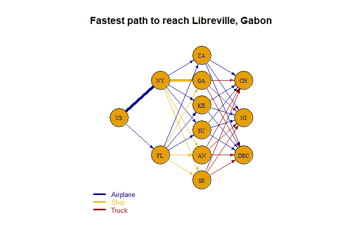<!-- --><table class="table table-striped table-bordered" style="margin-left: auto; margin-right: auto;">
 <thead>
  <tr>
   <th style="text-align:left;">   </th>
   <th style="text-align:left;"> NY </th>
   <th style="text-align:left;"> FL </th>
   <th style="text-align:left;"> ZA </th>
   <th style="text-align:left;"> GA </th>
   <th style="text-align:left;"> KE </th>
   <th style="text-align:left;"> SU </th>
   <th style="text-align:left;"> AN </th>
   <th style="text-align:left;"> SE </th>
   <th style="text-align:left;"> US </th>
   <th style="text-align:left;"> NI </th>
   <th style="text-align:left;"> DRC </th>
   <th style="text-align:left;"> CH </th>
   <th style="text-align:left;"> NY_ZA_Airplane </th>
   <th style="text-align:left;"> NY_GA_Ship </th>
   <th style="text-align:left;"> NY_KE_Airplane </th>
   <th style="text-align:left;"> NY_SU_Airplane </th>
   <th style="text-align:left;"> NY_AN_Ship </th>
   <th style="text-align:left;"> NY_SE_Ship </th>
   <th style="text-align:left;"> FL_ZA_Airplane </th>
   <th style="text-align:left;"> FL_GA_Ship </th>
   <th style="text-align:left;"> FL_KE_Airplane </th>
   <th style="text-align:left;"> FL_SU_Airplane </th>
   <th style="text-align:left;"> FL_AN_Ship </th>
   <th style="text-align:left;"> FL_SE_Ship </th>
   <th style="text-align:left;"> ZA_NI_Airplane </th>
   <th style="text-align:left;"> GA_NI_Truck </th>
   <th style="text-align:left;"> KE_NI_Airplane </th>
   <th style="text-align:left;"> SU_NI_Airplane </th>
   <th style="text-align:left;"> AN_NI_Truck </th>
   <th style="text-align:left;"> SE_NI_Truck </th>
   <th style="text-align:left;"> ZA_DRC_Airplane </th>
   <th style="text-align:left;"> GA_DRC_Truck </th>
   <th style="text-align:left;"> KE_DRC_Airplane </th>
   <th style="text-align:left;"> SU_DRC_Airplane </th>
   <th style="text-align:left;"> AN_DRC_Truck </th>
   <th style="text-align:left;"> SE_DRC_Truck </th>
   <th style="text-align:left;"> ZA_CH_Airplane </th>
   <th style="text-align:left;"> GA_CH_Truck </th>
   <th style="text-align:left;"> KE_CH_Airplane </th>
   <th style="text-align:left;"> SU_CH_Airplane </th>
   <th style="text-align:left;"> AN_CH_Truck </th>
   <th style="text-align:left;"> SE_CH_Truck </th>
   <th style="text-align:left;"> US_NY_Airplane </th>
   <th style="text-align:left;"> US_FL_Airplane </th>
  </tr>
 </thead>
<tbody>
  <tr>
   <td style="text-align:left;"> solution </td>
   <td style="text-align:left;"> 0 </td>
   <td style="text-align:left;"> 0 </td>
   <td style="text-align:left;"> 0 </td>
   <td style="text-align:left;"> -1 </td>
   <td style="text-align:left;"> 0 </td>
   <td style="text-align:left;"> 0 </td>
   <td style="text-align:left;"> 0 </td>
   <td style="text-align:left;"> 0 </td>
   <td style="text-align:left;"> 1 </td>
   <td style="text-align:left;"> 0 </td>
   <td style="text-align:left;"> 0 </td>
   <td style="text-align:left;"> 0 </td>
   <td style="text-align:left;"> 0 </td>
   <td style="text-align:left;"> 1 </td>
   <td style="text-align:left;"> 0 </td>
   <td style="text-align:left;"> 0 </td>
   <td style="text-align:left;"> 0 </td>
   <td style="text-align:left;"> 0 </td>
   <td style="text-align:left;"> 0 </td>
   <td style="text-align:left;"> 0 </td>
   <td style="text-align:left;"> 0 </td>
   <td style="text-align:left;"> 0 </td>
   <td style="text-align:left;"> 0 </td>
   <td style="text-align:left;"> 0 </td>
   <td style="text-align:left;"> 0 </td>
   <td style="text-align:left;"> 0 </td>
   <td style="text-align:left;"> 0 </td>
   <td style="text-align:left;"> 0 </td>
   <td style="text-align:left;"> 0 </td>
   <td style="text-align:left;"> 0 </td>
   <td style="text-align:left;"> 0 </td>
   <td style="text-align:left;"> 0 </td>
   <td style="text-align:left;"> 0 </td>
   <td style="text-align:left;"> 0 </td>
   <td style="text-align:left;"> 0 </td>
   <td style="text-align:left;"> 0 </td>
   <td style="text-align:left;"> 0 </td>
   <td style="text-align:left;"> 0 </td>
   <td style="text-align:left;"> 0 </td>
   <td style="text-align:left;"> 0 </td>
   <td style="text-align:left;"> 0 </td>
   <td style="text-align:left;"> 0 </td>
   <td style="text-align:left;"> 1 </td>
   <td style="text-align:left;"> 0 </td>
  </tr>
  <tr>
   <td style="text-align:left;"> duals/coef </td>
   <td style="text-align:left;"> 0 </td>
   <td style="text-align:left;"> 0 </td>
   <td style="text-align:left;"> 0 </td>
   <td style="text-align:left;"> -172.11 </td>
   <td style="text-align:left;"> 0 </td>
   <td style="text-align:left;"> 0 </td>
   <td style="text-align:left;"> 0 </td>
   <td style="text-align:left;"> 0 </td>
   <td style="text-align:left;"> 0 </td>
   <td style="text-align:left;"> 0 </td>
   <td style="text-align:left;"> 0 </td>
   <td style="text-align:left;"> 0 </td>
   <td style="text-align:left;"> 20.245 </td>
   <td style="text-align:left;"> 172.114285714286 </td>
   <td style="text-align:left;"> 20.125 </td>
   <td style="text-align:left;"> 17.6025 </td>
   <td style="text-align:left;"> 186.457142857143 </td>
   <td style="text-align:left;"> 119.2 </td>
   <td style="text-align:left;"> 19.86 </td>
   <td style="text-align:left;"> 180.828571428571 </td>
   <td style="text-align:left;"> 19.9025 </td>
   <td style="text-align:left;"> 17.71 </td>
   <td style="text-align:left;"> 195.085714285714 </td>
   <td style="text-align:left;"> 112.114285714286 </td>
   <td style="text-align:left;"> 10.175 </td>
   <td style="text-align:left;"> 20.64 </td>
   <td style="text-align:left;"> 6.31 </td>
   <td style="text-align:left;"> 5.1625 </td>
   <td style="text-align:left;"> 58.32 </td>
   <td style="text-align:left;"> 33.12 </td>
   <td style="text-align:left;"> 1.865 </td>
   <td style="text-align:left;"> 36.84 </td>
   <td style="text-align:left;"> 2.725 </td>
   <td style="text-align:left;"> 3.4425 </td>
   <td style="text-align:left;"> 27.78 </td>
   <td style="text-align:left;"> 92.46 </td>
   <td style="text-align:left;"> 5.275 </td>
   <td style="text-align:left;"> 28.3 </td>
   <td style="text-align:left;"> 4.42 </td>
   <td style="text-align:left;"> 3 </td>
   <td style="text-align:left;"> 53.04 </td>
   <td style="text-align:left;"> 54.5 </td>
   <td style="text-align:left;"> 0 </td>
   <td style="text-align:left;"> 0 </td>
  </tr>
  <tr>
   <td style="text-align:left;"> Sens From </td>
   <td style="text-align:left;"> -inf </td>
   <td style="text-align:left;"> -inf </td>
   <td style="text-align:left;"> -inf </td>
   <td style="text-align:left;"> -1 </td>
   <td style="text-align:left;"> -inf </td>
   <td style="text-align:left;"> -inf </td>
   <td style="text-align:left;"> -inf </td>
   <td style="text-align:left;"> -inf </td>
   <td style="text-align:left;"> 1 </td>
   <td style="text-align:left;"> -inf </td>
   <td style="text-align:left;"> -inf </td>
   <td style="text-align:left;"> -inf </td>
   <td style="text-align:left;"> 0 </td>
   <td style="text-align:left;"> -20.64 </td>
   <td style="text-align:left;"> 0 </td>
   <td style="text-align:left;"> 0 </td>
   <td style="text-align:left;"> 0 </td>
   <td style="text-align:left;"> 0 </td>
   <td style="text-align:left;"> 0 </td>
   <td style="text-align:left;"> 172.11 </td>
   <td style="text-align:left;"> 0 </td>
   <td style="text-align:left;"> 0 </td>
   <td style="text-align:left;"> 0 </td>
   <td style="text-align:left;"> 0 </td>
   <td style="text-align:left;"> 0 </td>
   <td style="text-align:left;"> -172.11 </td>
   <td style="text-align:left;"> 0 </td>
   <td style="text-align:left;"> 0 </td>
   <td style="text-align:left;"> 0 </td>
   <td style="text-align:left;"> 0 </td>
   <td style="text-align:left;"> 0 </td>
   <td style="text-align:left;"> -172.11 </td>
   <td style="text-align:left;"> 0 </td>
   <td style="text-align:left;"> 0 </td>
   <td style="text-align:left;"> 0 </td>
   <td style="text-align:left;"> 0 </td>
   <td style="text-align:left;"> 0 </td>
   <td style="text-align:left;"> -172.11 </td>
   <td style="text-align:left;"> 0 </td>
   <td style="text-align:left;"> 0 </td>
   <td style="text-align:left;"> 0 </td>
   <td style="text-align:left;"> 0 </td>
   <td style="text-align:left;"> -inf </td>
   <td style="text-align:left;"> 0 </td>
  </tr>
  <tr>
   <td style="text-align:left;"> Sens Till </td>
   <td style="text-align:left;"> inf </td>
   <td style="text-align:left;"> inf </td>
   <td style="text-align:left;"> inf </td>
   <td style="text-align:left;"> -1 </td>
   <td style="text-align:left;"> inf </td>
   <td style="text-align:left;"> inf </td>
   <td style="text-align:left;"> inf </td>
   <td style="text-align:left;"> inf </td>
   <td style="text-align:left;"> 1 </td>
   <td style="text-align:left;"> inf </td>
   <td style="text-align:left;"> inf </td>
   <td style="text-align:left;"> inf </td>
   <td style="text-align:left;"> inf </td>
   <td style="text-align:left;"> 180.83 </td>
   <td style="text-align:left;"> inf </td>
   <td style="text-align:left;"> inf </td>
   <td style="text-align:left;"> inf </td>
   <td style="text-align:left;"> inf </td>
   <td style="text-align:left;"> inf </td>
   <td style="text-align:left;"> inf </td>
   <td style="text-align:left;"> inf </td>
   <td style="text-align:left;"> inf </td>
   <td style="text-align:left;"> inf </td>
   <td style="text-align:left;"> inf </td>
   <td style="text-align:left;"> inf </td>
   <td style="text-align:left;"> inf </td>
   <td style="text-align:left;"> inf </td>
   <td style="text-align:left;"> inf </td>
   <td style="text-align:left;"> inf </td>
   <td style="text-align:left;"> inf </td>
   <td style="text-align:left;"> inf </td>
   <td style="text-align:left;"> inf </td>
   <td style="text-align:left;"> inf </td>
   <td style="text-align:left;"> inf </td>
   <td style="text-align:left;"> inf </td>
   <td style="text-align:left;"> inf </td>
   <td style="text-align:left;"> inf </td>
   <td style="text-align:left;"> inf </td>
   <td style="text-align:left;"> inf </td>
   <td style="text-align:left;"> inf </td>
   <td style="text-align:left;"> inf </td>
   <td style="text-align:left;"> inf </td>
   <td style="text-align:left;"> 0 </td>
   <td style="text-align:left;"> inf </td>
  </tr>
</tbody>
<tfoot>
<tr>
<td style = 'padding: 0; border:0;' colspan='100%'><sup></sup> Objective Value = 172.11</td>
</tr>
</tfoot>
</table>### Luanda, Angola
[1] 0
<br>[1] "Shortest Path: "
+ 3/12 vertices, named, from 3d59739:
[1] US NY AN
<br>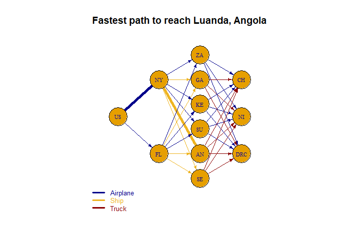<!-- --><table class="table table-striped table-bordered" style="margin-left: auto; margin-right: auto;">
 <thead>
  <tr>
   <th style="text-align:left;">   </th>
   <th style="text-align:left;"> NY </th>
   <th style="text-align:left;"> FL </th>
   <th style="text-align:left;"> ZA </th>
   <th style="text-align:left;"> GA </th>
   <th style="text-align:left;"> KE </th>
   <th style="text-align:left;"> SU </th>
   <th style="text-align:left;"> AN </th>
   <th style="text-align:left;"> SE </th>
   <th style="text-align:left;"> US </th>
   <th style="text-align:left;"> NI </th>
   <th style="text-align:left;"> DRC </th>
   <th style="text-align:left;"> CH </th>
   <th style="text-align:left;"> NY_ZA_Airplane </th>
   <th style="text-align:left;"> NY_GA_Ship </th>
   <th style="text-align:left;"> NY_KE_Airplane </th>
   <th style="text-align:left;"> NY_SU_Airplane </th>
   <th style="text-align:left;"> NY_AN_Ship </th>
   <th style="text-align:left;"> NY_SE_Ship </th>
   <th style="text-align:left;"> FL_ZA_Airplane </th>
   <th style="text-align:left;"> FL_GA_Ship </th>
   <th style="text-align:left;"> FL_KE_Airplane </th>
   <th style="text-align:left;"> FL_SU_Airplane </th>
   <th style="text-align:left;"> FL_AN_Ship </th>
   <th style="text-align:left;"> FL_SE_Ship </th>
   <th style="text-align:left;"> ZA_NI_Airplane </th>
   <th style="text-align:left;"> GA_NI_Truck </th>
   <th style="text-align:left;"> KE_NI_Airplane </th>
   <th style="text-align:left;"> SU_NI_Airplane </th>
   <th style="text-align:left;"> AN_NI_Truck </th>
   <th style="text-align:left;"> SE_NI_Truck </th>
   <th style="text-align:left;"> ZA_DRC_Airplane </th>
   <th style="text-align:left;"> GA_DRC_Truck </th>
   <th style="text-align:left;"> KE_DRC_Airplane </th>
   <th style="text-align:left;"> SU_DRC_Airplane </th>
   <th style="text-align:left;"> AN_DRC_Truck </th>
   <th style="text-align:left;"> SE_DRC_Truck </th>
   <th style="text-align:left;"> ZA_CH_Airplane </th>
   <th style="text-align:left;"> GA_CH_Truck </th>
   <th style="text-align:left;"> KE_CH_Airplane </th>
   <th style="text-align:left;"> SU_CH_Airplane </th>
   <th style="text-align:left;"> AN_CH_Truck </th>
   <th style="text-align:left;"> SE_CH_Truck </th>
   <th style="text-align:left;"> US_NY_Airplane </th>
   <th style="text-align:left;"> US_FL_Airplane </th>
  </tr>
 </thead>
<tbody>
  <tr>
   <td style="text-align:left;"> solution </td>
   <td style="text-align:left;"> 0 </td>
   <td style="text-align:left;"> 0 </td>
   <td style="text-align:left;"> 0 </td>
   <td style="text-align:left;"> 0 </td>
   <td style="text-align:left;"> 0 </td>
   <td style="text-align:left;"> 0 </td>
   <td style="text-align:left;"> -1 </td>
   <td style="text-align:left;"> 0 </td>
   <td style="text-align:left;"> 1 </td>
   <td style="text-align:left;"> 0 </td>
   <td style="text-align:left;"> 0 </td>
   <td style="text-align:left;"> 0 </td>
   <td style="text-align:left;"> 0 </td>
   <td style="text-align:left;"> 0 </td>
   <td style="text-align:left;"> 0 </td>
   <td style="text-align:left;"> 0 </td>
   <td style="text-align:left;"> 1 </td>
   <td style="text-align:left;"> 0 </td>
   <td style="text-align:left;"> 0 </td>
   <td style="text-align:left;"> 0 </td>
   <td style="text-align:left;"> 0 </td>
   <td style="text-align:left;"> 0 </td>
   <td style="text-align:left;"> 0 </td>
   <td style="text-align:left;"> 0 </td>
   <td style="text-align:left;"> 0 </td>
   <td style="text-align:left;"> 0 </td>
   <td style="text-align:left;"> 0 </td>
   <td style="text-align:left;"> 0 </td>
   <td style="text-align:left;"> 0 </td>
   <td style="text-align:left;"> 0 </td>
   <td style="text-align:left;"> 0 </td>
   <td style="text-align:left;"> 0 </td>
   <td style="text-align:left;"> 0 </td>
   <td style="text-align:left;"> 0 </td>
   <td style="text-align:left;"> 0 </td>
   <td style="text-align:left;"> 0 </td>
   <td style="text-align:left;"> 0 </td>
   <td style="text-align:left;"> 0 </td>
   <td style="text-align:left;"> 0 </td>
   <td style="text-align:left;"> 0 </td>
   <td style="text-align:left;"> 0 </td>
   <td style="text-align:left;"> 0 </td>
   <td style="text-align:left;"> 1 </td>
   <td style="text-align:left;"> 0 </td>
  </tr>
  <tr>
   <td style="text-align:left;"> duals/coef </td>
   <td style="text-align:left;"> 0 </td>
   <td style="text-align:left;"> 0 </td>
   <td style="text-align:left;"> 0 </td>
   <td style="text-align:left;"> 0 </td>
   <td style="text-align:left;"> 0 </td>
   <td style="text-align:left;"> 0 </td>
   <td style="text-align:left;"> -186.46 </td>
   <td style="text-align:left;"> 0 </td>
   <td style="text-align:left;"> 0 </td>
   <td style="text-align:left;"> 0 </td>
   <td style="text-align:left;"> 0 </td>
   <td style="text-align:left;"> 0 </td>
   <td style="text-align:left;"> 20.245 </td>
   <td style="text-align:left;"> 172.114285714286 </td>
   <td style="text-align:left;"> 20.125 </td>
   <td style="text-align:left;"> 17.6025 </td>
   <td style="text-align:left;"> 186.457142857143 </td>
   <td style="text-align:left;"> 119.2 </td>
   <td style="text-align:left;"> 19.86 </td>
   <td style="text-align:left;"> 180.828571428571 </td>
   <td style="text-align:left;"> 19.9025 </td>
   <td style="text-align:left;"> 17.71 </td>
   <td style="text-align:left;"> 195.085714285714 </td>
   <td style="text-align:left;"> 112.114285714286 </td>
   <td style="text-align:left;"> 10.175 </td>
   <td style="text-align:left;"> 20.64 </td>
   <td style="text-align:left;"> 6.31 </td>
   <td style="text-align:left;"> 5.1625 </td>
   <td style="text-align:left;"> 58.32 </td>
   <td style="text-align:left;"> 33.12 </td>
   <td style="text-align:left;"> 1.865 </td>
   <td style="text-align:left;"> 36.84 </td>
   <td style="text-align:left;"> 2.725 </td>
   <td style="text-align:left;"> 3.4425 </td>
   <td style="text-align:left;"> 27.78 </td>
   <td style="text-align:left;"> 92.46 </td>
   <td style="text-align:left;"> 5.275 </td>
   <td style="text-align:left;"> 28.3 </td>
   <td style="text-align:left;"> 4.42 </td>
   <td style="text-align:left;"> 3 </td>
   <td style="text-align:left;"> 53.04 </td>
   <td style="text-align:left;"> 54.5 </td>
   <td style="text-align:left;"> 0 </td>
   <td style="text-align:left;"> 0 </td>
  </tr>
  <tr>
   <td style="text-align:left;"> Sens From </td>
   <td style="text-align:left;"> -inf </td>
   <td style="text-align:left;"> -inf </td>
   <td style="text-align:left;"> -inf </td>
   <td style="text-align:left;"> -inf </td>
   <td style="text-align:left;"> -inf </td>
   <td style="text-align:left;"> -inf </td>
   <td style="text-align:left;"> -1 </td>
   <td style="text-align:left;"> -inf </td>
   <td style="text-align:left;"> 1 </td>
   <td style="text-align:left;"> -inf </td>
   <td style="text-align:left;"> -inf </td>
   <td style="text-align:left;"> -inf </td>
   <td style="text-align:left;"> 0 </td>
   <td style="text-align:left;"> 0 </td>
   <td style="text-align:left;"> 0 </td>
   <td style="text-align:left;"> 0 </td>
   <td style="text-align:left;"> -27.78 </td>
   <td style="text-align:left;"> 0 </td>
   <td style="text-align:left;"> 0 </td>
   <td style="text-align:left;"> 0 </td>
   <td style="text-align:left;"> 0 </td>
   <td style="text-align:left;"> 0 </td>
   <td style="text-align:left;"> 186.46 </td>
   <td style="text-align:left;"> 0 </td>
   <td style="text-align:left;"> 0 </td>
   <td style="text-align:left;"> 0 </td>
   <td style="text-align:left;"> 0 </td>
   <td style="text-align:left;"> 0 </td>
   <td style="text-align:left;"> -186.46 </td>
   <td style="text-align:left;"> 0 </td>
   <td style="text-align:left;"> 0 </td>
   <td style="text-align:left;"> 0 </td>
   <td style="text-align:left;"> 0 </td>
   <td style="text-align:left;"> 0 </td>
   <td style="text-align:left;"> -186.46 </td>
   <td style="text-align:left;"> 0 </td>
   <td style="text-align:left;"> 0 </td>
   <td style="text-align:left;"> 0 </td>
   <td style="text-align:left;"> 0 </td>
   <td style="text-align:left;"> 0 </td>
   <td style="text-align:left;"> -186.46 </td>
   <td style="text-align:left;"> 0 </td>
   <td style="text-align:left;"> -inf </td>
   <td style="text-align:left;"> 0 </td>
  </tr>
  <tr>
   <td style="text-align:left;"> Sens Till </td>
   <td style="text-align:left;"> inf </td>
   <td style="text-align:left;"> inf </td>
   <td style="text-align:left;"> inf </td>
   <td style="text-align:left;"> inf </td>
   <td style="text-align:left;"> inf </td>
   <td style="text-align:left;"> inf </td>
   <td style="text-align:left;"> -1 </td>
   <td style="text-align:left;"> inf </td>
   <td style="text-align:left;"> 1 </td>
   <td style="text-align:left;"> inf </td>
   <td style="text-align:left;"> inf </td>
   <td style="text-align:left;"> inf </td>
   <td style="text-align:left;"> inf </td>
   <td style="text-align:left;"> inf </td>
   <td style="text-align:left;"> inf </td>
   <td style="text-align:left;"> inf </td>
   <td style="text-align:left;"> 195.09 </td>
   <td style="text-align:left;"> inf </td>
   <td style="text-align:left;"> inf </td>
   <td style="text-align:left;"> inf </td>
   <td style="text-align:left;"> inf </td>
   <td style="text-align:left;"> inf </td>
   <td style="text-align:left;"> inf </td>
   <td style="text-align:left;"> inf </td>
   <td style="text-align:left;"> inf </td>
   <td style="text-align:left;"> inf </td>
   <td style="text-align:left;"> inf </td>
   <td style="text-align:left;"> inf </td>
   <td style="text-align:left;"> inf </td>
   <td style="text-align:left;"> inf </td>
   <td style="text-align:left;"> inf </td>
   <td style="text-align:left;"> inf </td>
   <td style="text-align:left;"> inf </td>
   <td style="text-align:left;"> inf </td>
   <td style="text-align:left;"> inf </td>
   <td style="text-align:left;"> inf </td>
   <td style="text-align:left;"> inf </td>
   <td style="text-align:left;"> inf </td>
   <td style="text-align:left;"> inf </td>
   <td style="text-align:left;"> inf </td>
   <td style="text-align:left;"> inf </td>
   <td style="text-align:left;"> inf </td>
   <td style="text-align:left;"> 0 </td>
   <td style="text-align:left;"> inf </td>
  </tr>
</tbody>
<tfoot>
<tr>
<td style = 'padding: 0; border:0;' colspan='100%'><sup></sup> Objective Value = 186.46</td>
</tr>
</tfoot>
</table>### Khartoum, Sudan
[1] 0
<br>[1] "Shortest Path: "
+ 3/12 vertices, named, from 3d59739:
[1] US NY SU
<br>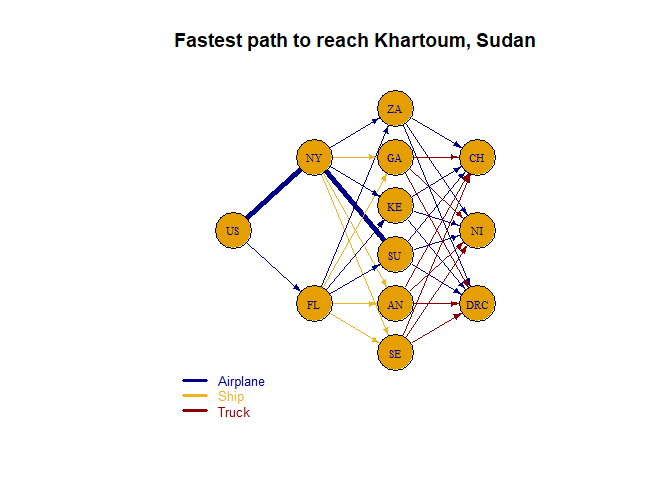<!-- --><table class="table table-striped table-bordered" style="margin-left: auto; margin-right: auto;">
 <thead>
  <tr>
   <th style="text-align:left;">   </th>
   <th style="text-align:left;"> NY </th>
   <th style="text-align:left;"> FL </th>
   <th style="text-align:left;"> ZA </th>
   <th style="text-align:left;"> GA </th>
   <th style="text-align:left;"> KE </th>
   <th style="text-align:left;"> SU </th>
   <th style="text-align:left;"> AN </th>
   <th style="text-align:left;"> SE </th>
   <th style="text-align:left;"> US </th>
   <th style="text-align:left;"> NI </th>
   <th style="text-align:left;"> DRC </th>
   <th style="text-align:left;"> CH </th>
   <th style="text-align:left;"> NY_ZA_Airplane </th>
   <th style="text-align:left;"> NY_GA_Ship </th>
   <th style="text-align:left;"> NY_KE_Airplane </th>
   <th style="text-align:left;"> NY_SU_Airplane </th>
   <th style="text-align:left;"> NY_AN_Ship </th>
   <th style="text-align:left;"> NY_SE_Ship </th>
   <th style="text-align:left;"> FL_ZA_Airplane </th>
   <th style="text-align:left;"> FL_GA_Ship </th>
   <th style="text-align:left;"> FL_KE_Airplane </th>
   <th style="text-align:left;"> FL_SU_Airplane </th>
   <th style="text-align:left;"> FL_AN_Ship </th>
   <th style="text-align:left;"> FL_SE_Ship </th>
   <th style="text-align:left;"> ZA_NI_Airplane </th>
   <th style="text-align:left;"> GA_NI_Truck </th>
   <th style="text-align:left;"> KE_NI_Airplane </th>
   <th style="text-align:left;"> SU_NI_Airplane </th>
   <th style="text-align:left;"> AN_NI_Truck </th>
   <th style="text-align:left;"> SE_NI_Truck </th>
   <th style="text-align:left;"> ZA_DRC_Airplane </th>
   <th style="text-align:left;"> GA_DRC_Truck </th>
   <th style="text-align:left;"> KE_DRC_Airplane </th>
   <th style="text-align:left;"> SU_DRC_Airplane </th>
   <th style="text-align:left;"> AN_DRC_Truck </th>
   <th style="text-align:left;"> SE_DRC_Truck </th>
   <th style="text-align:left;"> ZA_CH_Airplane </th>
   <th style="text-align:left;"> GA_CH_Truck </th>
   <th style="text-align:left;"> KE_CH_Airplane </th>
   <th style="text-align:left;"> SU_CH_Airplane </th>
   <th style="text-align:left;"> AN_CH_Truck </th>
   <th style="text-align:left;"> SE_CH_Truck </th>
   <th style="text-align:left;"> US_NY_Airplane </th>
   <th style="text-align:left;"> US_FL_Airplane </th>
  </tr>
 </thead>
<tbody>
  <tr>
   <td style="text-align:left;"> solution </td>
   <td style="text-align:left;"> 0 </td>
   <td style="text-align:left;"> 0 </td>
   <td style="text-align:left;"> 0 </td>
   <td style="text-align:left;"> 0 </td>
   <td style="text-align:left;"> 0 </td>
   <td style="text-align:left;"> -1 </td>
   <td style="text-align:left;"> 0 </td>
   <td style="text-align:left;"> 0 </td>
   <td style="text-align:left;"> 1 </td>
   <td style="text-align:left;"> 0 </td>
   <td style="text-align:left;"> 0 </td>
   <td style="text-align:left;"> 0 </td>
   <td style="text-align:left;"> 0 </td>
   <td style="text-align:left;"> 0 </td>
   <td style="text-align:left;"> 0 </td>
   <td style="text-align:left;"> 1 </td>
   <td style="text-align:left;"> 0 </td>
   <td style="text-align:left;"> 0 </td>
   <td style="text-align:left;"> 0 </td>
   <td style="text-align:left;"> 0 </td>
   <td style="text-align:left;"> 0 </td>
   <td style="text-align:left;"> 0 </td>
   <td style="text-align:left;"> 0 </td>
   <td style="text-align:left;"> 0 </td>
   <td style="text-align:left;"> 0 </td>
   <td style="text-align:left;"> 0 </td>
   <td style="text-align:left;"> 0 </td>
   <td style="text-align:left;"> 0 </td>
   <td style="text-align:left;"> 0 </td>
   <td style="text-align:left;"> 0 </td>
   <td style="text-align:left;"> 0 </td>
   <td style="text-align:left;"> 0 </td>
   <td style="text-align:left;"> 0 </td>
   <td style="text-align:left;"> 0 </td>
   <td style="text-align:left;"> 0 </td>
   <td style="text-align:left;"> 0 </td>
   <td style="text-align:left;"> 0 </td>
   <td style="text-align:left;"> 0 </td>
   <td style="text-align:left;"> 0 </td>
   <td style="text-align:left;"> 0 </td>
   <td style="text-align:left;"> 0 </td>
   <td style="text-align:left;"> 0 </td>
   <td style="text-align:left;"> 1 </td>
   <td style="text-align:left;"> 0 </td>
  </tr>
  <tr>
   <td style="text-align:left;"> duals/coef </td>
   <td style="text-align:left;"> 0 </td>
   <td style="text-align:left;"> 0 </td>
   <td style="text-align:left;"> 0 </td>
   <td style="text-align:left;"> 0 </td>
   <td style="text-align:left;"> 0 </td>
   <td style="text-align:left;"> -17.6 </td>
   <td style="text-align:left;"> 0 </td>
   <td style="text-align:left;"> 0 </td>
   <td style="text-align:left;"> 0 </td>
   <td style="text-align:left;"> 0 </td>
   <td style="text-align:left;"> 0 </td>
   <td style="text-align:left;"> 0 </td>
   <td style="text-align:left;"> 20.245 </td>
   <td style="text-align:left;"> 172.114285714286 </td>
   <td style="text-align:left;"> 20.125 </td>
   <td style="text-align:left;"> 17.6025 </td>
   <td style="text-align:left;"> 186.457142857143 </td>
   <td style="text-align:left;"> 119.2 </td>
   <td style="text-align:left;"> 19.86 </td>
   <td style="text-align:left;"> 180.828571428571 </td>
   <td style="text-align:left;"> 19.9025 </td>
   <td style="text-align:left;"> 17.71 </td>
   <td style="text-align:left;"> 195.085714285714 </td>
   <td style="text-align:left;"> 112.114285714286 </td>
   <td style="text-align:left;"> 10.175 </td>
   <td style="text-align:left;"> 20.64 </td>
   <td style="text-align:left;"> 6.31 </td>
   <td style="text-align:left;"> 5.1625 </td>
   <td style="text-align:left;"> 58.32 </td>
   <td style="text-align:left;"> 33.12 </td>
   <td style="text-align:left;"> 1.865 </td>
   <td style="text-align:left;"> 36.84 </td>
   <td style="text-align:left;"> 2.725 </td>
   <td style="text-align:left;"> 3.4425 </td>
   <td style="text-align:left;"> 27.78 </td>
   <td style="text-align:left;"> 92.46 </td>
   <td style="text-align:left;"> 5.275 </td>
   <td style="text-align:left;"> 28.3 </td>
   <td style="text-align:left;"> 4.42 </td>
   <td style="text-align:left;"> 3 </td>
   <td style="text-align:left;"> 53.04 </td>
   <td style="text-align:left;"> 54.5 </td>
   <td style="text-align:left;"> 0 </td>
   <td style="text-align:left;"> 0 </td>
  </tr>
  <tr>
   <td style="text-align:left;"> Sens From </td>
   <td style="text-align:left;"> -inf </td>
   <td style="text-align:left;"> -inf </td>
   <td style="text-align:left;"> -inf </td>
   <td style="text-align:left;"> -inf </td>
   <td style="text-align:left;"> -inf </td>
   <td style="text-align:left;"> -1 </td>
   <td style="text-align:left;"> -inf </td>
   <td style="text-align:left;"> -inf </td>
   <td style="text-align:left;"> 1 </td>
   <td style="text-align:left;"> -inf </td>
   <td style="text-align:left;"> -inf </td>
   <td style="text-align:left;"> -inf </td>
   <td style="text-align:left;"> 0 </td>
   <td style="text-align:left;"> 0 </td>
   <td style="text-align:left;"> 0 </td>
   <td style="text-align:left;"> -3 </td>
   <td style="text-align:left;"> 0 </td>
   <td style="text-align:left;"> 0 </td>
   <td style="text-align:left;"> 0 </td>
   <td style="text-align:left;"> 0 </td>
   <td style="text-align:left;"> 0 </td>
   <td style="text-align:left;"> 17.6 </td>
   <td style="text-align:left;"> 0 </td>
   <td style="text-align:left;"> 0 </td>
   <td style="text-align:left;"> 0 </td>
   <td style="text-align:left;"> 0 </td>
   <td style="text-align:left;"> 0 </td>
   <td style="text-align:left;"> -17.6 </td>
   <td style="text-align:left;"> 0 </td>
   <td style="text-align:left;"> 0 </td>
   <td style="text-align:left;"> 0 </td>
   <td style="text-align:left;"> 0 </td>
   <td style="text-align:left;"> 0 </td>
   <td style="text-align:left;"> -17.6 </td>
   <td style="text-align:left;"> 0 </td>
   <td style="text-align:left;"> 0 </td>
   <td style="text-align:left;"> 0 </td>
   <td style="text-align:left;"> 0 </td>
   <td style="text-align:left;"> 0 </td>
   <td style="text-align:left;"> -17.6 </td>
   <td style="text-align:left;"> 0 </td>
   <td style="text-align:left;"> 0 </td>
   <td style="text-align:left;"> -inf </td>
   <td style="text-align:left;"> 0 </td>
  </tr>
  <tr>
   <td style="text-align:left;"> Sens Till </td>
   <td style="text-align:left;"> inf </td>
   <td style="text-align:left;"> inf </td>
   <td style="text-align:left;"> inf </td>
   <td style="text-align:left;"> inf </td>
   <td style="text-align:left;"> inf </td>
   <td style="text-align:left;"> -1 </td>
   <td style="text-align:left;"> inf </td>
   <td style="text-align:left;"> inf </td>
   <td style="text-align:left;"> 1 </td>
   <td style="text-align:left;"> inf </td>
   <td style="text-align:left;"> inf </td>
   <td style="text-align:left;"> inf </td>
   <td style="text-align:left;"> inf </td>
   <td style="text-align:left;"> inf </td>
   <td style="text-align:left;"> inf </td>
   <td style="text-align:left;"> 17.71 </td>
   <td style="text-align:left;"> inf </td>
   <td style="text-align:left;"> inf </td>
   <td style="text-align:left;"> inf </td>
   <td style="text-align:left;"> inf </td>
   <td style="text-align:left;"> inf </td>
   <td style="text-align:left;"> inf </td>
   <td style="text-align:left;"> inf </td>
   <td style="text-align:left;"> inf </td>
   <td style="text-align:left;"> inf </td>
   <td style="text-align:left;"> inf </td>
   <td style="text-align:left;"> inf </td>
   <td style="text-align:left;"> inf </td>
   <td style="text-align:left;"> inf </td>
   <td style="text-align:left;"> inf </td>
   <td style="text-align:left;"> inf </td>
   <td style="text-align:left;"> inf </td>
   <td style="text-align:left;"> inf </td>
   <td style="text-align:left;"> inf </td>
   <td style="text-align:left;"> inf </td>
   <td style="text-align:left;"> inf </td>
   <td style="text-align:left;"> inf </td>
   <td style="text-align:left;"> inf </td>
   <td style="text-align:left;"> inf </td>
   <td style="text-align:left;"> inf </td>
   <td style="text-align:left;"> inf </td>
   <td style="text-align:left;"> inf </td>
   <td style="text-align:left;"> 0 </td>
   <td style="text-align:left;"> inf </td>
  </tr>
</tbody>
<tfoot>
<tr>
<td style = 'padding: 0; border:0;' colspan='100%'><sup></sup> Objective Value = 17.60</td>
</tr>
</tfoot>
</table>### Lusaka, Zambia
[1] 0
<br>[1] "Shortest Path: "
+ 3/12 vertices, named, from 3d59739:
[1] US FL ZA
<br>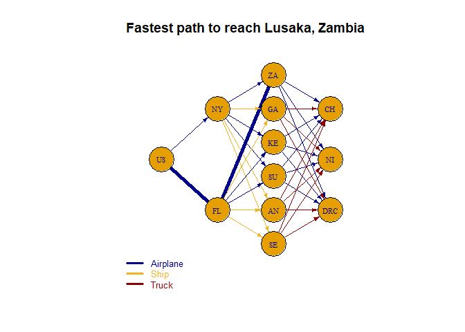<!-- --><table class="table table-striped table-bordered" style="margin-left: auto; margin-right: auto;">
 <thead>
  <tr>
   <th style="text-align:left;">   </th>
   <th style="text-align:left;"> NY </th>
   <th style="text-align:left;"> FL </th>
   <th style="text-align:left;"> ZA </th>
   <th style="text-align:left;"> GA </th>
   <th style="text-align:left;"> KE </th>
   <th style="text-align:left;"> SU </th>
   <th style="text-align:left;"> AN </th>
   <th style="text-align:left;"> SE </th>
   <th style="text-align:left;"> US </th>
   <th style="text-align:left;"> NI </th>
   <th style="text-align:left;"> DRC </th>
   <th style="text-align:left;"> CH </th>
   <th style="text-align:left;"> NY_ZA_Airplane </th>
   <th style="text-align:left;"> NY_GA_Ship </th>
   <th style="text-align:left;"> NY_KE_Airplane </th>
   <th style="text-align:left;"> NY_SU_Airplane </th>
   <th style="text-align:left;"> NY_AN_Ship </th>
   <th style="text-align:left;"> NY_SE_Ship </th>
   <th style="text-align:left;"> FL_ZA_Airplane </th>
   <th style="text-align:left;"> FL_GA_Ship </th>
   <th style="text-align:left;"> FL_KE_Airplane </th>
   <th style="text-align:left;"> FL_SU_Airplane </th>
   <th style="text-align:left;"> FL_AN_Ship </th>
   <th style="text-align:left;"> FL_SE_Ship </th>
   <th style="text-align:left;"> ZA_NI_Airplane </th>
   <th style="text-align:left;"> GA_NI_Truck </th>
   <th style="text-align:left;"> KE_NI_Airplane </th>
   <th style="text-align:left;"> SU_NI_Airplane </th>
   <th style="text-align:left;"> AN_NI_Truck </th>
   <th style="text-align:left;"> SE_NI_Truck </th>
   <th style="text-align:left;"> ZA_DRC_Airplane </th>
   <th style="text-align:left;"> GA_DRC_Truck </th>
   <th style="text-align:left;"> KE_DRC_Airplane </th>
   <th style="text-align:left;"> SU_DRC_Airplane </th>
   <th style="text-align:left;"> AN_DRC_Truck </th>
   <th style="text-align:left;"> SE_DRC_Truck </th>
   <th style="text-align:left;"> ZA_CH_Airplane </th>
   <th style="text-align:left;"> GA_CH_Truck </th>
   <th style="text-align:left;"> KE_CH_Airplane </th>
   <th style="text-align:left;"> SU_CH_Airplane </th>
   <th style="text-align:left;"> AN_CH_Truck </th>
   <th style="text-align:left;"> SE_CH_Truck </th>
   <th style="text-align:left;"> US_NY_Airplane </th>
   <th style="text-align:left;"> US_FL_Airplane </th>
  </tr>
 </thead>
<tbody>
  <tr>
   <td style="text-align:left;"> solution </td>
   <td style="text-align:left;"> 0 </td>
   <td style="text-align:left;"> 0 </td>
   <td style="text-align:left;"> -1 </td>
   <td style="text-align:left;"> 0 </td>
   <td style="text-align:left;"> 0 </td>
   <td style="text-align:left;"> 0 </td>
   <td style="text-align:left;"> 0 </td>
   <td style="text-align:left;"> 0 </td>
   <td style="text-align:left;"> 1 </td>
   <td style="text-align:left;"> 0 </td>
   <td style="text-align:left;"> 0 </td>
   <td style="text-align:left;"> 0 </td>
   <td style="text-align:left;"> 0 </td>
   <td style="text-align:left;"> 0 </td>
   <td style="text-align:left;"> 0 </td>
   <td style="text-align:left;"> 0 </td>
   <td style="text-align:left;"> 0 </td>
   <td style="text-align:left;"> 0 </td>
   <td style="text-align:left;"> 1 </td>
   <td style="text-align:left;"> 0 </td>
   <td style="text-align:left;"> 0 </td>
   <td style="text-align:left;"> 0 </td>
   <td style="text-align:left;"> 0 </td>
   <td style="text-align:left;"> 0 </td>
   <td style="text-align:left;"> 0 </td>
   <td style="text-align:left;"> 0 </td>
   <td style="text-align:left;"> 0 </td>
   <td style="text-align:left;"> 0 </td>
   <td style="text-align:left;"> 0 </td>
   <td style="text-align:left;"> 0 </td>
   <td style="text-align:left;"> 0 </td>
   <td style="text-align:left;"> 0 </td>
   <td style="text-align:left;"> 0 </td>
   <td style="text-align:left;"> 0 </td>
   <td style="text-align:left;"> 0 </td>
   <td style="text-align:left;"> 0 </td>
   <td style="text-align:left;"> 0 </td>
   <td style="text-align:left;"> 0 </td>
   <td style="text-align:left;"> 0 </td>
   <td style="text-align:left;"> 0 </td>
   <td style="text-align:left;"> 0 </td>
   <td style="text-align:left;"> 0 </td>
   <td style="text-align:left;"> 0 </td>
   <td style="text-align:left;"> 1 </td>
  </tr>
  <tr>
   <td style="text-align:left;"> duals/coef </td>
   <td style="text-align:left;"> 0 </td>
   <td style="text-align:left;"> 0 </td>
   <td style="text-align:left;"> -19.86 </td>
   <td style="text-align:left;"> 0 </td>
   <td style="text-align:left;"> 0 </td>
   <td style="text-align:left;"> 0 </td>
   <td style="text-align:left;"> 0 </td>
   <td style="text-align:left;"> 0 </td>
   <td style="text-align:left;"> 0 </td>
   <td style="text-align:left;"> 0 </td>
   <td style="text-align:left;"> 0 </td>
   <td style="text-align:left;"> 0 </td>
   <td style="text-align:left;"> 20.245 </td>
   <td style="text-align:left;"> 172.114285714286 </td>
   <td style="text-align:left;"> 20.125 </td>
   <td style="text-align:left;"> 17.6025 </td>
   <td style="text-align:left;"> 186.457142857143 </td>
   <td style="text-align:left;"> 119.2 </td>
   <td style="text-align:left;"> 19.86 </td>
   <td style="text-align:left;"> 180.828571428571 </td>
   <td style="text-align:left;"> 19.9025 </td>
   <td style="text-align:left;"> 17.71 </td>
   <td style="text-align:left;"> 195.085714285714 </td>
   <td style="text-align:left;"> 112.114285714286 </td>
   <td style="text-align:left;"> 10.175 </td>
   <td style="text-align:left;"> 20.64 </td>
   <td style="text-align:left;"> 6.31 </td>
   <td style="text-align:left;"> 5.1625 </td>
   <td style="text-align:left;"> 58.32 </td>
   <td style="text-align:left;"> 33.12 </td>
   <td style="text-align:left;"> 1.865 </td>
   <td style="text-align:left;"> 36.84 </td>
   <td style="text-align:left;"> 2.725 </td>
   <td style="text-align:left;"> 3.4425 </td>
   <td style="text-align:left;"> 27.78 </td>
   <td style="text-align:left;"> 92.46 </td>
   <td style="text-align:left;"> 5.275 </td>
   <td style="text-align:left;"> 28.3 </td>
   <td style="text-align:left;"> 4.42 </td>
   <td style="text-align:left;"> 3 </td>
   <td style="text-align:left;"> 53.04 </td>
   <td style="text-align:left;"> 54.5 </td>
   <td style="text-align:left;"> 0 </td>
   <td style="text-align:left;"> 0 </td>
  </tr>
  <tr>
   <td style="text-align:left;"> Sens From </td>
   <td style="text-align:left;"> 0 </td>
   <td style="text-align:left;"> -inf </td>
   <td style="text-align:left;"> -1 </td>
   <td style="text-align:left;"> -inf </td>
   <td style="text-align:left;"> -inf </td>
   <td style="text-align:left;"> -inf </td>
   <td style="text-align:left;"> -inf </td>
   <td style="text-align:left;"> -inf </td>
   <td style="text-align:left;"> 1 </td>
   <td style="text-align:left;"> -inf </td>
   <td style="text-align:left;"> -inf </td>
   <td style="text-align:left;"> -inf </td>
   <td style="text-align:left;"> 19.86 </td>
   <td style="text-align:left;"> 0 </td>
   <td style="text-align:left;"> 0 </td>
   <td style="text-align:left;"> 0 </td>
   <td style="text-align:left;"> 0 </td>
   <td style="text-align:left;"> 0 </td>
   <td style="text-align:left;"> -1.86 </td>
   <td style="text-align:left;"> 0 </td>
   <td style="text-align:left;"> 0 </td>
   <td style="text-align:left;"> 0 </td>
   <td style="text-align:left;"> 0 </td>
   <td style="text-align:left;"> 0 </td>
   <td style="text-align:left;"> -19.86 </td>
   <td style="text-align:left;"> 0 </td>
   <td style="text-align:left;"> 0 </td>
   <td style="text-align:left;"> 0 </td>
   <td style="text-align:left;"> 0 </td>
   <td style="text-align:left;"> 0 </td>
   <td style="text-align:left;"> -19.86 </td>
   <td style="text-align:left;"> 0 </td>
   <td style="text-align:left;"> 0 </td>
   <td style="text-align:left;"> 0 </td>
   <td style="text-align:left;"> 0 </td>
   <td style="text-align:left;"> 0 </td>
   <td style="text-align:left;"> -19.86 </td>
   <td style="text-align:left;"> 0 </td>
   <td style="text-align:left;"> 0 </td>
   <td style="text-align:left;"> 0 </td>
   <td style="text-align:left;"> 0 </td>
   <td style="text-align:left;"> 0 </td>
   <td style="text-align:left;"> -0.39 </td>
   <td style="text-align:left;"> -inf </td>
  </tr>
  <tr>
   <td style="text-align:left;"> Sens Till </td>
   <td style="text-align:left;"> 0 </td>
   <td style="text-align:left;"> inf </td>
   <td style="text-align:left;"> -1 </td>
   <td style="text-align:left;"> inf </td>
   <td style="text-align:left;"> inf </td>
   <td style="text-align:left;"> inf </td>
   <td style="text-align:left;"> inf </td>
   <td style="text-align:left;"> inf </td>
   <td style="text-align:left;"> 1 </td>
   <td style="text-align:left;"> inf </td>
   <td style="text-align:left;"> inf </td>
   <td style="text-align:left;"> inf </td>
   <td style="text-align:left;"> inf </td>
   <td style="text-align:left;"> inf </td>
   <td style="text-align:left;"> inf </td>
   <td style="text-align:left;"> inf </td>
   <td style="text-align:left;"> inf </td>
   <td style="text-align:left;"> inf </td>
   <td style="text-align:left;"> 20.25 </td>
   <td style="text-align:left;"> inf </td>
   <td style="text-align:left;"> inf </td>
   <td style="text-align:left;"> inf </td>
   <td style="text-align:left;"> inf </td>
   <td style="text-align:left;"> inf </td>
   <td style="text-align:left;"> inf </td>
   <td style="text-align:left;"> inf </td>
   <td style="text-align:left;"> inf </td>
   <td style="text-align:left;"> inf </td>
   <td style="text-align:left;"> inf </td>
   <td style="text-align:left;"> inf </td>
   <td style="text-align:left;"> inf </td>
   <td style="text-align:left;"> inf </td>
   <td style="text-align:left;"> inf </td>
   <td style="text-align:left;"> inf </td>
   <td style="text-align:left;"> inf </td>
   <td style="text-align:left;"> inf </td>
   <td style="text-align:left;"> inf </td>
   <td style="text-align:left;"> inf </td>
   <td style="text-align:left;"> inf </td>
   <td style="text-align:left;"> inf </td>
   <td style="text-align:left;"> inf </td>
   <td style="text-align:left;"> inf </td>
   <td style="text-align:left;"> inf </td>
   <td style="text-align:left;"> 0.39 </td>
  </tr>
</tbody>
<tfoot>
<tr>
<td style = 'padding: 0; border:0;' colspan='100%'><sup></sup> Objective Value = 19.86</td>
</tr>
</tfoot>
</table>### Nairobi, Kenya
[1] 0
<br>[1] "Shortest Path: "
+ 3/12 vertices, named, from 3d59739:
[1] US FL KE
<br>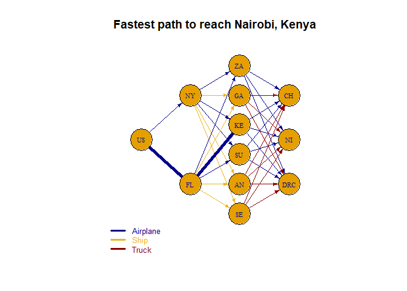<!-- --><table class="table table-striped table-bordered" style="margin-left: auto; margin-right: auto;">
 <thead>
  <tr>
   <th style="text-align:left;">   </th>
   <th style="text-align:left;"> NY </th>
   <th style="text-align:left;"> FL </th>
   <th style="text-align:left;"> ZA </th>
   <th style="text-align:left;"> GA </th>
   <th style="text-align:left;"> KE </th>
   <th style="text-align:left;"> SU </th>
   <th style="text-align:left;"> AN </th>
   <th style="text-align:left;"> SE </th>
   <th style="text-align:left;"> US </th>
   <th style="text-align:left;"> NI </th>
   <th style="text-align:left;"> DRC </th>
   <th style="text-align:left;"> CH </th>
   <th style="text-align:left;"> NY_ZA_Airplane </th>
   <th style="text-align:left;"> NY_GA_Ship </th>
   <th style="text-align:left;"> NY_KE_Airplane </th>
   <th style="text-align:left;"> NY_SU_Airplane </th>
   <th style="text-align:left;"> NY_AN_Ship </th>
   <th style="text-align:left;"> NY_SE_Ship </th>
   <th style="text-align:left;"> FL_ZA_Airplane </th>
   <th style="text-align:left;"> FL_GA_Ship </th>
   <th style="text-align:left;"> FL_KE_Airplane </th>
   <th style="text-align:left;"> FL_SU_Airplane </th>
   <th style="text-align:left;"> FL_AN_Ship </th>
   <th style="text-align:left;"> FL_SE_Ship </th>
   <th style="text-align:left;"> ZA_NI_Airplane </th>
   <th style="text-align:left;"> GA_NI_Truck </th>
   <th style="text-align:left;"> KE_NI_Airplane </th>
   <th style="text-align:left;"> SU_NI_Airplane </th>
   <th style="text-align:left;"> AN_NI_Truck </th>
   <th style="text-align:left;"> SE_NI_Truck </th>
   <th style="text-align:left;"> ZA_DRC_Airplane </th>
   <th style="text-align:left;"> GA_DRC_Truck </th>
   <th style="text-align:left;"> KE_DRC_Airplane </th>
   <th style="text-align:left;"> SU_DRC_Airplane </th>
   <th style="text-align:left;"> AN_DRC_Truck </th>
   <th style="text-align:left;"> SE_DRC_Truck </th>
   <th style="text-align:left;"> ZA_CH_Airplane </th>
   <th style="text-align:left;"> GA_CH_Truck </th>
   <th style="text-align:left;"> KE_CH_Airplane </th>
   <th style="text-align:left;"> SU_CH_Airplane </th>
   <th style="text-align:left;"> AN_CH_Truck </th>
   <th style="text-align:left;"> SE_CH_Truck </th>
   <th style="text-align:left;"> US_NY_Airplane </th>
   <th style="text-align:left;"> US_FL_Airplane </th>
  </tr>
 </thead>
<tbody>
  <tr>
   <td style="text-align:left;"> solution </td>
   <td style="text-align:left;"> 0 </td>
   <td style="text-align:left;"> 0 </td>
   <td style="text-align:left;"> 0 </td>
   <td style="text-align:left;"> 0 </td>
   <td style="text-align:left;"> -1 </td>
   <td style="text-align:left;"> 0 </td>
   <td style="text-align:left;"> 0 </td>
   <td style="text-align:left;"> 0 </td>
   <td style="text-align:left;"> 1 </td>
   <td style="text-align:left;"> 0 </td>
   <td style="text-align:left;"> 0 </td>
   <td style="text-align:left;"> 0 </td>
   <td style="text-align:left;"> 0 </td>
   <td style="text-align:left;"> 0 </td>
   <td style="text-align:left;"> 0 </td>
   <td style="text-align:left;"> 0 </td>
   <td style="text-align:left;"> 0 </td>
   <td style="text-align:left;"> 0 </td>
   <td style="text-align:left;"> 0 </td>
   <td style="text-align:left;"> 0 </td>
   <td style="text-align:left;"> 1 </td>
   <td style="text-align:left;"> 0 </td>
   <td style="text-align:left;"> 0 </td>
   <td style="text-align:left;"> 0 </td>
   <td style="text-align:left;"> 0 </td>
   <td style="text-align:left;"> 0 </td>
   <td style="text-align:left;"> 0 </td>
   <td style="text-align:left;"> 0 </td>
   <td style="text-align:left;"> 0 </td>
   <td style="text-align:left;"> 0 </td>
   <td style="text-align:left;"> 0 </td>
   <td style="text-align:left;"> 0 </td>
   <td style="text-align:left;"> 0 </td>
   <td style="text-align:left;"> 0 </td>
   <td style="text-align:left;"> 0 </td>
   <td style="text-align:left;"> 0 </td>
   <td style="text-align:left;"> 0 </td>
   <td style="text-align:left;"> 0 </td>
   <td style="text-align:left;"> 0 </td>
   <td style="text-align:left;"> 0 </td>
   <td style="text-align:left;"> 0 </td>
   <td style="text-align:left;"> 0 </td>
   <td style="text-align:left;"> 0 </td>
   <td style="text-align:left;"> 1 </td>
  </tr>
  <tr>
   <td style="text-align:left;"> duals/coef </td>
   <td style="text-align:left;"> 0 </td>
   <td style="text-align:left;"> 0 </td>
   <td style="text-align:left;"> 0 </td>
   <td style="text-align:left;"> 0 </td>
   <td style="text-align:left;"> -19.9 </td>
   <td style="text-align:left;"> 0 </td>
   <td style="text-align:left;"> 0 </td>
   <td style="text-align:left;"> 0 </td>
   <td style="text-align:left;"> 0 </td>
   <td style="text-align:left;"> 0 </td>
   <td style="text-align:left;"> 0 </td>
   <td style="text-align:left;"> 0 </td>
   <td style="text-align:left;"> 20.245 </td>
   <td style="text-align:left;"> 172.114285714286 </td>
   <td style="text-align:left;"> 20.125 </td>
   <td style="text-align:left;"> 17.6025 </td>
   <td style="text-align:left;"> 186.457142857143 </td>
   <td style="text-align:left;"> 119.2 </td>
   <td style="text-align:left;"> 19.86 </td>
   <td style="text-align:left;"> 180.828571428571 </td>
   <td style="text-align:left;"> 19.9025 </td>
   <td style="text-align:left;"> 17.71 </td>
   <td style="text-align:left;"> 195.085714285714 </td>
   <td style="text-align:left;"> 112.114285714286 </td>
   <td style="text-align:left;"> 10.175 </td>
   <td style="text-align:left;"> 20.64 </td>
   <td style="text-align:left;"> 6.31 </td>
   <td style="text-align:left;"> 5.1625 </td>
   <td style="text-align:left;"> 58.32 </td>
   <td style="text-align:left;"> 33.12 </td>
   <td style="text-align:left;"> 1.865 </td>
   <td style="text-align:left;"> 36.84 </td>
   <td style="text-align:left;"> 2.725 </td>
   <td style="text-align:left;"> 3.4425 </td>
   <td style="text-align:left;"> 27.78 </td>
   <td style="text-align:left;"> 92.46 </td>
   <td style="text-align:left;"> 5.275 </td>
   <td style="text-align:left;"> 28.3 </td>
   <td style="text-align:left;"> 4.42 </td>
   <td style="text-align:left;"> 3 </td>
   <td style="text-align:left;"> 53.04 </td>
   <td style="text-align:left;"> 54.5 </td>
   <td style="text-align:left;"> 0 </td>
   <td style="text-align:left;"> 0 </td>
  </tr>
  <tr>
   <td style="text-align:left;"> Sens From </td>
   <td style="text-align:left;"> 0 </td>
   <td style="text-align:left;"> -inf </td>
   <td style="text-align:left;"> -inf </td>
   <td style="text-align:left;"> -inf </td>
   <td style="text-align:left;"> -1 </td>
   <td style="text-align:left;"> -inf </td>
   <td style="text-align:left;"> -inf </td>
   <td style="text-align:left;"> -inf </td>
   <td style="text-align:left;"> 1 </td>
   <td style="text-align:left;"> -inf </td>
   <td style="text-align:left;"> -inf </td>
   <td style="text-align:left;"> -inf </td>
   <td style="text-align:left;"> 0 </td>
   <td style="text-align:left;"> 0 </td>
   <td style="text-align:left;"> 19.9 </td>
   <td style="text-align:left;"> 0 </td>
   <td style="text-align:left;"> 0 </td>
   <td style="text-align:left;"> 0 </td>
   <td style="text-align:left;"> 0 </td>
   <td style="text-align:left;"> 0 </td>
   <td style="text-align:left;"> -2.73 </td>
   <td style="text-align:left;"> 0 </td>
   <td style="text-align:left;"> 0 </td>
   <td style="text-align:left;"> 0 </td>
   <td style="text-align:left;"> 0 </td>
   <td style="text-align:left;"> 0 </td>
   <td style="text-align:left;"> -19.9 </td>
   <td style="text-align:left;"> 0 </td>
   <td style="text-align:left;"> 0 </td>
   <td style="text-align:left;"> 0 </td>
   <td style="text-align:left;"> 0 </td>
   <td style="text-align:left;"> 0 </td>
   <td style="text-align:left;"> -19.9 </td>
   <td style="text-align:left;"> 0 </td>
   <td style="text-align:left;"> 0 </td>
   <td style="text-align:left;"> 0 </td>
   <td style="text-align:left;"> 0 </td>
   <td style="text-align:left;"> 0 </td>
   <td style="text-align:left;"> -19.9 </td>
   <td style="text-align:left;"> 0 </td>
   <td style="text-align:left;"> 0 </td>
   <td style="text-align:left;"> 0 </td>
   <td style="text-align:left;"> -0.22 </td>
   <td style="text-align:left;"> -inf </td>
  </tr>
  <tr>
   <td style="text-align:left;"> Sens Till </td>
   <td style="text-align:left;"> 0 </td>
   <td style="text-align:left;"> inf </td>
   <td style="text-align:left;"> inf </td>
   <td style="text-align:left;"> inf </td>
   <td style="text-align:left;"> -1 </td>
   <td style="text-align:left;"> inf </td>
   <td style="text-align:left;"> inf </td>
   <td style="text-align:left;"> inf </td>
   <td style="text-align:left;"> 1 </td>
   <td style="text-align:left;"> inf </td>
   <td style="text-align:left;"> inf </td>
   <td style="text-align:left;"> inf </td>
   <td style="text-align:left;"> inf </td>
   <td style="text-align:left;"> inf </td>
   <td style="text-align:left;"> inf </td>
   <td style="text-align:left;"> inf </td>
   <td style="text-align:left;"> inf </td>
   <td style="text-align:left;"> inf </td>
   <td style="text-align:left;"> inf </td>
   <td style="text-align:left;"> inf </td>
   <td style="text-align:left;"> 20.12 </td>
   <td style="text-align:left;"> inf </td>
   <td style="text-align:left;"> inf </td>
   <td style="text-align:left;"> inf </td>
   <td style="text-align:left;"> inf </td>
   <td style="text-align:left;"> inf </td>
   <td style="text-align:left;"> inf </td>
   <td style="text-align:left;"> inf </td>
   <td style="text-align:left;"> inf </td>
   <td style="text-align:left;"> inf </td>
   <td style="text-align:left;"> inf </td>
   <td style="text-align:left;"> inf </td>
   <td style="text-align:left;"> inf </td>
   <td style="text-align:left;"> inf </td>
   <td style="text-align:left;"> inf </td>
   <td style="text-align:left;"> inf </td>
   <td style="text-align:left;"> inf </td>
   <td style="text-align:left;"> inf </td>
   <td style="text-align:left;"> inf </td>
   <td style="text-align:left;"> inf </td>
   <td style="text-align:left;"> inf </td>
   <td style="text-align:left;"> inf </td>
   <td style="text-align:left;"> inf </td>
   <td style="text-align:left;"> 0.22 </td>
  </tr>
</tbody>
<tfoot>
<tr>
<td style = 'padding: 0; border:0;' colspan='100%'><sup></sup> Objective Value = 19.90</td>
</tr>
</tfoot>
</table>### Niamey, Niger
[1] 0
<br>[1] "Shortest Path: "
+ 4/12 vertices, named, from 3d59739:
[1] US NY SU NI
<br>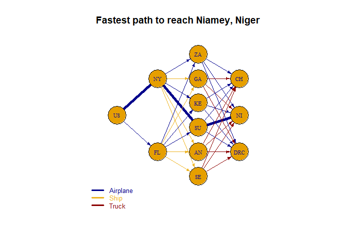<!-- --><table class="table table-striped table-bordered" style="margin-left: auto; margin-right: auto;">
 <thead>
  <tr>
   <th style="text-align:left;">   </th>
   <th style="text-align:left;"> NY </th>
   <th style="text-align:left;"> FL </th>
   <th style="text-align:left;"> ZA </th>
   <th style="text-align:left;"> GA </th>
   <th style="text-align:left;"> KE </th>
   <th style="text-align:left;"> SU </th>
   <th style="text-align:left;"> AN </th>
   <th style="text-align:left;"> SE </th>
   <th style="text-align:left;"> US </th>
   <th style="text-align:left;"> NI </th>
   <th style="text-align:left;"> DRC </th>
   <th style="text-align:left;"> CH </th>
   <th style="text-align:left;"> NY_ZA_Airplane </th>
   <th style="text-align:left;"> NY_GA_Ship </th>
   <th style="text-align:left;"> NY_KE_Airplane </th>
   <th style="text-align:left;"> NY_SU_Airplane </th>
   <th style="text-align:left;"> NY_AN_Ship </th>
   <th style="text-align:left;"> NY_SE_Ship </th>
   <th style="text-align:left;"> FL_ZA_Airplane </th>
   <th style="text-align:left;"> FL_GA_Ship </th>
   <th style="text-align:left;"> FL_KE_Airplane </th>
   <th style="text-align:left;"> FL_SU_Airplane </th>
   <th style="text-align:left;"> FL_AN_Ship </th>
   <th style="text-align:left;"> FL_SE_Ship </th>
   <th style="text-align:left;"> ZA_NI_Airplane </th>
   <th style="text-align:left;"> GA_NI_Truck </th>
   <th style="text-align:left;"> KE_NI_Airplane </th>
   <th style="text-align:left;"> SU_NI_Airplane </th>
   <th style="text-align:left;"> AN_NI_Truck </th>
   <th style="text-align:left;"> SE_NI_Truck </th>
   <th style="text-align:left;"> ZA_DRC_Airplane </th>
   <th style="text-align:left;"> GA_DRC_Truck </th>
   <th style="text-align:left;"> KE_DRC_Airplane </th>
   <th style="text-align:left;"> SU_DRC_Airplane </th>
   <th style="text-align:left;"> AN_DRC_Truck </th>
   <th style="text-align:left;"> SE_DRC_Truck </th>
   <th style="text-align:left;"> ZA_CH_Airplane </th>
   <th style="text-align:left;"> GA_CH_Truck </th>
   <th style="text-align:left;"> KE_CH_Airplane </th>
   <th style="text-align:left;"> SU_CH_Airplane </th>
   <th style="text-align:left;"> AN_CH_Truck </th>
   <th style="text-align:left;"> SE_CH_Truck </th>
   <th style="text-align:left;"> US_NY_Airplane </th>
   <th style="text-align:left;"> US_FL_Airplane </th>
  </tr>
 </thead>
<tbody>
  <tr>
   <td style="text-align:left;"> solution </td>
   <td style="text-align:left;"> 0 </td>
   <td style="text-align:left;"> 0 </td>
   <td style="text-align:left;"> 0 </td>
   <td style="text-align:left;"> 0 </td>
   <td style="text-align:left;"> 0 </td>
   <td style="text-align:left;"> 0 </td>
   <td style="text-align:left;"> 0 </td>
   <td style="text-align:left;"> 0 </td>
   <td style="text-align:left;"> 1 </td>
   <td style="text-align:left;"> -1 </td>
   <td style="text-align:left;"> 0 </td>
   <td style="text-align:left;"> 0 </td>
   <td style="text-align:left;"> 0 </td>
   <td style="text-align:left;"> 0 </td>
   <td style="text-align:left;"> 0 </td>
   <td style="text-align:left;"> 1 </td>
   <td style="text-align:left;"> 0 </td>
   <td style="text-align:left;"> 0 </td>
   <td style="text-align:left;"> 0 </td>
   <td style="text-align:left;"> 0 </td>
   <td style="text-align:left;"> 0 </td>
   <td style="text-align:left;"> 0 </td>
   <td style="text-align:left;"> 0 </td>
   <td style="text-align:left;"> 0 </td>
   <td style="text-align:left;"> 0 </td>
   <td style="text-align:left;"> 0 </td>
   <td style="text-align:left;"> 0 </td>
   <td style="text-align:left;"> 1 </td>
   <td style="text-align:left;"> 0 </td>
   <td style="text-align:left;"> 0 </td>
   <td style="text-align:left;"> 0 </td>
   <td style="text-align:left;"> 0 </td>
   <td style="text-align:left;"> 0 </td>
   <td style="text-align:left;"> 0 </td>
   <td style="text-align:left;"> 0 </td>
   <td style="text-align:left;"> 0 </td>
   <td style="text-align:left;"> 0 </td>
   <td style="text-align:left;"> 0 </td>
   <td style="text-align:left;"> 0 </td>
   <td style="text-align:left;"> 0 </td>
   <td style="text-align:left;"> 0 </td>
   <td style="text-align:left;"> 0 </td>
   <td style="text-align:left;"> 1 </td>
   <td style="text-align:left;"> 0 </td>
  </tr>
  <tr>
   <td style="text-align:left;"> duals/coef </td>
   <td style="text-align:left;"> 17.6 </td>
   <td style="text-align:left;"> 17.6 </td>
   <td style="text-align:left;"> 0 </td>
   <td style="text-align:left;"> 0 </td>
   <td style="text-align:left;"> 0 </td>
   <td style="text-align:left;"> 0 </td>
   <td style="text-align:left;"> 0 </td>
   <td style="text-align:left;"> 0 </td>
   <td style="text-align:left;"> 17.6 </td>
   <td style="text-align:left;"> -5.16 </td>
   <td style="text-align:left;"> 0 </td>
   <td style="text-align:left;"> 0 </td>
   <td style="text-align:left;"> 20.245 </td>
   <td style="text-align:left;"> 172.114285714286 </td>
   <td style="text-align:left;"> 20.125 </td>
   <td style="text-align:left;"> 17.6025 </td>
   <td style="text-align:left;"> 186.457142857143 </td>
   <td style="text-align:left;"> 119.2 </td>
   <td style="text-align:left;"> 19.86 </td>
   <td style="text-align:left;"> 180.828571428571 </td>
   <td style="text-align:left;"> 19.9025 </td>
   <td style="text-align:left;"> 17.71 </td>
   <td style="text-align:left;"> 195.085714285714 </td>
   <td style="text-align:left;"> 112.114285714286 </td>
   <td style="text-align:left;"> 10.175 </td>
   <td style="text-align:left;"> 20.64 </td>
   <td style="text-align:left;"> 6.31 </td>
   <td style="text-align:left;"> 5.1625 </td>
   <td style="text-align:left;"> 58.32 </td>
   <td style="text-align:left;"> 33.12 </td>
   <td style="text-align:left;"> 1.865 </td>
   <td style="text-align:left;"> 36.84 </td>
   <td style="text-align:left;"> 2.725 </td>
   <td style="text-align:left;"> 3.4425 </td>
   <td style="text-align:left;"> 27.78 </td>
   <td style="text-align:left;"> 92.46 </td>
   <td style="text-align:left;"> 5.275 </td>
   <td style="text-align:left;"> 28.3 </td>
   <td style="text-align:left;"> 4.42 </td>
   <td style="text-align:left;"> 3 </td>
   <td style="text-align:left;"> 53.04 </td>
   <td style="text-align:left;"> 54.5 </td>
   <td style="text-align:left;"> 0 </td>
   <td style="text-align:left;"> 0 </td>
  </tr>
  <tr>
   <td style="text-align:left;"> Sens From </td>
   <td style="text-align:left;"> 0 </td>
   <td style="text-align:left;"> 0 </td>
   <td style="text-align:left;"> -inf </td>
   <td style="text-align:left;"> -inf </td>
   <td style="text-align:left;"> -inf </td>
   <td style="text-align:left;"> -inf </td>
   <td style="text-align:left;"> -inf </td>
   <td style="text-align:left;"> -inf </td>
   <td style="text-align:left;"> 1 </td>
   <td style="text-align:left;"> -1 </td>
   <td style="text-align:left;"> -inf </td>
   <td style="text-align:left;"> -inf </td>
   <td style="text-align:left;"> 17.6 </td>
   <td style="text-align:left;"> 17.6 </td>
   <td style="text-align:left;"> 17.6 </td>
   <td style="text-align:left;"> -inf </td>
   <td style="text-align:left;"> 17.6 </td>
   <td style="text-align:left;"> 17.6 </td>
   <td style="text-align:left;"> 17.6 </td>
   <td style="text-align:left;"> 17.6 </td>
   <td style="text-align:left;"> 17.6 </td>
   <td style="text-align:left;"> 17.6 </td>
   <td style="text-align:left;"> 17.6 </td>
   <td style="text-align:left;"> 17.6 </td>
   <td style="text-align:left;"> 5.16 </td>
   <td style="text-align:left;"> 5.16 </td>
   <td style="text-align:left;"> 5.16 </td>
   <td style="text-align:left;"> -inf </td>
   <td style="text-align:left;"> 5.16 </td>
   <td style="text-align:left;"> 5.16 </td>
   <td style="text-align:left;"> 0 </td>
   <td style="text-align:left;"> 0 </td>
   <td style="text-align:left;"> 0 </td>
   <td style="text-align:left;"> 0 </td>
   <td style="text-align:left;"> 0 </td>
   <td style="text-align:left;"> 0 </td>
   <td style="text-align:left;"> 0 </td>
   <td style="text-align:left;"> 0 </td>
   <td style="text-align:left;"> 0 </td>
   <td style="text-align:left;"> 0 </td>
   <td style="text-align:left;"> 0 </td>
   <td style="text-align:left;"> 0 </td>
   <td style="text-align:left;"> -inf </td>
   <td style="text-align:left;"> -0.11 </td>
  </tr>
  <tr>
   <td style="text-align:left;"> Sens Till </td>
   <td style="text-align:left;"> 0 </td>
   <td style="text-align:left;"> 0 </td>
   <td style="text-align:left;"> inf </td>
   <td style="text-align:left;"> inf </td>
   <td style="text-align:left;"> inf </td>
   <td style="text-align:left;"> inf </td>
   <td style="text-align:left;"> inf </td>
   <td style="text-align:left;"> inf </td>
   <td style="text-align:left;"> 1 </td>
   <td style="text-align:left;"> -1 </td>
   <td style="text-align:left;"> inf </td>
   <td style="text-align:left;"> inf </td>
   <td style="text-align:left;"> inf </td>
   <td style="text-align:left;"> inf </td>
   <td style="text-align:left;"> inf </td>
   <td style="text-align:left;"> 17.71 </td>
   <td style="text-align:left;"> inf </td>
   <td style="text-align:left;"> inf </td>
   <td style="text-align:left;"> inf </td>
   <td style="text-align:left;"> inf </td>
   <td style="text-align:left;"> inf </td>
   <td style="text-align:left;"> inf </td>
   <td style="text-align:left;"> inf </td>
   <td style="text-align:left;"> inf </td>
   <td style="text-align:left;"> inf </td>
   <td style="text-align:left;"> inf </td>
   <td style="text-align:left;"> inf </td>
   <td style="text-align:left;"> 6.31 </td>
   <td style="text-align:left;"> inf </td>
   <td style="text-align:left;"> inf </td>
   <td style="text-align:left;"> inf </td>
   <td style="text-align:left;"> inf </td>
   <td style="text-align:left;"> inf </td>
   <td style="text-align:left;"> inf </td>
   <td style="text-align:left;"> inf </td>
   <td style="text-align:left;"> inf </td>
   <td style="text-align:left;"> inf </td>
   <td style="text-align:left;"> inf </td>
   <td style="text-align:left;"> inf </td>
   <td style="text-align:left;"> inf </td>
   <td style="text-align:left;"> inf </td>
   <td style="text-align:left;"> inf </td>
   <td style="text-align:left;"> 0.11 </td>
   <td style="text-align:left;"> inf </td>
  </tr>
</tbody>
<tfoot>
<tr>
<td style = 'padding: 0; border:0;' colspan='100%'><sup></sup> Objective Value = 22.77</td>
</tr>
</tfoot>
</table>### Kosongo, D.R. Congo
[1] 0
<br>[1] "Shortest Path: "
+ 4/12 vertices, named, from 3d59739:
[1] US  NY  SU  DRC
<br>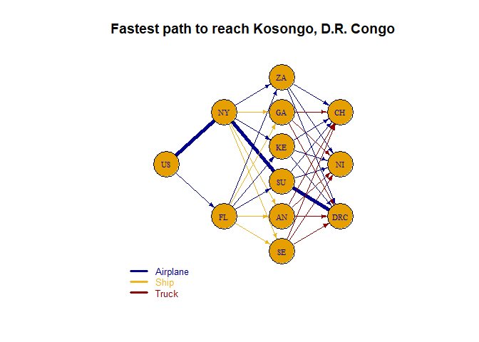<!-- --><table class="table table-striped table-bordered" style="margin-left: auto; margin-right: auto;">
 <thead>
  <tr>
   <th style="text-align:left;">   </th>
   <th style="text-align:left;"> NY </th>
   <th style="text-align:left;"> FL </th>
   <th style="text-align:left;"> ZA </th>
   <th style="text-align:left;"> GA </th>
   <th style="text-align:left;"> KE </th>
   <th style="text-align:left;"> SU </th>
   <th style="text-align:left;"> AN </th>
   <th style="text-align:left;"> SE </th>
   <th style="text-align:left;"> US </th>
   <th style="text-align:left;"> NI </th>
   <th style="text-align:left;"> DRC </th>
   <th style="text-align:left;"> CH </th>
   <th style="text-align:left;"> NY_ZA_Airplane </th>
   <th style="text-align:left;"> NY_GA_Ship </th>
   <th style="text-align:left;"> NY_KE_Airplane </th>
   <th style="text-align:left;"> NY_SU_Airplane </th>
   <th style="text-align:left;"> NY_AN_Ship </th>
   <th style="text-align:left;"> NY_SE_Ship </th>
   <th style="text-align:left;"> FL_ZA_Airplane </th>
   <th style="text-align:left;"> FL_GA_Ship </th>
   <th style="text-align:left;"> FL_KE_Airplane </th>
   <th style="text-align:left;"> FL_SU_Airplane </th>
   <th style="text-align:left;"> FL_AN_Ship </th>
   <th style="text-align:left;"> FL_SE_Ship </th>
   <th style="text-align:left;"> ZA_NI_Airplane </th>
   <th style="text-align:left;"> GA_NI_Truck </th>
   <th style="text-align:left;"> KE_NI_Airplane </th>
   <th style="text-align:left;"> SU_NI_Airplane </th>
   <th style="text-align:left;"> AN_NI_Truck </th>
   <th style="text-align:left;"> SE_NI_Truck </th>
   <th style="text-align:left;"> ZA_DRC_Airplane </th>
   <th style="text-align:left;"> GA_DRC_Truck </th>
   <th style="text-align:left;"> KE_DRC_Airplane </th>
   <th style="text-align:left;"> SU_DRC_Airplane </th>
   <th style="text-align:left;"> AN_DRC_Truck </th>
   <th style="text-align:left;"> SE_DRC_Truck </th>
   <th style="text-align:left;"> ZA_CH_Airplane </th>
   <th style="text-align:left;"> GA_CH_Truck </th>
   <th style="text-align:left;"> KE_CH_Airplane </th>
   <th style="text-align:left;"> SU_CH_Airplane </th>
   <th style="text-align:left;"> AN_CH_Truck </th>
   <th style="text-align:left;"> SE_CH_Truck </th>
   <th style="text-align:left;"> US_NY_Airplane </th>
   <th style="text-align:left;"> US_FL_Airplane </th>
  </tr>
 </thead>
<tbody>
  <tr>
   <td style="text-align:left;"> solution </td>
   <td style="text-align:left;"> 0 </td>
   <td style="text-align:left;"> 0 </td>
   <td style="text-align:left;"> 0 </td>
   <td style="text-align:left;"> 0 </td>
   <td style="text-align:left;"> 0 </td>
   <td style="text-align:left;"> 0 </td>
   <td style="text-align:left;"> 0 </td>
   <td style="text-align:left;"> 0 </td>
   <td style="text-align:left;"> 1 </td>
   <td style="text-align:left;"> 0 </td>
   <td style="text-align:left;"> -1 </td>
   <td style="text-align:left;"> 0 </td>
   <td style="text-align:left;"> 0 </td>
   <td style="text-align:left;"> 0 </td>
   <td style="text-align:left;"> 0 </td>
   <td style="text-align:left;"> 1 </td>
   <td style="text-align:left;"> 0 </td>
   <td style="text-align:left;"> 0 </td>
   <td style="text-align:left;"> 0 </td>
   <td style="text-align:left;"> 0 </td>
   <td style="text-align:left;"> 0 </td>
   <td style="text-align:left;"> 0 </td>
   <td style="text-align:left;"> 0 </td>
   <td style="text-align:left;"> 0 </td>
   <td style="text-align:left;"> 0 </td>
   <td style="text-align:left;"> 0 </td>
   <td style="text-align:left;"> 0 </td>
   <td style="text-align:left;"> 0 </td>
   <td style="text-align:left;"> 0 </td>
   <td style="text-align:left;"> 0 </td>
   <td style="text-align:left;"> 0 </td>
   <td style="text-align:left;"> 0 </td>
   <td style="text-align:left;"> 0 </td>
   <td style="text-align:left;"> 1 </td>
   <td style="text-align:left;"> 0 </td>
   <td style="text-align:left;"> 0 </td>
   <td style="text-align:left;"> 0 </td>
   <td style="text-align:left;"> 0 </td>
   <td style="text-align:left;"> 0 </td>
   <td style="text-align:left;"> 0 </td>
   <td style="text-align:left;"> 0 </td>
   <td style="text-align:left;"> 0 </td>
   <td style="text-align:left;"> 1 </td>
   <td style="text-align:left;"> 0 </td>
  </tr>
  <tr>
   <td style="text-align:left;"> duals/coef </td>
   <td style="text-align:left;"> 19.86 </td>
   <td style="text-align:left;"> 19.86 </td>
   <td style="text-align:left;"> 0 </td>
   <td style="text-align:left;"> 0 </td>
   <td style="text-align:left;"> 0 </td>
   <td style="text-align:left;"> 2.26 </td>
   <td style="text-align:left;"> 0 </td>
   <td style="text-align:left;"> 0 </td>
   <td style="text-align:left;"> 19.86 </td>
   <td style="text-align:left;"> 0 </td>
   <td style="text-align:left;"> -1.18 </td>
   <td style="text-align:left;"> 0 </td>
   <td style="text-align:left;"> 20.245 </td>
   <td style="text-align:left;"> 172.114285714286 </td>
   <td style="text-align:left;"> 20.125 </td>
   <td style="text-align:left;"> 17.6025 </td>
   <td style="text-align:left;"> 186.457142857143 </td>
   <td style="text-align:left;"> 119.2 </td>
   <td style="text-align:left;"> 19.86 </td>
   <td style="text-align:left;"> 180.828571428571 </td>
   <td style="text-align:left;"> 19.9025 </td>
   <td style="text-align:left;"> 17.71 </td>
   <td style="text-align:left;"> 195.085714285714 </td>
   <td style="text-align:left;"> 112.114285714286 </td>
   <td style="text-align:left;"> 10.175 </td>
   <td style="text-align:left;"> 20.64 </td>
   <td style="text-align:left;"> 6.31 </td>
   <td style="text-align:left;"> 5.1625 </td>
   <td style="text-align:left;"> 58.32 </td>
   <td style="text-align:left;"> 33.12 </td>
   <td style="text-align:left;"> 1.865 </td>
   <td style="text-align:left;"> 36.84 </td>
   <td style="text-align:left;"> 2.725 </td>
   <td style="text-align:left;"> 3.4425 </td>
   <td style="text-align:left;"> 27.78 </td>
   <td style="text-align:left;"> 92.46 </td>
   <td style="text-align:left;"> 5.275 </td>
   <td style="text-align:left;"> 28.3 </td>
   <td style="text-align:left;"> 4.42 </td>
   <td style="text-align:left;"> 3 </td>
   <td style="text-align:left;"> 53.04 </td>
   <td style="text-align:left;"> 54.5 </td>
   <td style="text-align:left;"> 0 </td>
   <td style="text-align:left;"> 0 </td>
  </tr>
  <tr>
   <td style="text-align:left;"> Sens From </td>
   <td style="text-align:left;"> 0 </td>
   <td style="text-align:left;"> 0 </td>
   <td style="text-align:left;"> -inf </td>
   <td style="text-align:left;"> -inf </td>
   <td style="text-align:left;"> -inf </td>
   <td style="text-align:left;"> 0 </td>
   <td style="text-align:left;"> -inf </td>
   <td style="text-align:left;"> -inf </td>
   <td style="text-align:left;"> 1 </td>
   <td style="text-align:left;"> -inf </td>
   <td style="text-align:left;"> -1 </td>
   <td style="text-align:left;"> -inf </td>
   <td style="text-align:left;"> 19.86 </td>
   <td style="text-align:left;"> 19.86 </td>
   <td style="text-align:left;"> 19.86 </td>
   <td style="text-align:left;"> 16.86 </td>
   <td style="text-align:left;"> 19.86 </td>
   <td style="text-align:left;"> 19.86 </td>
   <td style="text-align:left;"> 19.18 </td>
   <td style="text-align:left;"> 19.86 </td>
   <td style="text-align:left;"> 19.86 </td>
   <td style="text-align:left;"> 17.6 </td>
   <td style="text-align:left;"> 19.86 </td>
   <td style="text-align:left;"> 19.86 </td>
   <td style="text-align:left;"> 0 </td>
   <td style="text-align:left;"> 0 </td>
   <td style="text-align:left;"> 0 </td>
   <td style="text-align:left;"> 2.26 </td>
   <td style="text-align:left;"> 0 </td>
   <td style="text-align:left;"> 0 </td>
   <td style="text-align:left;"> 1.18 </td>
   <td style="text-align:left;"> 1.18 </td>
   <td style="text-align:left;"> 1.18 </td>
   <td style="text-align:left;"> -inf </td>
   <td style="text-align:left;"> 1.18 </td>
   <td style="text-align:left;"> 1.18 </td>
   <td style="text-align:left;"> 0 </td>
   <td style="text-align:left;"> 0 </td>
   <td style="text-align:left;"> 0 </td>
   <td style="text-align:left;"> 2.26 </td>
   <td style="text-align:left;"> 0 </td>
   <td style="text-align:left;"> 0 </td>
   <td style="text-align:left;"> -0.26 </td>
   <td style="text-align:left;"> -0.11 </td>
  </tr>
  <tr>
   <td style="text-align:left;"> Sens Till </td>
   <td style="text-align:left;"> 0 </td>
   <td style="text-align:left;"> 0 </td>
   <td style="text-align:left;"> inf </td>
   <td style="text-align:left;"> inf </td>
   <td style="text-align:left;"> inf </td>
   <td style="text-align:left;"> 0 </td>
   <td style="text-align:left;"> inf </td>
   <td style="text-align:left;"> inf </td>
   <td style="text-align:left;"> 1 </td>
   <td style="text-align:left;"> inf </td>
   <td style="text-align:left;"> -1 </td>
   <td style="text-align:left;"> inf </td>
   <td style="text-align:left;"> inf </td>
   <td style="text-align:left;"> inf </td>
   <td style="text-align:left;"> inf </td>
   <td style="text-align:left;"> 17.71 </td>
   <td style="text-align:left;"> inf </td>
   <td style="text-align:left;"> inf </td>
   <td style="text-align:left;"> inf </td>
   <td style="text-align:left;"> inf </td>
   <td style="text-align:left;"> inf </td>
   <td style="text-align:left;"> inf </td>
   <td style="text-align:left;"> inf </td>
   <td style="text-align:left;"> inf </td>
   <td style="text-align:left;"> inf </td>
   <td style="text-align:left;"> inf </td>
   <td style="text-align:left;"> inf </td>
   <td style="text-align:left;"> inf </td>
   <td style="text-align:left;"> inf </td>
   <td style="text-align:left;"> inf </td>
   <td style="text-align:left;"> inf </td>
   <td style="text-align:left;"> inf </td>
   <td style="text-align:left;"> inf </td>
   <td style="text-align:left;"> 4.12 </td>
   <td style="text-align:left;"> inf </td>
   <td style="text-align:left;"> inf </td>
   <td style="text-align:left;"> inf </td>
   <td style="text-align:left;"> inf </td>
   <td style="text-align:left;"> inf </td>
   <td style="text-align:left;"> inf </td>
   <td style="text-align:left;"> inf </td>
   <td style="text-align:left;"> inf </td>
   <td style="text-align:left;"> 0.11 </td>
   <td style="text-align:left;"> inf </td>
  </tr>
</tbody>
<tfoot>
<tr>
<td style = 'padding: 0; border:0;' colspan='100%'><sup></sup> Objective Value = 21.04</td>
</tr>
</tfoot>
</table>### Ndjamena, Chad
[1] 0
<br>[1] "Shortest Path: "
+ 4/12 vertices, named, from 3d59739:
[1] US NY SU CH
<br>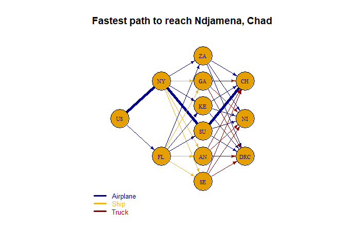<!-- --><table class="table table-striped table-bordered" style="margin-left: auto; margin-right: auto;">
 <thead>
  <tr>
   <th style="text-align:left;">   </th>
   <th style="text-align:left;"> NY </th>
   <th style="text-align:left;"> FL </th>
   <th style="text-align:left;"> ZA </th>
   <th style="text-align:left;"> GA </th>
   <th style="text-align:left;"> KE </th>
   <th style="text-align:left;"> SU </th>
   <th style="text-align:left;"> AN </th>
   <th style="text-align:left;"> SE </th>
   <th style="text-align:left;"> US </th>
   <th style="text-align:left;"> NI </th>
   <th style="text-align:left;"> DRC </th>
   <th style="text-align:left;"> CH </th>
   <th style="text-align:left;"> NY_ZA_Airplane </th>
   <th style="text-align:left;"> NY_GA_Ship </th>
   <th style="text-align:left;"> NY_KE_Airplane </th>
   <th style="text-align:left;"> NY_SU_Airplane </th>
   <th style="text-align:left;"> NY_AN_Ship </th>
   <th style="text-align:left;"> NY_SE_Ship </th>
   <th style="text-align:left;"> FL_ZA_Airplane </th>
   <th style="text-align:left;"> FL_GA_Ship </th>
   <th style="text-align:left;"> FL_KE_Airplane </th>
   <th style="text-align:left;"> FL_SU_Airplane </th>
   <th style="text-align:left;"> FL_AN_Ship </th>
   <th style="text-align:left;"> FL_SE_Ship </th>
   <th style="text-align:left;"> ZA_NI_Airplane </th>
   <th style="text-align:left;"> GA_NI_Truck </th>
   <th style="text-align:left;"> KE_NI_Airplane </th>
   <th style="text-align:left;"> SU_NI_Airplane </th>
   <th style="text-align:left;"> AN_NI_Truck </th>
   <th style="text-align:left;"> SE_NI_Truck </th>
   <th style="text-align:left;"> ZA_DRC_Airplane </th>
   <th style="text-align:left;"> GA_DRC_Truck </th>
   <th style="text-align:left;"> KE_DRC_Airplane </th>
   <th style="text-align:left;"> SU_DRC_Airplane </th>
   <th style="text-align:left;"> AN_DRC_Truck </th>
   <th style="text-align:left;"> SE_DRC_Truck </th>
   <th style="text-align:left;"> ZA_CH_Airplane </th>
   <th style="text-align:left;"> GA_CH_Truck </th>
   <th style="text-align:left;"> KE_CH_Airplane </th>
   <th style="text-align:left;"> SU_CH_Airplane </th>
   <th style="text-align:left;"> AN_CH_Truck </th>
   <th style="text-align:left;"> SE_CH_Truck </th>
   <th style="text-align:left;"> US_NY_Airplane </th>
   <th style="text-align:left;"> US_FL_Airplane </th>
  </tr>
 </thead>
<tbody>
  <tr>
   <td style="text-align:left;"> solution </td>
   <td style="text-align:left;"> 0 </td>
   <td style="text-align:left;"> 0 </td>
   <td style="text-align:left;"> 0 </td>
   <td style="text-align:left;"> 0 </td>
   <td style="text-align:left;"> 0 </td>
   <td style="text-align:left;"> 0 </td>
   <td style="text-align:left;"> 0 </td>
   <td style="text-align:left;"> 0 </td>
   <td style="text-align:left;"> 1 </td>
   <td style="text-align:left;"> 0 </td>
   <td style="text-align:left;"> 0 </td>
   <td style="text-align:left;"> -1 </td>
   <td style="text-align:left;"> 0 </td>
   <td style="text-align:left;"> 0 </td>
   <td style="text-align:left;"> 0 </td>
   <td style="text-align:left;"> 1 </td>
   <td style="text-align:left;"> 0 </td>
   <td style="text-align:left;"> 0 </td>
   <td style="text-align:left;"> 0 </td>
   <td style="text-align:left;"> 0 </td>
   <td style="text-align:left;"> 0 </td>
   <td style="text-align:left;"> 0 </td>
   <td style="text-align:left;"> 0 </td>
   <td style="text-align:left;"> 0 </td>
   <td style="text-align:left;"> 0 </td>
   <td style="text-align:left;"> 0 </td>
   <td style="text-align:left;"> 0 </td>
   <td style="text-align:left;"> 0 </td>
   <td style="text-align:left;"> 0 </td>
   <td style="text-align:left;"> 0 </td>
   <td style="text-align:left;"> 0 </td>
   <td style="text-align:left;"> 0 </td>
   <td style="text-align:left;"> 0 </td>
   <td style="text-align:left;"> 0 </td>
   <td style="text-align:left;"> 0 </td>
   <td style="text-align:left;"> 0 </td>
   <td style="text-align:left;"> 0 </td>
   <td style="text-align:left;"> 0 </td>
   <td style="text-align:left;"> 0 </td>
   <td style="text-align:left;"> 1 </td>
   <td style="text-align:left;"> 0 </td>
   <td style="text-align:left;"> 0 </td>
   <td style="text-align:left;"> 1 </td>
   <td style="text-align:left;"> 0 </td>
  </tr>
  <tr>
   <td style="text-align:left;"> duals/coef </td>
   <td style="text-align:left;"> 17.6 </td>
   <td style="text-align:left;"> 17.6 </td>
   <td style="text-align:left;"> 0 </td>
   <td style="text-align:left;"> 0 </td>
   <td style="text-align:left;"> 0 </td>
   <td style="text-align:left;"> 0 </td>
   <td style="text-align:left;"> 0 </td>
   <td style="text-align:left;"> 0 </td>
   <td style="text-align:left;"> 17.6 </td>
   <td style="text-align:left;"> 0 </td>
   <td style="text-align:left;"> 0 </td>
   <td style="text-align:left;"> -3 </td>
   <td style="text-align:left;"> 20.245 </td>
   <td style="text-align:left;"> 172.114285714286 </td>
   <td style="text-align:left;"> 20.125 </td>
   <td style="text-align:left;"> 17.6025 </td>
   <td style="text-align:left;"> 186.457142857143 </td>
   <td style="text-align:left;"> 119.2 </td>
   <td style="text-align:left;"> 19.86 </td>
   <td style="text-align:left;"> 180.828571428571 </td>
   <td style="text-align:left;"> 19.9025 </td>
   <td style="text-align:left;"> 17.71 </td>
   <td style="text-align:left;"> 195.085714285714 </td>
   <td style="text-align:left;"> 112.114285714286 </td>
   <td style="text-align:left;"> 10.175 </td>
   <td style="text-align:left;"> 20.64 </td>
   <td style="text-align:left;"> 6.31 </td>
   <td style="text-align:left;"> 5.1625 </td>
   <td style="text-align:left;"> 58.32 </td>
   <td style="text-align:left;"> 33.12 </td>
   <td style="text-align:left;"> 1.865 </td>
   <td style="text-align:left;"> 36.84 </td>
   <td style="text-align:left;"> 2.725 </td>
   <td style="text-align:left;"> 3.4425 </td>
   <td style="text-align:left;"> 27.78 </td>
   <td style="text-align:left;"> 92.46 </td>
   <td style="text-align:left;"> 5.275 </td>
   <td style="text-align:left;"> 28.3 </td>
   <td style="text-align:left;"> 4.42 </td>
   <td style="text-align:left;"> 3 </td>
   <td style="text-align:left;"> 53.04 </td>
   <td style="text-align:left;"> 54.5 </td>
   <td style="text-align:left;"> 0 </td>
   <td style="text-align:left;"> 0 </td>
  </tr>
  <tr>
   <td style="text-align:left;"> Sens From </td>
   <td style="text-align:left;"> 0 </td>
   <td style="text-align:left;"> 0 </td>
   <td style="text-align:left;"> -inf </td>
   <td style="text-align:left;"> -inf </td>
   <td style="text-align:left;"> -inf </td>
   <td style="text-align:left;"> -inf </td>
   <td style="text-align:left;"> -inf </td>
   <td style="text-align:left;"> -inf </td>
   <td style="text-align:left;"> 1 </td>
   <td style="text-align:left;"> -inf </td>
   <td style="text-align:left;"> -inf </td>
   <td style="text-align:left;"> -1 </td>
   <td style="text-align:left;"> 17.6 </td>
   <td style="text-align:left;"> 17.6 </td>
   <td style="text-align:left;"> 17.6 </td>
   <td style="text-align:left;"> -inf </td>
   <td style="text-align:left;"> 17.6 </td>
   <td style="text-align:left;"> 17.6 </td>
   <td style="text-align:left;"> 17.6 </td>
   <td style="text-align:left;"> 17.6 </td>
   <td style="text-align:left;"> 17.6 </td>
   <td style="text-align:left;"> 17.6 </td>
   <td style="text-align:left;"> 17.6 </td>
   <td style="text-align:left;"> 17.6 </td>
   <td style="text-align:left;"> 0 </td>
   <td style="text-align:left;"> 0 </td>
   <td style="text-align:left;"> 0 </td>
   <td style="text-align:left;"> 0 </td>
   <td style="text-align:left;"> 0 </td>
   <td style="text-align:left;"> 0 </td>
   <td style="text-align:left;"> 0 </td>
   <td style="text-align:left;"> 0 </td>
   <td style="text-align:left;"> 0 </td>
   <td style="text-align:left;"> 0 </td>
   <td style="text-align:left;"> 0 </td>
   <td style="text-align:left;"> 0 </td>
   <td style="text-align:left;"> 3 </td>
   <td style="text-align:left;"> 3 </td>
   <td style="text-align:left;"> 3 </td>
   <td style="text-align:left;"> -inf </td>
   <td style="text-align:left;"> 3 </td>
   <td style="text-align:left;"> 3 </td>
   <td style="text-align:left;"> -inf </td>
   <td style="text-align:left;"> -0.11 </td>
  </tr>
  <tr>
   <td style="text-align:left;"> Sens Till </td>
   <td style="text-align:left;"> 0 </td>
   <td style="text-align:left;"> 0 </td>
   <td style="text-align:left;"> inf </td>
   <td style="text-align:left;"> inf </td>
   <td style="text-align:left;"> inf </td>
   <td style="text-align:left;"> inf </td>
   <td style="text-align:left;"> inf </td>
   <td style="text-align:left;"> inf </td>
   <td style="text-align:left;"> 1 </td>
   <td style="text-align:left;"> inf </td>
   <td style="text-align:left;"> inf </td>
   <td style="text-align:left;"> -1 </td>
   <td style="text-align:left;"> inf </td>
   <td style="text-align:left;"> inf </td>
   <td style="text-align:left;"> inf </td>
   <td style="text-align:left;"> 17.71 </td>
   <td style="text-align:left;"> inf </td>
   <td style="text-align:left;"> inf </td>
   <td style="text-align:left;"> inf </td>
   <td style="text-align:left;"> inf </td>
   <td style="text-align:left;"> inf </td>
   <td style="text-align:left;"> inf </td>
   <td style="text-align:left;"> inf </td>
   <td style="text-align:left;"> inf </td>
   <td style="text-align:left;"> inf </td>
   <td style="text-align:left;"> inf </td>
   <td style="text-align:left;"> inf </td>
   <td style="text-align:left;"> inf </td>
   <td style="text-align:left;"> inf </td>
   <td style="text-align:left;"> inf </td>
   <td style="text-align:left;"> inf </td>
   <td style="text-align:left;"> inf </td>
   <td style="text-align:left;"> inf </td>
   <td style="text-align:left;"> inf </td>
   <td style="text-align:left;"> inf </td>
   <td style="text-align:left;"> inf </td>
   <td style="text-align:left;"> inf </td>
   <td style="text-align:left;"> inf </td>
   <td style="text-align:left;"> inf </td>
   <td style="text-align:left;"> 4.42 </td>
   <td style="text-align:left;"> inf </td>
   <td style="text-align:left;"> inf </td>
   <td style="text-align:left;"> 0.11 </td>
   <td style="text-align:left;"> inf </td>
  </tr>
</tbody>
<tfoot>
<tr>
<td style = 'padding: 0; border:0;' colspan='100%'><sup></sup> Objective Value = 20.60</td>
</tr>
</tfoot>
</table>


### Total Path:


```r
# # Generate edge width variable to plot the path:
  ew <- rep(1, ecount(net))
  ew[unlist(total_path)] <- 5
  png("Short_Path_Graph.png",
    units="in", 
    width=5, 
    height=4,
    pointsize=12*72/96, 
    res=96)
  
  plot(net, edge.width=ew, edge.arrow.size=.4, edge.color=edge.col, 
       vertex.label.font=1, vertex.label.cex=.7)
  legend(x=-1.5, y=-1.1, legend = c("Airplane","Ship", "Truck"),
       col =colrs, lwd = 3, text.col = colrs, cex=.8, bty="n", ncol=1)
  title("Fastest path to reach all cities")
  
  dev.off()
```

```
## png 
##   2
```

```r
  plot(net, edge.width=ew, edge.arrow.size=.4, edge.color=edge.col, 
       vertex.label.font=1, vertex.label.cex=.7)
  legend(x=-1.5, y=-1.1, legend = c("Airplane","Ship", "Truck"),
       col =colrs, lwd = 3, text.col = colrs, cex=.8, bty="n", ncol=1)
  title("Fastest path to reach all cities")
```

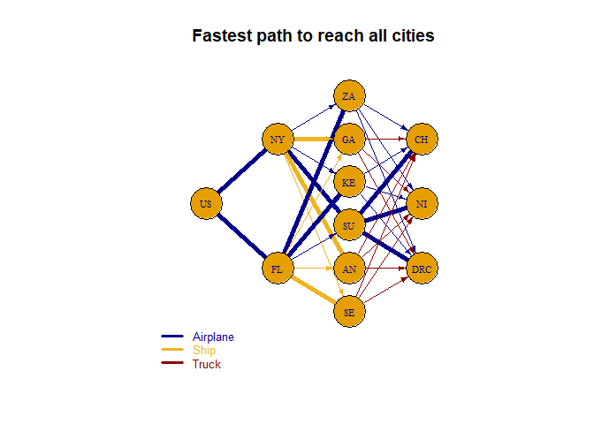<!-- -->


## Minimal Cost Plan

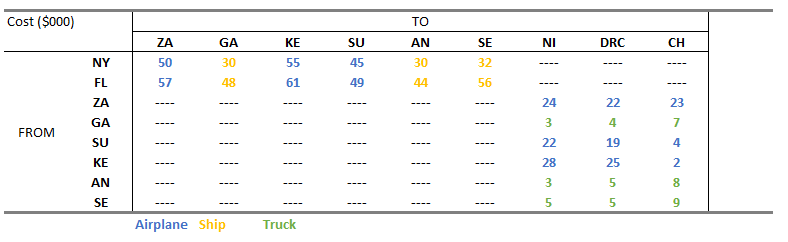{width=600px}


```r
# Set up the cost minimization
trans_1 <- make.lp(0, nrow(dist_cost))

# Build objective function and constraints
obj_fn <- dist_cost$Cost

set.objfn(trans_1, obj_fn)


# Both in New York and Jacksonville,Florida there are 500,000 tons of the necessary cargo available
add.constraint(trans_1, (dist_cost$From=="New York, NY")*dist_cost$Capacity, "=", 500000) 
add.constraint(trans_1, (dist_cost$From=="Jacksonville, FL")*dist_cost$Capacity, "=", 500000) 

# Supplies to Niamey, Niger can only arrive via air
add.constraint(trans_1, dist_cost$To=="Niamey, Niger" & dist_cost$Type_1!="Airplane", "=", 0) 

#The truck routes into Ndjamena, Chad are restricted so at most 840 trucks can be sent to Ndjamena, Chad from each port
add.constraint(trans_1, dist_cost$From=="Libreville, Gabon" & dist_cost$To=="Ndjamena, Chad", "<=", 840) 
add.constraint(trans_1, dist_cost$From=="Luanda, Angola" & dist_cost$To=="Ndjamena, Chad", "<=", 840) 
add.constraint(trans_1, dist_cost$From=="Dakar, Senegal" & dist_cost$To=="Ndjamena, Chad", "<=", 840) 


#The IFRC is restricted to at most 200 flights from Lusaka, Zambia to Ndjamena, Chad and to at most 200 flights from Khartoum, Sudan to Ndjamena, Chad.
add.constraint(trans_1, dist_cost$From=="Lusaka, Zambia" & dist_cost$To=="Ndjamena, Chad", "<=", 200)
add.constraint(trans_1, dist_cost$From=="Khartoum, Sudan" & dist_cost$To=="Ndjamena, Chad", "<=", 200)


#Necessary Aid
for (i in 1:nrow(aid_req)){ 
    add.constraint(trans_1, 
                   (dist_cost$From==pull(aid_req[i,1]))*dist_cost$Capacity - (dist_cost$To==pull(aid_req[i,1]))*dist_cost$Capacity,
                   '=',-pull(aid_req[i,2]))
    i <- i + 1
  }


# Add row and column names
restrictions_name <-  c("Max_NY", "Max_FL","Only_Air_NI", "Truck_Limit_GA_CH", "Truck_Limit_AN_CH", "Truck_Limit_SE_CH",
                        "Air_Limit_ZA_CH", "Air_Limit_SU_CH",aid_req$City_Short)
route_name <- paste(dist_cost$From_Short, dist_cost$To_Short,dist_cost$Type_1 , sep = "_")
dimnames(trans_1) <- list(restrictions_name,
                          route_name)


# Write to see named algebraic formulation
write.lp(trans_1, "Question_3.lp",type = 'lp')

# Solve the model, if this return 0 an optimal solution is found
solve(trans_1)
```

```
## [1] 0
```


```r
# Objective function Value:
get.objective(trans_1)
```

```
## [1] 310861.3
```

```r
# THe optimal variables:
get.variables(trans_1)
```

```
##  [1]   266.6667  1166.6667     0.0000     0.0000   541.6667   208.3333
##  [7]   733.3333     0.0000  1133.3333  1466.6667     0.0000     0.0000
## [13]     0.0000     0.0000     0.0000   666.6667     0.0000     0.0000
## [19]     0.0000 10169.4915     0.0000     0.0000     0.0000     0.0000
## [25]     0.0000     0.0000   333.3333   200.0000     0.0000     0.0000
## [31]     0.0000     0.0000
```

```r
# How much of the constraints we use?
get.constraints(trans_1)
```

```
##  [1]  500000  500000       0       0       0       0       0     200  -50000
## [10] -100000 -130000  -90000 -150000 -120000 -100000 -180000  -80000
```

```r
sensitivity_table(trans_1)
```

<table class="table table-striped table-bordered" style="margin-left: auto; margin-right: auto;">
 <thead>
  <tr>
   <th style="text-align:left;">   </th>
   <th style="text-align:left;"> Max_NY </th>
   <th style="text-align:left;"> Max_FL </th>
   <th style="text-align:left;"> Only_Air_NI </th>
   <th style="text-align:left;"> Truck_Limit_GA_CH </th>
   <th style="text-align:left;"> Truck_Limit_AN_CH </th>
   <th style="text-align:left;"> Truck_Limit_SE_CH </th>
   <th style="text-align:left;"> Air_Limit_ZA_CH </th>
   <th style="text-align:left;"> Air_Limit_SU_CH </th>
   <th style="text-align:left;"> SE </th>
   <th style="text-align:left;"> GA </th>
   <th style="text-align:left;"> AN </th>
   <th style="text-align:left;"> SU </th>
   <th style="text-align:left;"> ZA </th>
   <th style="text-align:left;"> KE </th>
   <th style="text-align:left;"> NI </th>
   <th style="text-align:left;"> DRC </th>
   <th style="text-align:left;"> CH </th>
   <th style="text-align:left;"> NY_ZA_Airplane </th>
   <th style="text-align:left;"> NY_GA_Ship </th>
   <th style="text-align:left;"> NY_KE_Airplane </th>
   <th style="text-align:left;"> NY_SU_Airplane </th>
   <th style="text-align:left;"> NY_AN_Ship </th>
   <th style="text-align:left;"> NY_SE_Ship </th>
   <th style="text-align:left;"> FL_ZA_Airplane </th>
   <th style="text-align:left;"> FL_GA_Ship </th>
   <th style="text-align:left;"> FL_KE_Airplane </th>
   <th style="text-align:left;"> FL_SU_Airplane </th>
   <th style="text-align:left;"> FL_AN_Ship </th>
   <th style="text-align:left;"> FL_SE_Ship </th>
   <th style="text-align:left;"> ZA_NI_Airplane </th>
   <th style="text-align:left;"> GA_NI_Truck </th>
   <th style="text-align:left;"> KE_NI_Airplane </th>
   <th style="text-align:left;"> SU_NI_Airplane </th>
   <th style="text-align:left;"> AN_NI_Truck </th>
   <th style="text-align:left;"> SE_NI_Truck </th>
   <th style="text-align:left;"> ZA_DRC_Airplane </th>
   <th style="text-align:left;"> GA_DRC_Truck </th>
   <th style="text-align:left;"> KE_DRC_Airplane </th>
   <th style="text-align:left;"> SU_DRC_Airplane </th>
   <th style="text-align:left;"> AN_DRC_Truck </th>
   <th style="text-align:left;"> SE_DRC_Truck </th>
   <th style="text-align:left;"> ZA_CH_Airplane </th>
   <th style="text-align:left;"> GA_CH_Truck </th>
   <th style="text-align:left;"> KE_CH_Airplane </th>
   <th style="text-align:left;"> SU_CH_Airplane </th>
   <th style="text-align:left;"> AN_CH_Truck </th>
   <th style="text-align:left;"> SE_CH_Truck </th>
   <th style="text-align:left;"> US_NY_Airplane </th>
   <th style="text-align:left;"> US_FL_Airplane </th>
  </tr>
 </thead>
<tbody>
  <tr>
   <td style="text-align:left;"> solution </td>
   <td style="text-align:left;"> 500000 </td>
   <td style="text-align:left;"> 500000 </td>
   <td style="text-align:left;"> 0 </td>
   <td style="text-align:left;"> 0 </td>
   <td style="text-align:left;"> 0 </td>
   <td style="text-align:left;"> 0 </td>
   <td style="text-align:left;"> 0 </td>
   <td style="text-align:left;"> 200 </td>
   <td style="text-align:left;"> -50000 </td>
   <td style="text-align:left;"> -100000 </td>
   <td style="text-align:left;"> -130000 </td>
   <td style="text-align:left;"> -90000.0000000001 </td>
   <td style="text-align:left;"> -150000 </td>
   <td style="text-align:left;"> -120000 </td>
   <td style="text-align:left;"> -100000 </td>
   <td style="text-align:left;"> -180000 </td>
   <td style="text-align:left;"> -80000 </td>
   <td style="text-align:left;"> 266.666666666666 </td>
   <td style="text-align:left;"> 1166.66666666667 </td>
   <td style="text-align:left;"> 0 </td>
   <td style="text-align:left;"> 0 </td>
   <td style="text-align:left;"> 541.666666666668 </td>
   <td style="text-align:left;"> 208.333333333333 </td>
   <td style="text-align:left;"> 733.333333333334 </td>
   <td style="text-align:left;"> 0 </td>
   <td style="text-align:left;"> 1133.33333333333 </td>
   <td style="text-align:left;"> 1466.66666666667 </td>
   <td style="text-align:left;"> 0 </td>
   <td style="text-align:left;"> 0 </td>
   <td style="text-align:left;"> 0 </td>
   <td style="text-align:left;"> 0 </td>
   <td style="text-align:left;"> 0 </td>
   <td style="text-align:left;"> 666.666666666666 </td>
   <td style="text-align:left;"> 0 </td>
   <td style="text-align:left;"> 0 </td>
   <td style="text-align:left;"> 0 </td>
   <td style="text-align:left;"> 10169.4915254237 </td>
   <td style="text-align:left;"> 0 </td>
   <td style="text-align:left;"> 0 </td>
   <td style="text-align:left;"> 0 </td>
   <td style="text-align:left;"> 0 </td>
   <td style="text-align:left;"> 0 </td>
   <td style="text-align:left;"> 0 </td>
   <td style="text-align:left;"> 333.333333333333 </td>
   <td style="text-align:left;"> 200 </td>
   <td style="text-align:left;"> 0 </td>
   <td style="text-align:left;"> 0 </td>
   <td style="text-align:left;"> 0 </td>
   <td style="text-align:left;"> 0 </td>
  </tr>
  <tr>
   <td style="text-align:left;"> duals/coef </td>
   <td style="text-align:left;"> 0.36 </td>
   <td style="text-align:left;"> 0.41 </td>
   <td style="text-align:left;"> -2.34 </td>
   <td style="text-align:left;"> 0 </td>
   <td style="text-align:left;"> 0 </td>
   <td style="text-align:left;"> 0 </td>
   <td style="text-align:left;"> 0 </td>
   <td style="text-align:left;"> -10 </td>
   <td style="text-align:left;"> 0.23 </td>
   <td style="text-align:left;"> 0.23 </td>
   <td style="text-align:left;"> 0.24 </td>
   <td style="text-align:left;"> 0.08 </td>
   <td style="text-align:left;"> 0.03 </td>
   <td style="text-align:left;"> 0 </td>
   <td style="text-align:left;"> -0.07 </td>
   <td style="text-align:left;"> 0.01 </td>
   <td style="text-align:left;"> -0.01 </td>
   <td style="text-align:left;"> 50 </td>
   <td style="text-align:left;"> 30 </td>
   <td style="text-align:left;"> 55 </td>
   <td style="text-align:left;"> 45 </td>
   <td style="text-align:left;"> 30 </td>
   <td style="text-align:left;"> 32 </td>
   <td style="text-align:left;"> 57 </td>
   <td style="text-align:left;"> 48 </td>
   <td style="text-align:left;"> 61 </td>
   <td style="text-align:left;"> 49 </td>
   <td style="text-align:left;"> 44 </td>
   <td style="text-align:left;"> 56 </td>
   <td style="text-align:left;"> 24 </td>
   <td style="text-align:left;"> 3 </td>
   <td style="text-align:left;"> 28 </td>
   <td style="text-align:left;"> 22 </td>
   <td style="text-align:left;"> 3 </td>
   <td style="text-align:left;"> 5 </td>
   <td style="text-align:left;"> 22 </td>
   <td style="text-align:left;"> 4 </td>
   <td style="text-align:left;"> 25 </td>
   <td style="text-align:left;"> 19 </td>
   <td style="text-align:left;"> 5 </td>
   <td style="text-align:left;"> 5 </td>
   <td style="text-align:left;"> 23 </td>
   <td style="text-align:left;"> 7 </td>
   <td style="text-align:left;"> 2 </td>
   <td style="text-align:left;"> 4 </td>
   <td style="text-align:left;"> 8 </td>
   <td style="text-align:left;"> 9 </td>
   <td style="text-align:left;"> 0 </td>
   <td style="text-align:left;"> 0 </td>
  </tr>
  <tr>
   <td style="text-align:left;"> Sens From </td>
   <td style="text-align:left;"> 500000 </td>
   <td style="text-align:left;"> 500000 </td>
   <td style="text-align:left;"> 0 </td>
   <td style="text-align:left;"> -inf </td>
   <td style="text-align:left;"> -inf </td>
   <td style="text-align:left;"> -inf </td>
   <td style="text-align:left;"> -inf </td>
   <td style="text-align:left;"> 0 </td>
   <td style="text-align:left;"> -50000 </td>
   <td style="text-align:left;"> -100000 </td>
   <td style="text-align:left;"> -130000 </td>
   <td style="text-align:left;"> -90000 </td>
   <td style="text-align:left;"> -150000 </td>
   <td style="text-align:left;"> -inf </td>
   <td style="text-align:left;"> -100000 </td>
   <td style="text-align:left;"> -180000 </td>
   <td style="text-align:left;"> -80000 </td>
   <td style="text-align:left;"> 48.25 </td>
   <td style="text-align:left;"> 30 </td>
   <td style="text-align:left;"> 54 </td>
   <td style="text-align:left;"> 42 </td>
   <td style="text-align:left;"> 16.44 </td>
   <td style="text-align:left;"> 16.44 </td>
   <td style="text-align:left;"> 56 </td>
   <td style="text-align:left;"> 41.2 </td>
   <td style="text-align:left;"> 51 </td>
   <td style="text-align:left;"> 40.65 </td>
   <td style="text-align:left;"> 41.2 </td>
   <td style="text-align:left;"> 43.2 </td>
   <td style="text-align:left;"> 14 </td>
   <td style="text-align:left;"> 3 </td>
   <td style="text-align:left;"> 10 </td>
   <td style="text-align:left;"> -inf </td>
   <td style="text-align:left;"> -inf </td>
   <td style="text-align:left;"> 2.85 </td>
   <td style="text-align:left;"> 2.65 </td>
   <td style="text-align:left;"> -inf </td>
   <td style="text-align:left;"> -1.35 </td>
   <td style="text-align:left;"> 10.65 </td>
   <td style="text-align:left;"> 4 </td>
   <td style="text-align:left;"> 3.85 </td>
   <td style="text-align:left;"> 6 </td>
   <td style="text-align:left;"> 4.4 </td>
   <td style="text-align:left;"> -8 </td>
   <td style="text-align:left;"> -inf </td>
   <td style="text-align:left;"> 4.4 </td>
   <td style="text-align:left;"> 4.25 </td>
   <td style="text-align:left;"> 0 </td>
   <td style="text-align:left;"> 0 </td>
  </tr>
  <tr>
   <td style="text-align:left;"> Sens Till </td>
   <td style="text-align:left;"> 500000 </td>
   <td style="text-align:left;"> 500000 </td>
   <td style="text-align:left;"> 2259.89 </td>
   <td style="text-align:left;"> inf </td>
   <td style="text-align:left;"> inf </td>
   <td style="text-align:left;"> inf </td>
   <td style="text-align:left;"> inf </td>
   <td style="text-align:left;"> 533.33 </td>
   <td style="text-align:left;"> -50000 </td>
   <td style="text-align:left;"> -100000 </td>
   <td style="text-align:left;"> -130000 </td>
   <td style="text-align:left;"> -90000 </td>
   <td style="text-align:left;"> -150000 </td>
   <td style="text-align:left;"> inf </td>
   <td style="text-align:left;"> -100000 </td>
   <td style="text-align:left;"> -180000 </td>
   <td style="text-align:left;"> -80000 </td>
   <td style="text-align:left;"> 51 </td>
   <td style="text-align:left;"> 36.8 </td>
   <td style="text-align:left;"> inf </td>
   <td style="text-align:left;"> inf </td>
   <td style="text-align:left;"> 30 </td>
   <td style="text-align:left;"> 44.8 </td>
   <td style="text-align:left;"> 58.75 </td>
   <td style="text-align:left;"> inf </td>
   <td style="text-align:left;"> 62 </td>
   <td style="text-align:left;"> 52 </td>
   <td style="text-align:left;"> inf </td>
   <td style="text-align:left;"> inf </td>
   <td style="text-align:left;"> inf </td>
   <td style="text-align:left;"> inf </td>
   <td style="text-align:left;"> inf </td>
   <td style="text-align:left;"> 32 </td>
   <td style="text-align:left;"> inf </td>
   <td style="text-align:left;"> inf </td>
   <td style="text-align:left;"> inf </td>
   <td style="text-align:left;"> 4.99 </td>
   <td style="text-align:left;"> inf </td>
   <td style="text-align:left;"> inf </td>
   <td style="text-align:left;"> inf </td>
   <td style="text-align:left;"> inf </td>
   <td style="text-align:left;"> inf </td>
   <td style="text-align:left;"> inf </td>
   <td style="text-align:left;"> 19 </td>
   <td style="text-align:left;"> 14 </td>
   <td style="text-align:left;"> inf </td>
   <td style="text-align:left;"> inf </td>
   <td style="text-align:left;"> inf </td>
   <td style="text-align:left;"> inf </td>
  </tr>
</tbody>
<tfoot>
<tr>
<td style = 'padding: 0; border:0;' colspan='100%'><sup></sup> Objective Value = 310,861.30</td>
</tr>
</tfoot>
</table>


## Maximize the total amount of cargo

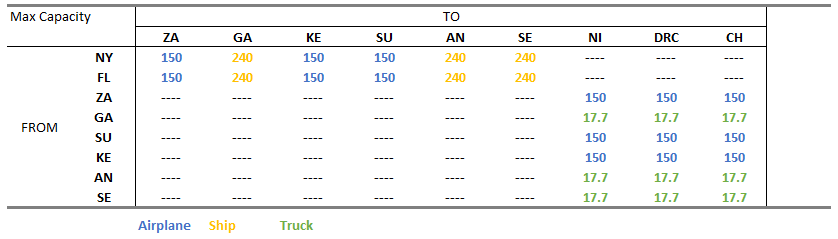{width=600px}


```r
# Set up the cost minimization
trans_2 <- make.lp(0, nrow(dist_cost))
```


```r
# Build objective function and constraints
obj_fn <- dist_cost$Capacity * (dist_cost$From_Short=="NY" | dist_cost$From_Short == "FL")

set.objfn(trans_2, obj_fn)


# Both in New York and Jacksonville,Florida there are 500,000 tons of the necessary cargo available
add.constraint(trans_2, (dist_cost$From=="New York, NY")*dist_cost$Capacity, "<=", 500000) 
add.constraint(trans_2, (dist_cost$From=="Jacksonville, FL")*dist_cost$Capacity, "<=", 500000) 

# Air Transport restricitions
for (i in 1:nrow(air_restr)){ 
    add.constraint(trans_2, 
                   dist_cost$From==pull(air_restr[i,1]) & dist_cost$To==pull(air_restr[i,2]) ,
                   '<=',pull(air_restr[i,3]))
    i <- i + 1
  }

# Truck Transport restricitions
for (i in 1:nrow(truck_restr)){ 
    add.constraint(trans_2, 
                   dist_cost$From==pull(truck_restr[i,1]) & dist_cost$To==pull(truck_restr[i,2]) ,
                   '<=',pull(truck_restr[i,3]))
    i <- i + 1
  }

# Max Necessary Aid
for (i in 1:nrow(aid_req)){ 
    add.constraint(trans_2, 
                   (dist_cost$From==pull(aid_req[i,1]))*dist_cost$Capacity - (dist_cost$To==pull(aid_req[i,1]))*dist_cost$Capacity,
                   '>=',-pull(aid_req[i,2]))
    i <- i + 1
  }

# Add row and column names
restrictions_name <-  c("Max_NY", 
                        "Max_FL",
                        paste("Air", air_restr$From_Short, air_restr$To_Short, sep = "_"), 
                        paste("Truck", truck_restr$From_Short, truck_restr$To_Short, sep = "_"),
                        paste0("Max_Aid_", aid_req$City_Short))

route_name <- paste(dist_cost$From_Short, dist_cost$To_Short,dist_cost$Type_1 , sep = "_")

dimnames(trans_2) <- list(restrictions_name,
                          route_name)


# Write to see named algebraic formulation
write.lp(trans_2, "Question_4.lp",type = 'lp')

# Solve the model, if this return 0 an optimal solution is found
solve(trans_2)
```

```
## [1] 0
```


```r
# Objective function Value:
get.objective(trans_2)
```

```
## [1] 816170
```

```r
# THe optimal variables:
get.variables(trans_2)
```

```
##  [1]  300.0000  487.3833  440.0000  420.0000  577.8042  293.1458  500.0000
##  [8]  192.3750  700.0000  600.0000    0.0000    0.0000    0.0000 3107.3446
## [15]    0.0000  300.0000    0.0000    0.0000    0.0000  300.0000   40.0000
## [22]   80.0000  250.0000  700.0000    0.0000  160.0000  300.0000   40.0000
## [29]  240.0000  450.0000    0.0000    0.0000
```

```r
# How much of the constraints we use?
get.constraints(trans_2)
```

```
##  [1]  500000  316170     300     440     420     500     700     600       0
## [10]       0     300       0      40      80       0     300      40     250
## [19]     240     300     160     700     450  -50000 -100000 -130000  -90000
## [28] -120000 -120000 -100000  -40125  -66045
```

```r
sensitivity_table(trans_2)
```

<table class="table table-striped table-bordered" style="margin-left: auto; margin-right: auto;">
 <thead>
  <tr>
   <th style="text-align:left;">   </th>
   <th style="text-align:left;"> Max_NY </th>
   <th style="text-align:left;"> Max_FL </th>
   <th style="text-align:left;"> Air_NY_ZA </th>
   <th style="text-align:left;"> Air_NY_KE </th>
   <th style="text-align:left;"> Air_NY_SU </th>
   <th style="text-align:left;"> Air_FL_ZA </th>
   <th style="text-align:left;"> Air_FL_KE </th>
   <th style="text-align:left;"> Air_FL_SU </th>
   <th style="text-align:left;"> Air_ZA_NI </th>
   <th style="text-align:left;"> Air_KE_NI </th>
   <th style="text-align:left;"> Air_SU_NI </th>
   <th style="text-align:left;"> Air_ZA_DRC </th>
   <th style="text-align:left;"> Air_KE_DRC </th>
   <th style="text-align:left;"> Air_SU_DRC </th>
   <th style="text-align:left;"> Air_ZA_CH </th>
   <th style="text-align:left;"> Air_KE_CH </th>
   <th style="text-align:left;"> Air_SU_CH </th>
   <th style="text-align:left;"> Truck_AN_DRC </th>
   <th style="text-align:left;"> Truck_AN_CH </th>
   <th style="text-align:left;"> Truck_GA_DRC </th>
   <th style="text-align:left;"> Truck_GA_CH </th>
   <th style="text-align:left;"> Truck_SE_DRC </th>
   <th style="text-align:left;"> Truck_SE_CH </th>
   <th style="text-align:left;"> Max_Aid_SE </th>
   <th style="text-align:left;"> Max_Aid_GA </th>
   <th style="text-align:left;"> Max_Aid_AN </th>
   <th style="text-align:left;"> Max_Aid_SU </th>
   <th style="text-align:left;"> Max_Aid_ZA </th>
   <th style="text-align:left;"> Max_Aid_KE </th>
   <th style="text-align:left;"> Max_Aid_NI </th>
   <th style="text-align:left;"> Max_Aid_DRC </th>
   <th style="text-align:left;"> Max_Aid_CH </th>
   <th style="text-align:left;"> NY_ZA_Airplane </th>
   <th style="text-align:left;"> NY_GA_Ship </th>
   <th style="text-align:left;"> NY_KE_Airplane </th>
   <th style="text-align:left;"> NY_SU_Airplane </th>
   <th style="text-align:left;"> NY_AN_Ship </th>
   <th style="text-align:left;"> NY_SE_Ship </th>
   <th style="text-align:left;"> FL_ZA_Airplane </th>
   <th style="text-align:left;"> FL_GA_Ship </th>
   <th style="text-align:left;"> FL_KE_Airplane </th>
   <th style="text-align:left;"> FL_SU_Airplane </th>
   <th style="text-align:left;"> FL_AN_Ship </th>
   <th style="text-align:left;"> FL_SE_Ship </th>
   <th style="text-align:left;"> ZA_NI_Airplane </th>
   <th style="text-align:left;"> GA_NI_Truck </th>
   <th style="text-align:left;"> KE_NI_Airplane </th>
   <th style="text-align:left;"> SU_NI_Airplane </th>
   <th style="text-align:left;"> AN_NI_Truck </th>
   <th style="text-align:left;"> SE_NI_Truck </th>
   <th style="text-align:left;"> ZA_DRC_Airplane </th>
   <th style="text-align:left;"> GA_DRC_Truck </th>
   <th style="text-align:left;"> KE_DRC_Airplane </th>
   <th style="text-align:left;"> SU_DRC_Airplane </th>
   <th style="text-align:left;"> AN_DRC_Truck </th>
   <th style="text-align:left;"> SE_DRC_Truck </th>
   <th style="text-align:left;"> ZA_CH_Airplane </th>
   <th style="text-align:left;"> GA_CH_Truck </th>
   <th style="text-align:left;"> KE_CH_Airplane </th>
   <th style="text-align:left;"> SU_CH_Airplane </th>
   <th style="text-align:left;"> AN_CH_Truck </th>
   <th style="text-align:left;"> SE_CH_Truck </th>
   <th style="text-align:left;"> US_NY_Airplane </th>
   <th style="text-align:left;"> US_FL_Airplane </th>
  </tr>
 </thead>
<tbody>
  <tr>
   <td style="text-align:left;"> solution </td>
   <td style="text-align:left;"> 500000 </td>
   <td style="text-align:left;"> 316170 </td>
   <td style="text-align:left;"> 300 </td>
   <td style="text-align:left;"> 440 </td>
   <td style="text-align:left;"> 420 </td>
   <td style="text-align:left;"> 500 </td>
   <td style="text-align:left;"> 700 </td>
   <td style="text-align:left;"> 600 </td>
   <td style="text-align:left;"> 0 </td>
   <td style="text-align:left;"> 0 </td>
   <td style="text-align:left;"> 300 </td>
   <td style="text-align:left;"> 0 </td>
   <td style="text-align:left;"> 40 </td>
   <td style="text-align:left;"> 80 </td>
   <td style="text-align:left;"> 0 </td>
   <td style="text-align:left;"> 300 </td>
   <td style="text-align:left;"> 40 </td>
   <td style="text-align:left;"> 250 </td>
   <td style="text-align:left;"> 240 </td>
   <td style="text-align:left;"> 300 </td>
   <td style="text-align:left;"> 160 </td>
   <td style="text-align:left;"> 700 </td>
   <td style="text-align:left;"> 450 </td>
   <td style="text-align:left;"> -50000 </td>
   <td style="text-align:left;"> -100000 </td>
   <td style="text-align:left;"> -130000 </td>
   <td style="text-align:left;"> -90000 </td>
   <td style="text-align:left;"> -120000 </td>
   <td style="text-align:left;"> -120000 </td>
   <td style="text-align:left;"> -100000 </td>
   <td style="text-align:left;"> -40125 </td>
   <td style="text-align:left;"> -66045 </td>
   <td style="text-align:left;"> 300 </td>
   <td style="text-align:left;"> 487.383333333333 </td>
   <td style="text-align:left;"> 440 </td>
   <td style="text-align:left;"> 420 </td>
   <td style="text-align:left;"> 577.804166666667 </td>
   <td style="text-align:left;"> 293.145833333333 </td>
   <td style="text-align:left;"> 500 </td>
   <td style="text-align:left;"> 192.375 </td>
   <td style="text-align:left;"> 700 </td>
   <td style="text-align:left;"> 600 </td>
   <td style="text-align:left;"> 0 </td>
   <td style="text-align:left;"> 0 </td>
   <td style="text-align:left;"> 0 </td>
   <td style="text-align:left;"> 3107.34463276836 </td>
   <td style="text-align:left;"> 0 </td>
   <td style="text-align:left;"> 300 </td>
   <td style="text-align:left;"> 0 </td>
   <td style="text-align:left;"> 0 </td>
   <td style="text-align:left;"> 0 </td>
   <td style="text-align:left;"> 300 </td>
   <td style="text-align:left;"> 40 </td>
   <td style="text-align:left;"> 80 </td>
   <td style="text-align:left;"> 250 </td>
   <td style="text-align:left;"> 700 </td>
   <td style="text-align:left;"> 0 </td>
   <td style="text-align:left;"> 160 </td>
   <td style="text-align:left;"> 300 </td>
   <td style="text-align:left;"> 40 </td>
   <td style="text-align:left;"> 240 </td>
   <td style="text-align:left;"> 450 </td>
   <td style="text-align:left;"> 0 </td>
   <td style="text-align:left;"> 0 </td>
  </tr>
  <tr>
   <td style="text-align:left;"> duals/coef </td>
   <td style="text-align:left;"> 0 </td>
   <td style="text-align:left;"> 0 </td>
   <td style="text-align:left;"> 150 </td>
   <td style="text-align:left;"> 0 </td>
   <td style="text-align:left;"> 0 </td>
   <td style="text-align:left;"> 150 </td>
   <td style="text-align:left;"> 0 </td>
   <td style="text-align:left;"> 0 </td>
   <td style="text-align:left;"> 0 </td>
   <td style="text-align:left;"> 0 </td>
   <td style="text-align:left;"> 0 </td>
   <td style="text-align:left;"> 0 </td>
   <td style="text-align:left;"> 150 </td>
   <td style="text-align:left;"> 150 </td>
   <td style="text-align:left;"> 0 </td>
   <td style="text-align:left;"> 150 </td>
   <td style="text-align:left;"> 150 </td>
   <td style="text-align:left;"> 17.7 </td>
   <td style="text-align:left;"> 17.7 </td>
   <td style="text-align:left;"> 17.7 </td>
   <td style="text-align:left;"> 17.7 </td>
   <td style="text-align:left;"> 17.7 </td>
   <td style="text-align:left;"> 17.7 </td>
   <td style="text-align:left;"> -1 </td>
   <td style="text-align:left;"> -1 </td>
   <td style="text-align:left;"> -1 </td>
   <td style="text-align:left;"> -1 </td>
   <td style="text-align:left;"> 0 </td>
   <td style="text-align:left;"> -1 </td>
   <td style="text-align:left;"> -1 </td>
   <td style="text-align:left;"> 0 </td>
   <td style="text-align:left;"> 0 </td>
   <td style="text-align:left;"> 150 </td>
   <td style="text-align:left;"> 240 </td>
   <td style="text-align:left;"> 150 </td>
   <td style="text-align:left;"> 150 </td>
   <td style="text-align:left;"> 240 </td>
   <td style="text-align:left;"> 240 </td>
   <td style="text-align:left;"> 150 </td>
   <td style="text-align:left;"> 240 </td>
   <td style="text-align:left;"> 150 </td>
   <td style="text-align:left;"> 150 </td>
   <td style="text-align:left;"> 240 </td>
   <td style="text-align:left;"> 240 </td>
   <td style="text-align:left;"> 0 </td>
   <td style="text-align:left;"> 0 </td>
   <td style="text-align:left;"> 0 </td>
   <td style="text-align:left;"> 0 </td>
   <td style="text-align:left;"> 0 </td>
   <td style="text-align:left;"> 0 </td>
   <td style="text-align:left;"> 0 </td>
   <td style="text-align:left;"> 0 </td>
   <td style="text-align:left;"> 0 </td>
   <td style="text-align:left;"> 0 </td>
   <td style="text-align:left;"> 0 </td>
   <td style="text-align:left;"> 0 </td>
   <td style="text-align:left;"> 0 </td>
   <td style="text-align:left;"> 0 </td>
   <td style="text-align:left;"> 0 </td>
   <td style="text-align:left;"> 0 </td>
   <td style="text-align:left;"> 0 </td>
   <td style="text-align:left;"> 0 </td>
   <td style="text-align:left;"> 0 </td>
   <td style="text-align:left;"> 0 </td>
  </tr>
  <tr>
   <td style="text-align:left;"> Sens From </td>
   <td style="text-align:left;"> 383028 </td>
   <td style="text-align:left;"> -inf </td>
   <td style="text-align:left;"> 0 </td>
   <td style="text-align:left;"> -inf </td>
   <td style="text-align:left;"> -inf </td>
   <td style="text-align:left;"> 0 </td>
   <td style="text-align:left;"> 640 </td>
   <td style="text-align:left;"> 520 </td>
   <td style="text-align:left;"> -inf </td>
   <td style="text-align:left;"> 0 </td>
   <td style="text-align:left;"> 0 </td>
   <td style="text-align:left;"> -inf </td>
   <td style="text-align:left;"> 0 </td>
   <td style="text-align:left;"> 0 </td>
   <td style="text-align:left;"> -inf </td>
   <td style="text-align:left;"> 0 </td>
   <td style="text-align:left;"> 0 </td>
   <td style="text-align:left;"> 0 </td>
   <td style="text-align:left;"> 0 </td>
   <td style="text-align:left;"> 0 </td>
   <td style="text-align:left;"> 0 </td>
   <td style="text-align:left;"> 0 </td>
   <td style="text-align:left;"> 0 </td>
   <td style="text-align:left;"> -166972 </td>
   <td style="text-align:left;"> -283830 </td>
   <td style="text-align:left;"> -246972 </td>
   <td style="text-align:left;"> -102000 </td>
   <td style="text-align:left;"> -inf </td>
   <td style="text-align:left;"> -129000 </td>
   <td style="text-align:left;"> -283830 </td>
   <td style="text-align:left;"> -inf </td>
   <td style="text-align:left;"> -inf </td>
   <td style="text-align:left;"> 0 </td>
   <td style="text-align:left;"> 240 </td>
   <td style="text-align:left;"> 150 </td>
   <td style="text-align:left;"> 150 </td>
   <td style="text-align:left;"> 240 </td>
   <td style="text-align:left;"> 240 </td>
   <td style="text-align:left;"> 0 </td>
   <td style="text-align:left;"> 240 </td>
   <td style="text-align:left;"> 150 </td>
   <td style="text-align:left;"> 150 </td>
   <td style="text-align:left;"> -inf </td>
   <td style="text-align:left;"> -inf </td>
   <td style="text-align:left;"> -inf </td>
   <td style="text-align:left;"> 0 </td>
   <td style="text-align:left;"> -inf </td>
   <td style="text-align:left;"> 0 </td>
   <td style="text-align:left;"> -inf </td>
   <td style="text-align:left;"> -inf </td>
   <td style="text-align:left;"> -inf </td>
   <td style="text-align:left;"> -17.7 </td>
   <td style="text-align:left;"> -150 </td>
   <td style="text-align:left;"> -150 </td>
   <td style="text-align:left;"> -17.7 </td>
   <td style="text-align:left;"> -17.7 </td>
   <td style="text-align:left;"> -inf </td>
   <td style="text-align:left;"> -17.7 </td>
   <td style="text-align:left;"> -150 </td>
   <td style="text-align:left;"> -150 </td>
   <td style="text-align:left;"> -17.7 </td>
   <td style="text-align:left;"> -17.7 </td>
   <td style="text-align:left;"> -inf </td>
   <td style="text-align:left;"> -inf </td>
  </tr>
  <tr>
   <td style="text-align:left;"> Sens Till </td>
   <td style="text-align:left;"> 546170 </td>
   <td style="text-align:left;"> inf </td>
   <td style="text-align:left;"> 500 </td>
   <td style="text-align:left;"> inf </td>
   <td style="text-align:left;"> inf </td>
   <td style="text-align:left;"> 700 </td>
   <td style="text-align:left;"> 1007.8 </td>
   <td style="text-align:left;"> 907.8 </td>
   <td style="text-align:left;"> inf </td>
   <td style="text-align:left;"> 60 </td>
   <td style="text-align:left;"> 380 </td>
   <td style="text-align:left;"> inf </td>
   <td style="text-align:left;"> 100 </td>
   <td style="text-align:left;"> 160 </td>
   <td style="text-align:left;"> inf </td>
   <td style="text-align:left;"> 360 </td>
   <td style="text-align:left;"> 120 </td>
   <td style="text-align:left;"> 6858.59 </td>
   <td style="text-align:left;"> 1028.42 </td>
   <td style="text-align:left;"> 8202.54 </td>
   <td style="text-align:left;"> 948.42 </td>
   <td style="text-align:left;"> 7308.59 </td>
   <td style="text-align:left;"> 1238.42 </td>
   <td style="text-align:left;"> -3830 </td>
   <td style="text-align:left;"> -53830 </td>
   <td style="text-align:left;"> -83830 </td>
   <td style="text-align:left;"> -43830 </td>
   <td style="text-align:left;"> inf </td>
   <td style="text-align:left;"> -73830 </td>
   <td style="text-align:left;"> -53830 </td>
   <td style="text-align:left;"> inf </td>
   <td style="text-align:left;"> inf </td>
   <td style="text-align:left;"> inf </td>
   <td style="text-align:left;"> 240 </td>
   <td style="text-align:left;"> 150 </td>
   <td style="text-align:left;"> 150 </td>
   <td style="text-align:left;"> 240 </td>
   <td style="text-align:left;"> 240 </td>
   <td style="text-align:left;"> inf </td>
   <td style="text-align:left;"> 240 </td>
   <td style="text-align:left;"> inf </td>
   <td style="text-align:left;"> inf </td>
   <td style="text-align:left;"> 240 </td>
   <td style="text-align:left;"> 240 </td>
   <td style="text-align:left;"> 150 </td>
   <td style="text-align:left;"> 0 </td>
   <td style="text-align:left;"> inf </td>
   <td style="text-align:left;"> inf </td>
   <td style="text-align:left;"> 0 </td>
   <td style="text-align:left;"> 0 </td>
   <td style="text-align:left;"> 0 </td>
   <td style="text-align:left;"> inf </td>
   <td style="text-align:left;"> inf </td>
   <td style="text-align:left;"> inf </td>
   <td style="text-align:left;"> inf </td>
   <td style="text-align:left;"> inf </td>
   <td style="text-align:left;"> 0 </td>
   <td style="text-align:left;"> inf </td>
   <td style="text-align:left;"> inf </td>
   <td style="text-align:left;"> inf </td>
   <td style="text-align:left;"> inf </td>
   <td style="text-align:left;"> inf </td>
   <td style="text-align:left;"> 0 </td>
   <td style="text-align:left;"> 0 </td>
  </tr>
</tbody>
<tfoot>
<tr>
<td style = 'padding: 0; border:0;' colspan='100%'><sup></sup> Objective Value = 816,170.00</td>
</tr>
</tfoot>
</table>
