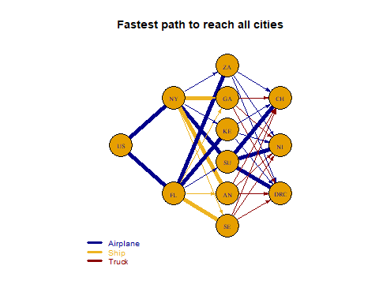
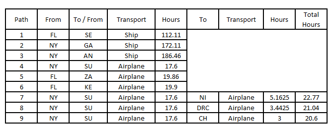
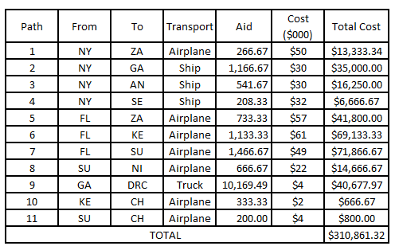
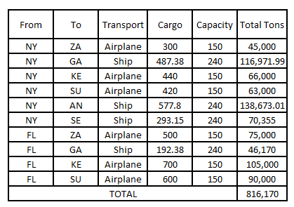
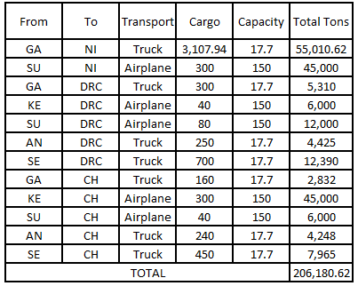
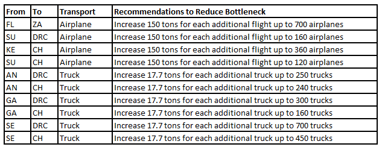

#### **To: Donors of the International Federation of Red Cross**  
  
#### **From: Renato Albolea, Erika Ronquillo**
  
#### **Date: "`r format(Sys.time(), '%A, %B %d %Y')`"**   
  
#### **RE: Aiding Africa: Disaster/Disease Relief Plan**  

***

Many African communities lack a basic infrastructure which makes them easily susceptible to disaster and disease. There is also a prevalence of instability within their governments which often prevents an adequate amount of resources to be available in an emergency. The International Federation of Red Cross has recently created a plan to swiftly deliver workers, equipment, food, fuel and other supplies to these communities in the case of adversity.   

The plan will consist of three main components to ensure efficient preparedness for when the next disaster hits. Airplanes and ships will transport workers and supplies from either New York or Jacksonville, Florida to three ports or three airfields on the African continent where they can refuel and resupply before they reach their ultimate destinations. From the final IFRC cities, supplies can then be dispersed throughout the country.   

The ‘Coding Network Map’ shows a summary of the different possible pathways from the United States to the nine IFRC cities. The center of the map shows the three ports and three airfields where the aids will first land before transferring into the one of the three main IFRC cities on the right. The different colored arrows between destinations represent the different methods of transport. The blue arrow represents transport by airplane, the orange arrow is transport by ship, and the green arrow is transport by truck.  

The first part of the overall plan is deemed the “cost is no object” plan where the objective is to bring as many workers and supplies to the IFRC cities as fast as possible. Below is a summary of the total travel time from the United States to each of the nine IFRC cities:  

{width=1200px}

Based on the times above, the shortest path overall would be from the US -> Sudan -> Chad.
In trying to determine the shortest path to the 9 IFRC cities, we’ve outlined the paths that would be the fastest for traveling from the US to each city. Below is a summary of the transport types and routes we suggest ensuring we are able to get the supplies to those in need as fast as possible:  

{width=600px}

{width=600px}

As we can see from the summary above, the fastest route into one any of the IFRC cities is from New York to the airfield in Khartoum, Sudan. We also see that the route from NY -> Sudan -> Chad is the fastest path to one of the final strategic cities, as we also saw in the earlier in the report. The summary also helps us identify the bottleneck in Luanda, Angola, which has the longest route in transporting aid to Africa. We suggest trying to add airfield to either Senegal, Angola, or Gabon to help reduce the transport time that it takes by ship. If an airfield is added to one of those cities, then the aid can then be distributed to the strategic cities by truck. This will help greatly reduce the number of transporting hours and reduce the bottleneck.  

In order to effectively utilize the funds of the donors, we developed the second part of the plan which identifies the paths that will deliver each IFRC city their required aid in tons at a minimum cost. This plan also takes into consideration any transport restrictions they might have.  We found that we are able to deliver the aid at $310,861 as seen below:  

{width=600px}

As we can see, there is a bottleneck once again from Khartoum, Sudan to Ndjamena, Chad based on the sensitivity analysis presented on the Technical Appendix. Considering there is already an airplane transport from Nairobi, Kenya to Ndjamena, Chad with enough aid, the second transport from Sudan to Chad (path 11) can be removed entirely and have those airplanes transfer aid from Nairobi, Kenya to Ndjamena, Chad instead since there is no restriction for that particular route. Since the cost of transferring aid from Kenya to Chad is also lower by $2, this change would also further reduce the cost by $400 so that the total cost would be $310,461.32.  

Unfortunately, there are additional restrictions that must be taken into consideration when determining how much cargo we can transport to each of the IFRC cities. Certain parts of the continent require no more than a maximum number of airplanes and trucks to travel across the continent. In the last part of the plan of providing aid to Africa, we apply these restricted number of airplanes and trucks to determine what is the maximum capacity that we can transport to Africa:  

{width=600px}

Once the maximum capacity is brought into Africa, the air can then be immediately dispersed into the three strategic countries via the following paths:  

{width=600px}

Based on the tables above and on the sensitivity analysis presented on the Technical Appendix, we see the bottlenecks below. We’ve also included recommendations for reducing the bottleneck in the table:  

{width=600px}

We appreciate your time and generosity in our efforts to assist the countries of Africa from disaster and disease. Please feel free to contact us if you have any questions or would like to discuss the analysis further.   

Best regards,  
Renato Albolea and Erika Ronquillo

