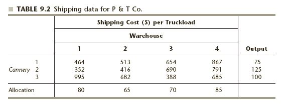

```{r echo = FALSE}
# Course: 5260 Math models for decision making
# Title: Week 3-Transportation problem
# Purpose: Demonstrate the specifics of a transport problem
# Date: March 15, 2020
# Author: Gareth Green

```

```{r echo = FALSE}
# Clear environment of variables and functions
rm(list = ls(all = TRUE)) 

# Clear environmet of packages
if(is.null(sessionInfo()$otherPkgs) == FALSE)lapply(paste("package:", names(sessionInfo()$otherPkgs), sep=""), detach, character.only = TRUE, unload = TRUE)

```

```{r echo = FALSE}
# Load packages
library(lpSolveAPI)
`%>%` <- magrittr::`%>%`
library(knitr)
library(kableExtra)

```

Set up the problem
=============================================

Canning and distributing peas  

+ 3 cannerys  
+ 4 Warehouses  

  

Include costs from sources to destinations
=============================================

  

  


Set up the problem
=============================================

```{r}
# Set up the cost minimization
trans_9_1 <- make.lp(0, 12)

# Build objective function and constraints
obj_fn <- c(464, 513, 654, 867, 352, 416, 690, 791, 995, 682, 388, 685)
set.objfn(trans_9_1, obj_fn)
add.constraint(trans_9_1, c(1, 1, 1, 1, 0, 0, 0, 0, 0, 0, 0, 0), "=", 75)
add.constraint(trans_9_1, c(0, 0, 0, 0, 1, 1, 1, 1, 0, 0, 0, 0), "=", 125)
add.constraint(trans_9_1, c(0, 0, 0, 0, 0, 0, 0, 0, 1, 1, 1, 1), "=", 100)
add.constraint(trans_9_1, c(1, 0, 0, 0, 1, 0, 0, 0, 1, 0, 0, 0), "=", 80)
add.constraint(trans_9_1, c(0, 1, 0, 0, 0, 1, 0, 0, 0, 1, 0, 0), "=", 65)
add.constraint(trans_9_1, c(0, 0, 1, 0, 0, 0, 1, 0, 0, 0, 1, 0), "=", 70)
add.constraint(trans_9_1, c(0, 0, 0, 1, 0, 0, 0, 1, 0, 0, 0, 1), "=", 85)


```


Can also export the problem to a text file
=============================================

This is not unique to the transportation model  

```{r}
# Write to view the algebraic formulation
write.lp(trans_9_1, "W3-3-1_generic_ex1.lp",type = 'lp')

```


Add names to rows and columns
=============================================

```{r}
# Add row and column names
dimnames(trans_9_1) <- list(c("Bell", "Eue", "AL", "Sac", "SLC", "RC", "Alb"),
                          c("Bell_Sac", "Bell_SLC", "Bell_RC", "Bell_Alb",
                            "Eue_Sac", "Eue_SLC", "Eue_RC", "Eue_Alb",
                            "AL_Sac", "AL_SLC", "AL_RC", "AL_Alb"))

# Write to see named algebraic formulation
write.lp(trans_9_1, "W3-3-1_trans_9_1_ex1.lp",type = 'lp')

```


Can set up the problem from a text file
=============================================

If you are more comfortable setting up the problem in text file  
 
+ Can create in text file then load

```{r}
# Remove all data to illustrate you can read the model from a file
rm(list = ls(all = TRUE))

# Load the model from a text file to illustrate one method of code set up
trans_9_1 <- read.lp("W3-3-1_trans_9_1_ex1.lp", type = "lp")

```


Solve the model and show results
=============================================

<div style="float: left; width: 95%;">

```{r }
# Solve the model, if this return 0 an optimal solution is found
solve(trans_9_1)

```


```{r echo = FALSE, include = FALSE}
# Make solution/sensitivity analysis table
# Get primal solution
ps <- get.primal.solution(trans_9_1)

# Have to re-enter obj fn to get Sens Ana table since cannot pull from model
obj_fn <- c(464, 513, 654, 867, 352, 416, 690, 791, 995, 682, 388, 685)

# Get sensitivity analysis
obj_sa <- get.sensitivity.obj(trans_9_1)
rhs_sa <- get.sensitivity.rhs(trans_9_1)

n <- length(get.variables(trans_9_1))
m <- length(get.constr.type(trans_9_1))
ov <- paste0("Objective Value = ", ps[1])

sa_tab <- rbind(ps[2:(n + m + 1)], 
                c(round(rhs_sa$duals[1:m], 2), obj_fn),
                round(c(rhs_sa$dualsfrom[1:m],obj_sa$objfrom), 2),
                round(c(rhs_sa$dualstill[1:m],obj_sa$objtill), 2)) 
colnames(sa_tab) <- c(rownames(trans_9_1), colnames(trans_9_1))
rownames(sa_tab) <- c("solution", "duals/coef", "Sens From", "Sens Till")      

# Substitute "inf" and "-inf" so tables are easier to read (coded by two classmates!)
sa_tab <- ifelse(sa_tab == -1.000e+30, "-inf", sa_tab)
sa_tab <- ifelse(sa_tab == 1.000e+30, "inf", sa_tab)

```

```{r echo = FALSE}
# Print the table
kable(sa_tab, format.args = list(big.mark = ",")) %>%
  kable_styling(bootstrap_options = c("striped", "bordered")) %>% 
  add_footnote(label = ov, notation = "none")

```

</div>


Demonstate using lpSolve package, command lp.transport()
=============================================

One difference between lpSolve and lpSoveAPI is that can build lpSove from a data frame  

+ lpSolveAPI has to be built constraint or column at a time  
    - But will show how to build with loops in next code file W3-3-2_trans_9_1_ex2.RMD

```{r warning=FALSE, message=FALSE}
# Clear packages 
if(is.null(sessionInfo()$otherPkgs) == FALSE)lapply(
  paste("package:", names(sessionInfo()$otherPkgs), sep=""), 
  detach, character.only = TRUE, unload = TRUE)

# Clear environment
rm(list = ls(all = TRUE)) 

```

```{r}
# Load packages
library(lpSolve)

```


Build using cost matrix approach
=============================================

Cost matrix approach has a smaller matrix  

+ Quicker calculations  

+ Build from data.frame or csv file

```{r}
# Read in data file of costs and rhs
mat <- read.csv("W3-3-1_trans_9_1_ex1.csv", header = FALSE)

# Set up cost matrix, constraint signs, and row/column "rhs"
m <- nrow(mat) - 1
n <- ncol(mat) - 1

# Cost matrix is the cost of activities
# Note how much smaller this is than using lpSolveAPI
lp_costs <- as.matrix(mat[1:m, 1:n])
dimnames(lp_costs) <- list(c("Bell", "Eue", "AL"), c("Sac", "SLC", "RC", "Alb"))
lp_costs

# These are standard constraint signs and values
row.signs <- rep ("=", m)
row.rhs <- mat[1:m, n + 1]

# Column constraints
  ## This is how lp.transport problem is set up differently
col.signs <- rep ("=", n)
col.rhs <- mat[m + 1,1:n]

# Solve 9_1 prototype problem with lp.transport()
trans_9_1 <- lp.transport(lp_costs, "min", row.signs, row.rhs, col.signs, col.rhs)
trans_9_1

```

Model solution 
=============================================

```{r}
# Show solution--Unforuntaely the solution does not maintain row/column names
trans_9_1$solution

```

I recommend lpSolveAPI
=============================================

+ We won't do large enough problems to make using lp.transport() beneficial  

+ Sensitivity not working in lpSolve so takes more work  

+ Just want to remind you that there are many specialty programs for operations reserach


