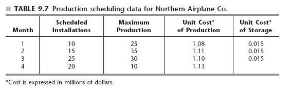
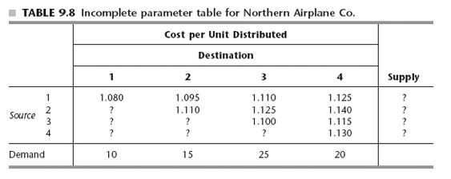
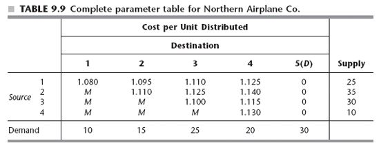

  
```{r echo = FALSE}
# Title: Week 3-Transportation problem dummy destination
# Purpose: demonstrate lpSolveAPI on dummy destination on pg327 reading from OR text
# Date: March 15, 2020
# Author: Gareth Green

```

```{r echo = FALSE}
# Clear environment of variables and functions
rm(list = ls(all = TRUE)) 

# Clear environmet of packages
if(is.null(sessionInfo()$otherPkgs) == FALSE)lapply(paste("package:", names(sessionInfo()$otherPkgs), sep=""), detach, character.only = TRUE, unload = TRUE)

```

```{r echo = FALSE}
# Load packages
library(lpSolveAPI)
`%>%` <- magrittr::`%>%`
library(knitr)
library(kableExtra)

```

Example with a Dummy Destination, pg 327
=============================================

The NORTHERN AIRPLANE COMPANY builds commercial airplanes  

+ The last stage of production is to produce the jet engines and then to install them in the completed airplane frame  
+ The company has been working under some contracts to deliver a considerable number of airplanes in the near future  
+ Production of the jet engines for these planes must now be scheduled for the next four months  

+ To meet the contracted dates for delivery, the company must supply engines for installation in the quantities indicated in the second column of the Table 9.7     

+ The cumulative number of engines produced by the end of months 1, 2, 3, and 4 must be at least 10, 25, 50, and 70 

+ Because of the variations in production costs, it may well be worthwhile to produce some of the engines a month or more before they are scheduled for installation  

+ **The drawback is that such engines must be stored until the scheduled installation (the airplane frames will not be ready early) at a storage cost of $15,000 per month**

Cost and production data
=============================================

  

Schedule possible production cost and supply
=============================================

  


Incorporate dummy destination for storage
=============================================

+ Furthermore, because the demand for the dummy destination is the total unused capacity, this demand is

+ Storage = Max production (25 + 35 + 30 + 10) - Scheduled installations (10 + 15 + 25 + 20) = 30

+ With this demand included, the sum of the supplies now equals the sum of the demands

  


Build and solve the model
=============================================

<div style="float: left; width: 50%;">

This time load model from a text file

```{r}
# Load the model from a text file
trans_9_1_ex2 <- read.lp("W3-3-2_trans_9_1_ex2.lp", type = "lp")

```

```{r }
# Solve the model
solve(trans_9_1_ex2)

```

```{r echo = FALSE, include = FALSE}
# Make solution/sensitivity analysis table
# Get primal solution
ps <- get.primal.solution(trans_9_1_ex2)

# Get sensitivity analysis
obj_sa <- get.sensitivity.obj(trans_9_1_ex2)
rhs_sa <- get.sensitivity.rhs(trans_9_1_ex2)

n <- length(get.variables(trans_9_1_ex2))
m <- length(get.constr.type(trans_9_1_ex2))
obj_fn <- c(1.080, 1.095, 1.110, 1.125, 0, 1000, 1.110, 1.125, 1.140,
            0, 1000, 1000, 1.1, 1.115, 0, 1000, 1000, 1000, 1.130, 0)
ov <- paste0("Objective Value = ", ps[1])

sa_tab <- rbind(ps[2:(n + m + 1)], 
                round(c(rhs_sa$duals[1:m], obj_fn), 2),
                round(c(rhs_sa$dualsfrom[1:m],obj_sa$objfrom), 2),
                round(c(rhs_sa$dualstill[1:m],obj_sa$objtill), 2)) 
colnames(sa_tab) <- c(rownames(trans_9_1_ex2), colnames(trans_9_1_ex2))
rownames(sa_tab) <- c("solution", "duals/coef", "Sens From", "Sens Till")      

# Substitute "inf" and "-inf" so tables are easier to read (coded by two classmates!)
sa_tab <- ifelse(sa_tab == -1.000e+30, "-inf", sa_tab)
sa_tab <- ifelse(sa_tab == 1.000e+30, "inf", sa_tab)

```

```{r echo = FALSE}
# Print the table
kable(sa_tab, format.args = list(big.mark = ",")) %>%
  kable_styling(bootstrap_options = c("striped", "bordered")) %>% 
  add_footnote(label = ov, notation = "none")

```

</div>`

