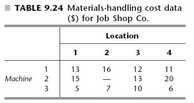
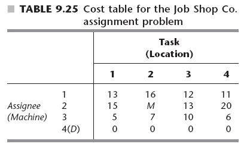

```{r echo = FALSE}
# Title: Week 3-Assignment Problem with dummy machine
# Purpose: Demonstrate lpSolveAPI on pg348 Prototype reading in data from csv
# Date: March 15, 2020
# Author: Gareth Green

```

```{r echo = FALSE}
# Clear environment of variables and functions
rm(list = ls(all = TRUE)) 

# Clear environmet of packages
if(is.null(sessionInfo()$otherPkgs) == FALSE)lapply(paste("package:", names(sessionInfo()$otherPkgs), sep=""), detach, character.only = TRUE, unload = TRUE)

```

```{r echo = FALSE}
# Load packages
library(lpSolveAPI)
`%>%` <- magrittr::`%>%`
library(knitr)
library(kableExtra)

```
  

Problem background
=============================================

The JOB SHOP COMPANY has purchased three new machines of different types   

+ There are four available locations in the shop where a machine could be installed   

+ Some of these locations are more desirable than others for particular machines because of their proximity to work centers that will have a heavy work flow to and from these machines 

+ Therefore, the objective is to assign the new machines to the available locations to minimize the total cost of materials handling  

+ The estimated cost in dollars per hour are given in Table 9.24 for the respective locations  

+ Location 2 is not considered suitable for machine 2, so no cost is given for this case  




Problem design
=============================================

To formulate this problem as an assignment problem, we must introduce a dummy machine for the extra location  

+ Also, an extremely large cost M should be attached to the assignment of machine 2 to location 2 to prevent this assignment in the optimal solution  

+ The resulting assignment problem cost table is shown in Table 9.25  



Set up the model from CSV file and loops
=============================================

```{r}
# Read in data file of costs and rhs
mat <- read.csv("W3-4-1_as_9_3_ex1.csv", header = FALSE)

# Seperate out objective function
m <- nrow(mat) - 1
n <- ncol(mat) - 1
obj_fn <- unlist(as.data.frame(t(mat[1:m, 1:n])))

# Make model
as_9_3_ex1 <- make.lp(0, n * m)

# Set up model
set.objfn(as_9_3_ex1, obj_fn)

# Set up row constraints
for(i in 0:(m - 1)){ 
  add.constraint(as_9_3_ex1, c(rep(0, i * n), rep(1, n), rep(0, (m-1-i) * n)), "=", mat[(i+1),(n+1)])
  i <- i + 1
}

for(j in 0:(n-1) ){ 
  add.constraint(as_9_3_ex1, (rep(c(rep(0,j),1,rep(0, n-1-j)),m)), "=", mat[(m+1),(j+1)])
  j <- j + 1
}

# Write to view the algebraic formulation
write.lp(as_9_3_ex1, "W3-4-1_as_9_3_ex1.lp",type = 'lp')

```


Solve and get results
=============================================

```{r}

# Solve the model, if this return 0 an optimal solution is found
solve(as_9_3_ex1)

```

```{r echo = FALSE, include = FALSE}
# Get primal
ps <- get.primal.solution(as_9_3_ex1)

# Get sensitivity analysis
obj_sa <- get.sensitivity.obj(as_9_3_ex1)
rhs_sa <- get.sensitivity.rhs(as_9_3_ex1)

nv <- length(get.variables(as_9_3_ex1))
mc <- length(get.constr.type(as_9_3_ex1))
ov <- paste0("Objective Value = ", ps[1])

sa_tab <- rbind(ps[2:(nv + mc + 1)], 
                round(c(rhs_sa$duals[1:mc], obj_fn), 2),
                round(c(rhs_sa$dualsfrom[1:mc],obj_sa$objfrom), 2),
                round(c(rhs_sa$dualstill[1:mc],obj_sa$objtill), 2)) 
colnames(sa_tab) <- c(rownames(as_9_3_ex1), colnames(as_9_3_ex1))
rownames(sa_tab) <- c("solution", "duals/coef", "Sens From", "Sens Till")      

# Substitute "inf" and "-inf" so tables are easier to read (coded by two classmates!)
sa_tab <- ifelse(sa_tab == -1.000e+30, "-inf", sa_tab)
sa_tab <- ifelse(sa_tab == 1.000e+30, "inf", sa_tab)

```

```{r echo = FALSE}
# Print the table
kable(sa_tab, format.args = list(big.mark = ",")) %>%
  kable_styling(bootstrap_options = c("striped", "bordered")) %>% 
  add_footnote(label = ov, notation = "none")

```
