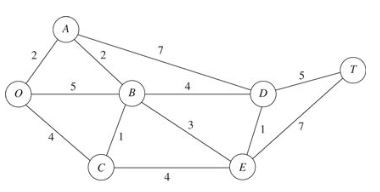
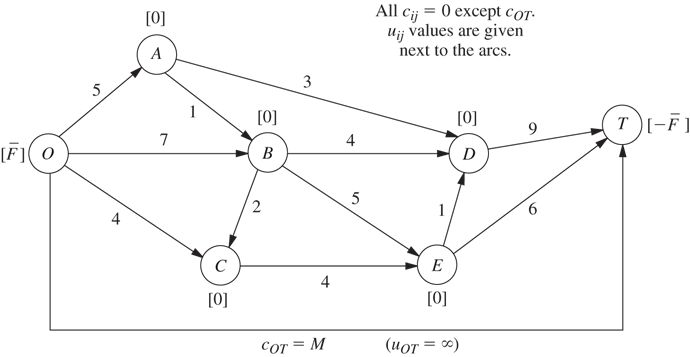
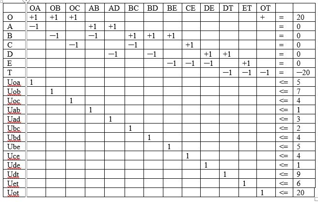
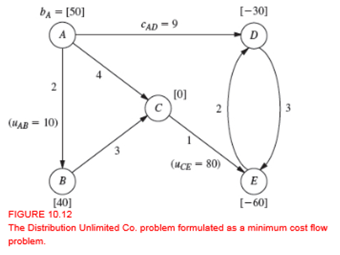

```{r echo = FALSE}
# Course: 5260 Math models for decision making
# Title: Week 4-Network optimization
# Purpose: Begin with shortest path (10.3), min spanning tree (10.4), max flow (10.5), min cost flow (10.6) and time-cost trade-off (10.8)
# Date: March 15, 2020
# Author: Gareth Green

```

```{r echo = FALSE}
# Clear environment of variables and functions
rm(list = ls(all = TRUE)) 

# Clear environmet of packages
if(is.null(sessionInfo()$otherPkgs) == FALSE)lapply(paste("package:", names(sessionInfo()$otherPkgs), sep=""), detach, character.only = TRUE, unload = TRUE)

```

```{r echo = FALSE, message = FALSE}
# Load packages
library(lpSolveAPI)
`%>%` <- magrittr::`%>%`
library(knitr)
library(kableExtra)

```


Network optimization
=============================================

+ Networks provide a powerful visual aid for showing relationships and systems  

  - Usually best to begin analysis by drawing a general picture

+ There are a number of special cases of network optimization  

  - The text does a good job of bring them together in a unified example  
    - These are all classic engineering problems  

+ I'll demonstrate the cases using lpSolveAPI and igraph 

  - Show you the structure of each  
  - Important to think about how they are related   


Network optimization
=============================================
+ Network analysis has changed dramatically due to social network analysis  

  + The textbook only covers classic network cases -- **WHY??**  
  + New cases revolve around better understanding of relationships between people  
    + The role of influencers  
    + Degrees of connectedness  
    + These are not optimization  

+ Network basics relative to Seervada Park example Chapter 10  

    + Node/vertices  
        - Supply/source, demand/destination and transshipment/intermediate node  
    +	Edges/arcs/links
        - Have costs and capacities  
    + Directed/undirected  
        - Flow direction  

Network optimization
=============================================

+ **Must "balance" the network when programming "flow" problems** 

  - think of O as the beginning and T as the end
  - exactly what goes in must come out
  - this flow is controled in the constraint matrix
    - may be slightly different depending on the problem

{width=60%}

This week
=============================================

+ Network Optimization can be seen as a series special problems

+ We will be looking at a series of problems following the text

  - 10.3 Shortest path 
  - 10.4 Minimum spanning tree
  - 10.5 Maximum flow 
  - 10.6 Minimum cost flow
  - 10.8 Time-cost trade-off
 
+ We will work 10.3, 10.4 and 10.5 related to the Seervada Park set up

+ Set up 10.6 differently and dive into the interpretation

+ Set up 10.8 entirely differently 

  - Look at a time/cost model rather than distance


Shortest Path problem, Ch 10.3
=============================================
Set up Seervada Park Network  

+ A park with sereral routes from one end to the other  

    - Which route is the shortest?
    - Balance: if go in one end then must come out the other

{width=60%}

+ **Set up a flow matrix with nodes as rows and links as columns similar example above**  

    + What are the values and decision variables in the objective function?
    + How many constraints (rows)?  
    + How many variables (columns)? 
    + What are the rhs values?


Shortest Path problem
=============================================

<div style="float: left; width: 50%;">


</div>

<div style="float: right; width: 50%;">

+ Think of the constraints as a table

  

+ **Write down a model to represent this problem**

</div>


Shortest Path problem
=============================================
Examine the code below  

+ What does each row represent?  

    >- <span style="color:red; ">Rows represent nodes, balance = 0</span>  

+ What does each column represent?  

    >- <span style="color:red; ">Columns represent edges, the choice varables, i.e. the path</span>    


+ **How is this like the trans and assign problems of Ch 9??**  

    - How are rows and columns similar to trans and assign problems?
    - How is "balance" similar and different than trans and assign problems?  

```{r}
# Set up model
sp <- make.lp(0, 12)

# Set objective fn and constraints
obj_fn <- c(2, 5, 4, 2, 7, 1, 4, 3, 4, 1, 5, 7)
set.objfn(sp, obj_fn)
add.constraint(sp, c( 1, 1, 1, 0, 0, 0, 0, 0, 0, 0, 0, 0), "=", 1)
add.constraint(sp, c(-1, 0, 0, 1, 1, 0, 0, 0, 0, 0, 0, 0), "=", 0)
add.constraint(sp, c( 0,-1, 0,-1, 0, 1, 1, 1, 0, 0, 0, 0), "=", 0)
add.constraint(sp, c( 0, 0,-1, 0, 0,-1, 0, 0, 1, 0, 0, 0), "=", 0)
add.constraint(sp, c( 0, 0, 0, 0,-1, 0,-1, 0, 0, 1, 1, 0), "=", 0)
add.constraint(sp, c( 0, 0, 0, 0, 0, 0, 0,-1,-1,-1, 0, 1), "=", 0)
add.constraint(sp, c( 0, 0, 0, 0, 0, 0, 0, 0, 0, 0,-1,-1), "=",-1)

```

{width=60%}

Shortest Path problem
=============================================
Add dimension names to clarify  

+ View the text file to check it is set up correctly  

```{r}
# Add names
dimnames(sp) <- list(c("O", "A","B", "C", "D", "E", "T"), 
                      c("OA", "OB", "OC", "AB", "AD", "BC", "BD", "BE", "CE", "DE", "DT", "ET"))

# Write to view the algebraic formulation
write.lp(sp, "W4_sp.lp",type = 'lp')

# Solve the model
solve(sp)

```


Shortest path problem solution
=============================================

```{r echo = FALSE, include = FALSE}
# Make results and sensitivity table 
ps <- get.primal.solution(sp)
obj_sa <- get.sensitivity.obj(sp)
rhs_sa <- get.sensitivity.rhs(sp)

nv <- length(get.variables(sp))
mc <- length(get.constr.type(sp))
ov <- paste0("Objective Value = ", ps[1])

sa_tab <- rbind(ps[2:(nv + mc + 1)], 
                round(c(rhs_sa$duals[1:mc], obj_fn), 2),
                round(c(rhs_sa$dualsfrom[1:mc],obj_sa$objfrom), 2),
                round(c(rhs_sa$dualstill[1:mc],obj_sa$objtill), 2)) 
colnames(sa_tab) <- c(rownames(sp), colnames(sp))
rownames(sa_tab) <- c("solution", "duals/coef", "Sens From", "Sens Till")      

# Substitute "inf" and "-inf" so tables are easier to read (coded by two classmates!)
sa_tab <- ifelse(sa_tab == -1.000e+30, "-inf", sa_tab)
sa_tab <- ifelse(sa_tab == 1.000e+30, "inf", sa_tab)

```

```{r echo = FALSE}
# Print the table
knitr::kable(sa_tab, format.args = list(big.mark = ",")) %>%
  kableExtra::kable_styling(bootstrap_options = c("striped", "bordered")) %>% 
  kableExtra::add_footnote(label = ov, notation = "none")

```

Results indicate:  

+ The shortest path from one end of the park to the other is 13 miles  

+ Shortest route is O-A-B-D-T  


Maximum Flow problem, 10.5
=============================================

<div style="float: left; width: 50%;">

+ Goal of max flow is to push as much through the network as possible

  - think of as electiricity or fluid where cost of movement is negligible relative to the value of the product

+ Use the Seervada Park network as an example

  - The park has several routes to the scenic wonder  
  - Just want to maximize trips, not worried about cost
  - Always booked (i.e. profitable) so not worried about cost  

+ This map has different flow constraints than shortest path  

  - Constraints are number of trips possible on each route  
  - Routes are directed, indicated by arrow head

</div>

<div style="float: right; width: 50%;">

+ <span style="color:red; ">Warning - figure 10.6 on page 387 is wrong, should be figure 10.11 on page 394</span>  

{width=90%}

</div>


Maximum Flow, set up the model
=============================================

<div style="float: left; width: 50%;">


</div>

<div style="float: right; width: 50%;">
    
+ **Write down a model (or table) to represent this problem**

  + What is the objective?  

    >- flow maximization    

  + What are your decision variables?  

    >- how much flow through each link  

  + What are the constraints?  

    >- The supply nodes   
    >- The demand at nodes  
    >- The flow along the routes  

</div>


Maximum flow objective function
=============================================

<div style="float: left; width: 50%;">


</div>

<div style="float: right; width: 50%;">

```{r}
# Define parameters of the lp
mxf <- make.lp(0, 12)

# Run in a hidden chunk to avoid the output
#lp.control(mxf, sense = "max") 

```


```{r echo = FALSE, include = FALSE}
# Set up model
lp.control(mxf, sense = "max")

```


```{r}
# Set objective fn to count the number of units exiting the system
obj_fn <- c(0, 0, 0, 0, 0, 0, 0, 0, 0, 0, 1, 1)
set.objfn(mxf, obj_fn)

```

</div>


Maximum flow node constraints
=============================================

<div style="float: left; width: 35%;">

{width=90%}

</div>

<div style="float: right; width: 65%;">

```{r}
# Set up node constraints, similar to shortest path except additional path (column)
add.constraint(mxf, c( 1, 1, 1, 0, 0, 0, 0, 0, 0, 0, 0, 0), "<=", 16) # Max inflow
add.constraint(mxf, c(-1, 0, 0, 1, 1, 0, 0, 0, 0, 0, 0, 0), "=", 0)   # 0 at node since is trans-shipment
add.constraint(mxf, c( 0,-1, 0,-1, 0, 1, 1, 1, 0, 0, 0, 0), "=", 0)
add.constraint(mxf, c( 0, 0,-1, 0, 0,-1, 0, 0, 1, 0, 0, 0), "=", 0)
add.constraint(mxf, c( 0, 0, 0, 0,-1, 0,-1, 0, 0,-1, 1, 0), "=", 0)
add.constraint(mxf, c( 0, 0, 0, 0, 0, 0, 0,-1,-1, 1, 0, 1), "=", 0)
add.constraint(mxf, c( 0, 0, 0, 0, 0, 0, 0, 0, 0, 0,-1,-1), "<=", 15) # Max outflow

# Shortest path constaint - these are the same except for flow quantity
# add.constraint(sp, c( 1, 1, 1, 0, 0, 0, 0, 0, 0, 0, 0, 0), "=", 1)
# add.constraint(sp, c(-1, 0, 0, 1, 1, 0, 0, 0, 0, 0, 0, 0), "=", 0)
# add.constraint(sp, c( 0,-1, 0,-1, 0, 1, 1, 1, 0, 0, 0, 0), "=", 0)
# add.constraint(sp, c( 0, 0,-1, 0, 0,-1, 0, 0, 1, 0, 0, 0), "=", 0)
# add.constraint(sp, c( 0, 0, 0, 0,-1, 0,-1, 0, 0, 1, 1, 0), "=", 0)
# add.constraint(sp, c( 0, 0, 0, 0, 0, 0, 0,-1,-1,-1, 0, 1), "=", 0)
# add.constraint(sp, c( 0, 0, 0, 0, 0, 0, 0, 0, 0, 0,-1,-1), "=",-1)

```

</div>


Maximum flow edge constraints
=============================================

<div style="float: left; width: 35%;">

{width=90%}

</div>

<div style="float: right; width: 65%;">

```{r}
# Edge capacity constraints, these are "like" distances in shortest path
add.constraint(mxf, c(1, 0, 0, 0, 0, 0, 0, 0, 0, 0, 0, 0), "<=", 5)
add.constraint(mxf, c(0, 1, 0, 0, 0, 0, 0, 0, 0, 0, 0, 0), "<=", 7)
add.constraint(mxf, c(0, 0, 1, 0, 0, 0, 0, 0, 0, 0, 0, 0), "<=", 4)
add.constraint(mxf, c(0, 0, 0, 1, 0, 0, 0, 0, 0, 0, 0, 0), "<=", 1)
add.constraint(mxf, c(0, 0, 0, 0, 1, 0, 0, 0, 0, 0, 0, 0), "<=", 3)
add.constraint(mxf, c(0, 0, 0, 0, 0, 1, 0, 0, 0, 0, 0, 0), "<=", 2)
add.constraint(mxf, c(0, 0, 0, 0, 0, 0, 1, 0, 0, 0, 0, 0), "<=", 4)
add.constraint(mxf, c(0, 0, 0, 0, 0, 0, 0, 1, 0, 0, 0, 0), "<=", 5)
add.constraint(mxf, c(0, 0, 0, 0, 0, 0, 0, 0, 1, 0, 0, 0), "<=", 4)
add.constraint(mxf, c(0, 0, 0, 0, 0, 0, 0, 0, 0, 1, 0, 0), "<=", 1)
add.constraint(mxf, c(0, 0, 0, 0, 0, 0, 0, 0, 0, 0, 1, 0), "<=", 9)
add.constraint(mxf, c(0, 0, 0, 0, 0, 0, 0, 0, 0, 0, 0, 1), "<=", 6)

dimnames(mxf) <- list(c("O", "A","B", "C", "D", "E", "T", 
                       "Uoa", "Uob", "Uoc", "Uab", "Uad", "Ubc", "Ubd", "Ube", "Uce", "Ude", "Udt", "Uet"), 
                      c("OA", "OB", "OC", "AB", "AD", "BC", "BD", "BE", "CE", "DE", "DT", "ET"))

```

</div>


Maximum flow problem solution
=============================================

```{r}
# Write to view the algebraic formulation
write.lp(mxf, "W4_mxf.lp",type = 'lp')

# Solve the model
solve(mxf)

```

```{r echo = FALSE, include = FALSE}
# Make results and sensitivity table 
ps <- get.primal.solution(mxf)
obj_sa <- get.sensitivity.obj(mxf)
rhs_sa <- get.sensitivity.rhs(mxf)

nv <- length(get.variables(mxf))
mc <- length(get.constr.type(mxf))
ov <- paste0("Objective Value = ", ps[1])

sa_tab <- rbind(ps[2:(nv + mc + 1)], 
                round(c(rhs_sa$duals[1:mc], obj_fn), 2),
                round(c(rhs_sa$dualsfrom[1:mc],obj_sa$objfrom), 2),
                round(c(rhs_sa$dualstill[1:mc],obj_sa$objtill), 2)) 
colnames(sa_tab) <- c(rownames(mxf), colnames(mxf))
rownames(sa_tab) <- c("solution", "duals/coef", "Sens From", "Sens Till")      

# Substitute "inf" and "-inf" so tables are easier to read (coded by two classmates!)
sa_tab <- ifelse(sa_tab == -1.000e+30, "-inf", sa_tab)
sa_tab <- ifelse(sa_tab == 1.000e+30, "inf", sa_tab)

```

```{r echo = FALSE}
# Print the table
knitr::kable(sa_tab, format.args = list(big.mark = ",")) %>%
  kableExtra::kable_styling(bootstrap_options = c("striped", "bordered")) %>% 
  kableExtra::add_footnote(label = ov, notation = "none")

```

Results indicate:  

+ The maximum number of trips to the scenic wonder is `r ps[1]`  

+ Only AB & BC don't have some trips (flow) along it  


Minimum cost flow problem, 10.6
=============================================

+ Many similarities with previous models

  - Has flow through a network like max flow
  - Considers cost on edges like shortest path
  - Can include multiple sources and destinations like transport/assign with associated costs

+ Network is directed (and connected)

+ Have at least one supply (source) and one demand (destination) node

  - all remaining nodes are transhipment - cannot store
  
+ All node from supply gets to demand and vise versa

  - so need to set up dummy supply or demand if not balanced

+ Objective is to minimize cost of sending supply to demand


Seervada minimum cost flow problem, pg 402
=============================================

<div style="float: left; width: 60%;">

+ Same set up as before, but want to ensure minimum cost  

+ Use a trick to get max flow at minumum cost    

  - set up a very expensive dummy route
  - Will get maximum flow  
  - But routes will be minimum cost  



<br>

</div>

<div style="float: right; width: 40%;">

+ **Write down a model (or table) to represent this problem**

  - What is the objective?

    >- maximize total flow (no cost)  
    >- set costs of all except dummy node to 0  

  - What are your decision variables?  

    >- How much on each link

  - What are the constraints?

    >- capacity of links
    >- Set up dummy link from source to destination with high cost  

</div>


Minimum cost flow Seervada Park set up
=============================================

<div style="float: left; width: 50%;">


</div>

<div style="float: right; width: 50%;">

 

</div>


Minimum cost flow Seervada Park set up
=============================================

```{r}
# Set up model
mcf_sp <- make.lp(0, 13)

# Set objective fn, not worried about costs
obj_fn <- c(0, 0, 0, 0, 0, 0, 0, 0, 0, 0, 0, 0, 100)
set.objfn(mcf_sp, obj_fn)

# Set up node constraints, similar to shortest path except additional path (column)
add.constraint(mcf_sp, c( 1, 1, 1, 0, 0, 0, 0, 0, 0, 0, 0, 0, 1), "=", 20)
add.constraint(mcf_sp, c(-1, 0, 0, 1, 1, 0, 0, 0, 0, 0, 0, 0, 0), "=", 0)
add.constraint(mcf_sp, c( 0,-1, 0,-1, 0, 1, 1, 1, 0, 0, 0, 0, 0), "=", 0)
add.constraint(mcf_sp, c( 0, 0,-1, 0, 0,-1, 0, 0, 1, 0, 0, 0, 0), "=", 0)
add.constraint(mcf_sp, c( 0, 0, 0, 0,-1, 0,-1, 0, 0,-1, 1, 0, 0), "=", 0)
add.constraint(mcf_sp, c( 0, 0, 0, 0, 0, 0, 0,-1,-1, 1, 0, 1, 0), "=", 0)
add.constraint(mcf_sp, c( 0, 0, 0, 0, 0, 0, 0, 0, 0, 0,-1,-1,-1), "=",-20)

# Edge capacity constraints, these are "like" distances in shortest path
add.constraint(mcf_sp, c(1, 0, 0, 0, 0, 0, 0, 0, 0, 0, 0, 0, 0), "<=", 5)
add.constraint(mcf_sp, c(0, 1, 0, 0, 0, 0, 0, 0, 0, 0, 0, 0, 0), "<=", 7)
add.constraint(mcf_sp, c(0, 0, 1, 0, 0, 0, 0, 0, 0, 0, 0, 0, 0), "<=", 4)
add.constraint(mcf_sp, c(0, 0, 0, 1, 0, 0, 0, 0, 0, 0, 0, 0, 0), "<=", 1)
add.constraint(mcf_sp, c(0, 0, 0, 0, 1, 0, 0, 0, 0, 0, 0, 0, 0), "<=", 3)
add.constraint(mcf_sp, c(0, 0, 0, 0, 0, 1, 0, 0, 0, 0, 0, 0, 0), "<=", 2)
add.constraint(mcf_sp, c(0, 0, 0, 0, 0, 0, 1, 0, 0, 0, 0, 0, 0), "<=", 4)
add.constraint(mcf_sp, c(0, 0, 0, 0, 0, 0, 0, 1, 0, 0, 0, 0, 0), "<=", 5)
add.constraint(mcf_sp, c(0, 0, 0, 0, 0, 0, 0, 0, 1, 0, 0, 0, 0), "<=", 4)
add.constraint(mcf_sp, c(0, 0, 0, 0, 0, 0, 0, 0, 0, 1, 0, 0, 0), "<=", 1)
add.constraint(mcf_sp, c(0, 0, 0, 0, 0, 0, 0, 0, 0, 0, 1, 0, 0), "<=", 9)
add.constraint(mcf_sp, c(0, 0, 0, 0, 0, 0, 0, 0, 0, 0, 0, 1, 0), "<=", 6)
add.constraint(mcf_sp, c(0, 0, 0, 0, 0, 0, 0, 0, 0, 0, 0, 0, 1), "<=", 20)

# Add names, rows are nodes and capacity constraints, columns are edges
dimnames(mcf_sp) <- list(c("O", "A","B", "C", "D", "E", "T", 
                       "Uoa", "Uob", "Uoc", "Uab", "Uad", "Ubc", "Ubd", "Ube", "Uce", "Ude", "Udt", "Uet", "Uot"), 
                      c("OA", "OB", "OC", "AB", "AD", "BC", "BD", "BE", "CE", "DE", "DT", "ET", "OT"))

# Write to view the algebraic formulation
write.lp(mcf_sp, "W4_mcf_sp.lp",type = 'lp')

# Solve the model
solve(mcf_sp)

```


Seervada Park as minimum cost flow solution
=============================================

```{r echo = FALSE, include = FALSE}
# Make results and sensitivity table 
ps <- get.primal.solution(mcf_sp)
obj_sa <- get.sensitivity.obj(mcf_sp)
rhs_sa <- get.sensitivity.rhs(mcf_sp)

nv <- length(get.variables(mcf_sp))
mc <- length(get.constr.type(mcf_sp))
ov <- paste0("Objective Value = ", 20 - ps[1]/100)

sa_tab <- rbind(ps[2:(nv + mc + 1)], 
                round(c(rhs_sa$duals[1:mc], obj_fn), 2),
                round(c(rhs_sa$dualsfrom[1:mc],obj_sa$objfrom), 2),
                round(c(rhs_sa$dualstill[1:mc],obj_sa$objtill), 2)) 
colnames(sa_tab) <- c(rownames(mcf_sp), colnames(mcf_sp))
rownames(sa_tab) <- c("solution", "duals/coef", "Sens From", "Sens Till")      

# Substitute "inf" and "-inf" so tables are easier to read (coded by two classmates!)
sa_tab <- ifelse(sa_tab == -1.000e+30, "-inf", sa_tab)
sa_tab <- ifelse(sa_tab == 1.000e+30, "inf", sa_tab)

```

```{r echo = FALSE}
# Print the table
knitr::kable(sa_tab, format.args = list(big.mark = ",")) %>%
  kableExtra::kable_styling(bootstrap_options = c("striped", "bordered")) %>% 
  kableExtra::add_footnote(label = ov, notation = "none")

```

Results indicate:  

+ The maximum number of trips to the scenic wonder is `r 20 - ps[1]/100`  

+ Only BC doesn't have some trips (flow) along it  


Minimum cost flow problem, Ch 10.6
=============================================

<div style="float: left; width: 50%;">

+ Set up **Distribution Unlimited Co. (DUC) problem**    

+ DUC has several routes from A & B to D & E  

    - How maximize the flow at least cost?  

+ This map has flow constraints and shipping costs  

+ **Write down a model (or table) to represent this problem**

+ What is the objective?

  >- cost minimization    

+ What are your decision variables?  

    >- how much flow through each link  

</div>

<div style="float: right; width: 50%;">

+ What are the constraints?  

  >- The supply nodes   
  >- The demand at nodes  
  >- The flow along the routes  



</div>


Minimum cost flow 
=============================================

<div style="float: left; width: 50%;">

{width=50%} 

+ How is the minimum cost flow problem like the shortest path and max flow?  

  - "minimum cost" is like shortest path
  - "flow" is like max flow

</div>

<div style="float: right; width: 50%;">

{width=50%}

+ Specifics are

  - A and B are supply
  - D and E are demand
  - B and C are transshipment nodes

</div>


Minimum cost flow 
=============================================

```{r}
# Set up model
mcf <- make.lp(0, 7)

# Set objective fn
obj_fn <- c(2, 4, 9, 3, 1, 3, 2)
set.objfn(mcf, obj_fn)
add.constraint(mcf, c( 1, 1, 1, 0, 0, 0, 0), "=",  50)
add.constraint(mcf, c(-1, 0, 0, 1, 0, 0, 0), "=",  40)
add.constraint(mcf, c( 0,-1, 0,-1, 1, 0, 0), "=",   0)
add.constraint(mcf, c( 0, 0,-1, 0, 0, 1,-1), "=", -30)
add.constraint(mcf, c( 0, 0, 0, 0,-1,-1, 1), "=", -60)
add.constraint(mcf, c( 1, 0, 0, 0, 0, 0, 0), "<=", 10)
add.constraint(mcf, c( 0, 0, 0, 0, 1, 0, 0), "<=", 80)

# Add names
dimnames(mcf) <- list(c("A","B", "C", "D", "E", "Uab", "Uce"), 
                      c("AB", "AC", "AD", "BC", "CE", "DE", "ED"))

# Write to view the algebraic formulation
write.lp(mcf, "W4_mcf_duc.lp",type = 'lp')

# Solve the model
solve(mcf)

```


Minimum cost flow problem solution
=============================================

```{r echo = FALSE, include = FALSE}
# Make results and sensitivity table 
ps <- get.primal.solution(mcf)
obj_sa <- get.sensitivity.obj(mcf)
rhs_sa <- get.sensitivity.rhs(mcf)

nv <- length(get.variables(mcf))
mc <- length(get.constr.type(mcf))
ov <- paste0("Objective Value = ", ps[1])

sa_tab <- rbind(ps[2:(nv + mc + 1)], 
                round(c(rhs_sa$duals[1:mc], obj_fn), 2),
                round(c(rhs_sa$dualsfrom[1:mc],obj_sa$objfrom), 2),
                round(c(rhs_sa$dualstill[1:mc],obj_sa$objtill), 2)) 
colnames(sa_tab) <- c(rownames(mcf), colnames(mcf))
rownames(sa_tab) <- c("solution", "duals/coef", "Sens From", "Sens Till")      

# Substitute "inf" and "-inf" so tables are easier to read (coded by two classmates!)
sa_tab <- ifelse(sa_tab == -1.000e+30, "-inf", sa_tab)
sa_tab <- ifelse(sa_tab == 1.000e+30, "inf", sa_tab)

```

```{r echo = FALSE}
# Print the table
knitr::kable(sa_tab, format.args = list(big.mark = ",")) %>%
  kableExtra::kable_styling(bootstrap_options = c("striped", "bordered")) %>% 
  kableExtra::add_footnote(label = ov, notation = "none")

```

Results indicate:  

+ The cost is $490  

+ Problem is set so flow is 90  

+ What do dual values mean?  

  >- if supply (and demand) increases at A profit increase by $7
  >- if supply (and demand) increases at B profit increase by $6


Network optimization
=============================================

+ Examined four types of problems

  1. Shortest path
  2. Minimum spanning tree
  3. Maximum flow (no cost)
  4. Minimum cost flow problem (maximum flow)

+ Remember, it is the structure that makes them different, not the application

+ Saw how Minimum cost is like an application of shortest path and maximum flow

+ Now move to different application that is like minimum cost flow

