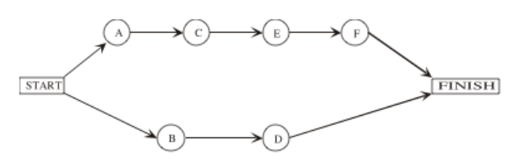

```{r echo = FALSE}
# Course: 5260 Math models for decision making
# Title: Week 4-Network optimization
# Purpose: Demonstrate time-cost trade-off solved example 10.8
# Date: March 15, 2020
# Author: Gareth Green

```

```{r echo = FALSE}
# Clear environment of variables and functions
rm(list = ls(all = TRUE)) 

# Clear environmet of packages
if(is.null(sessionInfo()$otherPkgs) == FALSE)lapply(paste("package:", names(sessionInfo()$otherPkgs), sep=""), detach, character.only = TRUE, unload = TRUE)

```

```{r echo = FALSE, message = FALSE}
# Load packages
library(lpSolveAPI)
`%>%` <- magrittr::`%>%`
library(knitr)
library(kableExtra)

```


Apply network optimization over time, Ch 10.8
=============================================

<div style="float: left; width: 50%;">

+ Treat different stages in a network as different points in time  

  - We have treated stages as locations (i.e plants, warehouses, etc)  
  - Spatial (distance) optimization with capacity constraints  

+ Task times can be represented as a network  

  - Each node indicates a task that must be accomplished before the next can task can be started  
  - Each edge indicates the time it takes the task to be completed    
  - Network appearance comes from being able to do multiple tasks simultaneously  
    - Tasks are occuring simultaneously and sequetially
  - Creates branches between beginning and end  

+ Text book example of construction  

</div>

<div style="float: right; width: 50%;">


</div>


Incorporate multiple criteria into an optimization
=============================================

+ Suppose you need to optimize over more than one criteria of a problem   
    
  - Cost and time  
  - Profit and distance  

+ Units of the objective function must be the same  

  - Cannot sum dollars, time, miles, etc together  

+ How can you optimize over criteria in different units??  

  >- Convert all criteria to a specific unit such as dollars  
  >- Include different criteria in the constraints  


Time-cost trade-off for project as a network
=============================================

<div style="float: left; width: 50%;">

+ The time-cost problem framework addresses this problem more directly  

  - We will use a simpler example than above  

+ We are interested in the length of each path  

  - A-C-E-F-finish = 12 + 15 + 18 + 6 = 51 days	
  - B-D-finish = 23 + 25 = 48 days  

+	**Critical Path** is the longest path  

    - Represents the project length
        - A-C-E-F-finish is the critical path in this example  
    - If need to reduce the project length must shorten longest path  
        - And possibly all paths  

<br>

</div>

<div style="float: right; width: 50%;">



</div>


What if want to reduce the time to completion?
=============================================

**Crashing** the project: take costly steps to reduce project duration  

+ Same idea applies to shipping goods (and other network problems)  

+ What is the least-cost way to crash the project?  

    - This is a network optimization problem with multiple objectives  
    - Two ways to model this problem in a linear programming framework  
    1.	Minimize the cost of reducing days  
        -	Decision variables are **reduced days** at a _higher cost_ and **start days**  
        - Have to simultaneously determine reduced days and **new** start dates for activities
            - Why??
            - What does this mean for codding the problem?
        - This is how crashing is presented in text of the chapter  

    2.	Minimize total cost based on a given number of days
        -	Decision variables are **total days** at _crash cost_ and **start days**
        -	This is how crashing is presented text for spreadsheets

<br>


Time-cost trade-off project "crash" example
=============================================

<div style="float: left; width: 50%;">


</div>

<div style="float: right; width: 50%;">

+ Time: Normal vs Crash project is standard time vs shortest time  

    - Cost: Normal vs Crash is standard vs crash cost  
    - Max day reduction = Normal - Crash time  
    - Crash cost per day = (standard vs crash cost)/(Normal - Crash time)

>+ <span style="color:red; ">Time is being convered to dollars!!</span>    

</div>


How represent this mathematically??
=============================================

<div style="float: left; width: 60%;">

+ The original project cost/time calculation is not necessarily an optimization  

    - We will find cost of reducing from the original = $1,860,000

+ Use approach 1: Minimize the cost of reducing days  

**What are the decision variables for the objective function??**  

+ Number of reduced days
  
$$ x_A, \;	x_B, \; x_C, \;	x_D, \;	x_E, \;	and \; x_F $$  

+ New start dates tasks C, D, E and F  
  
$$ y_C,\;	y_D,\;	y_E,\;	and\; y_F $$  

</div>

<div style="float: right; width: 40%;">


</div>


How represent this mathematically??
=============================================

<div style="float: left; width: 60%;">

**What are the the constraints??**  

+ Maximum of reduced days 
    
$$ x_A\le3, \;	x_B\le5, \; x_C\le 3, \;	x_D\le6, \;	x_E\le4, \;	x_F\le2 $$ 

+ Start dates accounting for new task times and new finish times   

  - Task dates for A to finish  

$$
y_C \; \ge \; (12 - x_A), \\	
y_E \; \ge \; y_C + (15 - x_C),\;	and \\ 
y_F \; \ge \; y_E + (18 - x_E)
$$ 

+ Task dates for B to finish  

$$ 
y_D \; \ge \; (23 - x_B)
$$ 

</div>

<div style="float: right; width: 40%;">


+ Finish for A

$$
y_{Finish} \; \ge \; y_D + (25 - x_D)
$$ 

+ Finish for B

$$
y_{Finish} \; \ge \; y_F + (6 - x_F)
$$ 

</div>


How represent this as a model?
=============================================

<div style="float: left; width: 50%;">

+ But there is a problem with the way these are written  

  - Some decision variables are on the right hand side of the equations  
  - The equations must not have variables on the RHS!  
    
+ Now it is your turn  

  - Write up the model so it is ready for coding  
  - Decision variables  

$$
x_A, \;	x_B, \; x_C, \;	x_D, \;	x_E, \;	and \; x_F
$$  
$$
y_C,\;	y_D,\;	y_E,\;	and\; y_F
$$  

</div>

<div style="float: right; width: 50%;">

+ Constraints    
  
$$
x_A\le3, \;	x_B\le5, \; x_C\le 3, \;	x_D\le6, \;	x_E\le4, \;	x_F\le2
$$ 

$$
y_C \; \ge \; (12 - x_A), \\	
y_E \; \ge \; y_C + (15 - x_C), \\ 
y_F \; \ge \; y_E + (18 - x_E),
$$ 

$$
y_D \; \ge \; (23 - x_B),
$$ 

$$
y_{Finish} \; \ge \; y_D + (25 - x_D), \; and
$$ 

$$
y_{Finish} \; \ge \; y_F + (6 - x_F)
$$ 

</div>


Time-cost trade-off for project as network
=============================================

+ Code the problem  

  - Reduce the project time to 47 days  
  - Which tasks get shortened?  
  - What is the cost of reduction? 


Code for time-cost trade-off for project as network
=============================================

```{r }
# Slight modification d-fin is 25 days (rather than 27)
tcto <- make.lp(0, 10)

# Set new project time frame
fin <- 47 

# Set objective function

obj_fn <- c(20, 10, 10, 10, 15, 25, 0, 0, 0, 0)
set.objfn(tcto, obj_fn)

# set constraints,      xA xB xC xD xE xF yC yD yE yF       Days
add.constraint(tcto,  c(1, 0, 0, 0, 0, 0, 0, 0, 0, 0), "<=", 3)  #xA max days reduced
add.constraint(tcto,  c(0, 1, 0, 0, 0, 0, 0, 0, 0, 0), "<=", 5)  #xB max days reduced
add.constraint(tcto,  c(0, 0, 1, 0, 0, 0, 0, 0, 0, 0), "<=", 3)  #xC max days reduced
add.constraint(tcto,  c(0, 0, 0, 1, 0, 0, 0, 0, 0, 0), "<=", 6)  #xD max days reduced
add.constraint(tcto,  c(0, 0, 0, 0, 1, 0, 0, 0, 0, 0), "<=", 4)  #xE max days reduced
add.constraint(tcto,  c(0, 0, 0, 0, 0, 1, 0, 0, 0, 0), "<=", 2)  #xF max days reduced
add.constraint(tcto,  c(1, 0, 0, 0, 0, 0, 1, 0, 0, 0), ">=", 12) #yC min days for task to calc new start date
add.constraint(tcto,  c(0, 1, 0, 0, 0, 0, 0, 1, 0, 0), ">=", 23) #yD min days for task to calc new start date
add.constraint(tcto,  c(0, 0, 1, 0, 0, 0,-1, 0, 1, 0), ">=", 15) #yE min days for task to calc new start date
add.constraint(tcto,  c(0, 0, 0, 0, 1, 0, 0, 0,-1, 1), ">=", 18) #yF min days for task to calc new start date
add.constraint(tcto,  c(0, 0, 0, 0, 0,-1, 0, 0, 0, 1), "<=", fin - 6)  # New finish days-yF
add.constraint(tcto,  c(0, 0, 0,-1, 0, 0, 0, 1, 0, 0), "<=", fin - 25) # New finish days-yD

# Add row and column names
dimnames(tcto) <- list(c("xA","xB", "xC", "xD", "xE", "xF", "yC", "yD", "yE", "yF", "yF_fin", "yD_fin"), 
                      c("xA","xB", "xC", "xD", "xE", "xF", "yC", "yD", "yE", "yF"))

# Write to view the algebraic formulation
write.lp(tcto, "W4_tcto.lp",type = 'lp')

# Solve the model, if this return 0 an optimal solution is found
solve(tcto)

```


Solution and sensitivity
=============================================

```{r echo = FALSE}
# Make results and sensitivity table 
ps <- get.primal.solution(tcto)
obj_sa <- get.sensitivity.obj(tcto)
rhs_sa <- get.sensitivity.rhs(tcto)

nv <- length(get.variables(tcto))
mc <- length(get.constr.type(tcto))
ov <- paste0("Objective Value = ", ps[1])

sa_tab <- rbind(round(ps[2:(nv + mc + 1)], 2),
  round(c(rhs_sa$duals[1:mc], obj_fn), 2),
  round(c(rhs_sa$dualsfrom[1:mc],obj_sa$objfrom), 2),
  round(c(rhs_sa$dualstill[1:mc],obj_sa$objtill), 2))
colnames(sa_tab) <- c(rownames(tcto), colnames(tcto))
rownames(sa_tab) <- c("solution", "duals/coef", "Sens From", "Sens Till")

# Substitute "inf" and "-inf" so tables are easier to read (coded by two classmates!)
sa_tab <- ifelse(sa_tab == -1.000e+30, "-inf", sa_tab)
sa_tab <- ifelse(sa_tab == 1.000e+30, "inf", sa_tab)

```

```{r echo = FALSE}
# Print the table
knitr::kable(sa_tab, format.args = list(big.mark = ",")) %>%
  kableExtra::kable_styling(bootstrap_options = c("striped", "bordered")) %>% 
  kableExtra::add_footnote(label = ov, notation = "none")

```

<div style="float: left; width: 50%;">

+ Which tasks get reduced?  

$$ x_B \; reduced \; 1 \; day  $$
$$ x_C \; reduced \; 3 \; days  $$
$$ x_E \; reduced \; 1 \; day  $$

</div>

<div style="float: right; width: 50%;">


</div>


